Define safety policies to control agent behavior and protect against harmful outputs.

```mermaid
graph LR
    subgraph "Guardrail Flow"
        A[📥 Input] --> B{🛡️ Policy}
        B -->|Allow| C[✅ Process]
        B -->|Block| D[🚫 Reject]
        B -->|Warn| E[⚠️ Log & Process]
    end
    
    classDef input fill:#6366F1,stroke:#7C90A0,color:#fff
    classDef policy fill:#F59E0B,stroke:#7C90A0,color:#fff
    classDef allow fill:#10B981,stroke:#7C90A0,color:#fff
    classDef block fill:#8B0000,stroke:#7C90A0,color:#fff
    classDef warn fill:#189AB4,stroke:#7C90A0,color:#fff
    
    class A input
    class B policy
    class C allow
    class D block
    class E warn
```



## Quick Start

<Steps>

<Step title="Define Policies">
```typescript
import { GuardrailPolicy, resolveGuardrailPolicies } from 'praisonai';

const policies: GuardrailPolicy[] = [
  {
    name: 'no-pii',
    action: 'block',
    message: 'PII detected in output'
  },
  {
    name: 'content-filter',
    action: 'warn',
    message: 'Potentially sensitive content'
  }
];
```
</Step>

<Step title="Use Preset Policies">
```typescript
import { resolveGuardrailPolicies, GUARDRAIL_PRESETS } from 'praisonai';

// Use preset by name
const resolved = resolveGuardrailPolicies(['strict', 'no-pii']);
```
</Step>

</Steps>

---

## Policy Actions

```mermaid
graph TB
    subgraph "Choose Your Action"
        A{What should happen?}
        A -->|Stop execution| B[🚫 block]
        A -->|Log and continue| C[⚠️ warn]
        A -->|Just log| D[📝 log]
        A -->|Do nothing| E[✅ allow]
    end
    
    classDef question fill:#6366F1,stroke:#7C90A0,color:#fff
    classDef block fill:#8B0000,stroke:#7C90A0,color:#fff
    classDef warn fill:#F59E0B,stroke:#7C90A0,color:#fff
    classDef log fill:#189AB4,stroke:#7C90A0,color:#fff
    classDef allow fill:#10B981,stroke:#7C90A0,color:#fff
    
    class A question
    class B block
    class C warn
    class D log
    class E allow
```



| Action | Behavior |
|--------|----------|
| `block` | Stop execution and return error |
| `warn` | Log warning and continue |
| `log` | Log event and continue silently |
| `allow` | Allow without any action |

---

## GuardrailPolicy Interface

```typescript
interface GuardrailPolicy {
  name: string;                    // Policy name
  action: 'block' | 'warn' | 'log' | 'allow';
  conditions?: Record<string, any>; // Optional conditions
  message?: string;                // Message to show/log
}
```

---

## Preset Policies

Use built-in presets for common scenarios:

```typescript
import { GUARDRAIL_PRESETS, resolveGuardrailPolicies } from 'praisonai';

// Available presets
GUARDRAIL_PRESETS.strict      // Block harmful content
GUARDRAIL_PRESETS.moderate    // Warn on sensitive content
GUARDRAIL_PRESETS.permissive  // Log only, allow all
GUARDRAIL_PRESETS['no-pii']   // Block PII
GUARDRAIL_PRESETS['no-code']  // Block code execution

// Resolve by name
const policies = resolveGuardrailPolicies(['strict', 'no-pii']);
```

### Preset Definitions

| Preset | Action | Description |
|--------|--------|-------------|
| `strict` | `block` | Block all harmful content |
| `moderate` | `warn` | Warn on sensitive content |
| `permissive` | `log` | Log everything, block nothing |
| `no-pii` | `block` | Block personal information |
| `no-code` | `block` | Block code execution |

---

## Resolve Policies

Convert string presets and policy objects:

```typescript
import { resolveGuardrailPolicies, GuardrailPolicy } from 'praisonai';

// Mix of presets and custom policies
const policies = resolveGuardrailPolicies([
  'strict',                           // Preset name
  'no-pii',                           // Preset name
  {                                   // Custom policy
    name: 'custom-filter',
    action: 'warn',
    message: 'Custom warning'
  }
]);

// Returns array of GuardrailPolicy objects
console.log(policies);
```

---

## Common Patterns

<Tabs>

<Tab title="Content Moderation">
```typescript
import { resolveGuardrailPolicies, GuardrailPolicy } from 'praisonai';

const moderationPolicies: GuardrailPolicy[] = [
  {
    name: 'profanity-filter',
    action: 'block',
    message: 'Profanity detected'
  },
  {
    name: 'hate-speech',
    action: 'block',
    message: 'Hate speech detected'
  },
  {
    name: 'spam-detection',
    action: 'warn',
    message: 'Potential spam detected'
  }
];

const resolved = resolveGuardrailPolicies(moderationPolicies);
```
</Tab>

<Tab title="Data Protection">
```typescript
import { GuardrailPolicy } from 'praisonai';

const dataProtectionPolicies: GuardrailPolicy[] = [
  {
    name: 'pii-detection',
    action: 'block',
    conditions: {
      patterns: ['ssn', 'credit-card', 'phone']
    },
    message: 'Personal information detected'
  },
  {
    name: 'api-key-leak',
    action: 'block',
    conditions: {
      patterns: ['sk-', 'api_key', 'secret']
    },
    message: 'API key detected in output'
  }
];
```
</Tab>

<Tab title="Environment-Based">
```typescript
import { resolveGuardrailPolicies } from 'praisonai';

function getPolicies() {
  if (process.env.NODE_ENV === 'production') {
    return resolveGuardrailPolicies(['strict', 'no-pii']);
  } else if (process.env.NODE_ENV === 'staging') {
    return resolveGuardrailPolicies(['moderate']);
  } else {
    return resolveGuardrailPolicies(['permissive']);
  }
}
```
</Tab>

</Tabs>

---

## Best Practices

<AccordionGroup>
  <Accordion title="Use strict policies in production">
    Always use `strict` and `no-pii` policies in production environments.
  </Accordion>
  
  <Accordion title="Log before blocking">
    Use `warn` during development to understand what would be blocked.
  </Accordion>
  
  <Accordion title="Provide clear messages">
    Include descriptive messages to help users understand why content was blocked.
  </Accordion>
  
  <Accordion title="Layer policies">
    Combine multiple policies for comprehensive protection.
  </Accordion>
</AccordionGroup>

---

## Related

<CardGroup cols={2}>
  <Card title="Guardrails" icon="shield" href="/js/guardrails">
    Full guardrails implementation
  </Card>
  <Card title="LLM Guardrail" icon="brain" href="/js/llm-guardrail">
    LLM-based content filtering
  </Card>
</CardGroup>
