Extend your agents with powerful plugins that add tools, hooks, and custom functionality.

```mermaid
graph LR
    subgraph "Plugin System"
        A[🔌 Plugin] --> B{📋 Manager}
        B --> C[🔧 Tool Plugin]
        B --> D[🪝 Hook Plugin]
        B --> E[🤖 Agent Plugin]
        B --> F[🧠 LLM Plugin]
    end
    
    classDef plugin fill:#6366F1,stroke:#7C90A0,color:#fff
    classDef manager fill:#F59E0B,stroke:#7C90A0,color:#fff
    classDef type fill:#10B981,stroke:#7C90A0,color:#fff
    
    class A plugin
    class B manager
    class C,D,E,F type
```



## Quick Start

<Steps>

<Step title="Create a Plugin">
```typescript
import { Plugin, PluginHook, PluginType } from 'praisonai';

const myPlugin = new Plugin({
  name: "my-plugin",
  version: "1.0.0",
  description: "Custom logging plugin",
  type: PluginType.HOOK,
  hooks: [PluginHook.BEFORE_AGENT, PluginHook.AFTER_AGENT]
});

myPlugin.onHook = (hook, ...args) => {
  console.log(`Hook triggered: ${hook}`, args);
};
```
</Step>

<Step title="Register with Manager">
```typescript
import { PluginManager } from 'praisonai';

const manager = new PluginManager();
manager.register(myPlugin);
manager.enable("my-plugin");

// List all plugins
const plugins = manager.list();
console.log(plugins);
```
</Step>

</Steps>

---

## Plugin Types

```mermaid
graph TB
    subgraph "Choose Your Plugin Type"
        A{What do you need?}
        A -->|Add new tools| B[🔧 Tool Plugin]
        A -->|Intercept events| C[🪝 Hook Plugin]
        A -->|Modify agent behavior| D[🤖 Agent Plugin]
        A -->|Customize LLM calls| E[🧠 LLM Plugin]
    end
    
    classDef question fill:#6366F1,stroke:#7C90A0,color:#fff
    classDef tool fill:#10B981,stroke:#7C90A0,color:#fff
    classDef hook fill:#F59E0B,stroke:#7C90A0,color:#fff
    classDef agent fill:#8B0000,stroke:#7C90A0,color:#fff
    classDef llm fill:#189AB4,stroke:#7C90A0,color:#fff
    
    class A question
    class B tool
    class C hook
    class D agent
    class E llm
```



### Tool Plugin

```typescript
import { ToolPluginProtocol, PluginHook } from 'praisonai';

const toolPlugin: ToolPluginProtocol = {
  name: "calculator",
  version: "1.0.0",
  type: "tool",
  
  execute(input: { expression: string }) {
    return eval(input.expression);
  },
  
  getSchema() {
    return {
      name: "calculate",
      description: "Evaluate math expressions",
      parameters: {
        type: "object",
        properties: {
          expression: { type: "string" }
        }
      }
    };
  }
};
```

### Hook Plugin

```typescript
import { HookPluginProtocol, PluginHook } from 'praisonai';

const hookPlugin: HookPluginProtocol = {
  name: "logger",
  version: "1.0.0",
  type: "hook",
  hooks: [PluginHook.BEFORE_TOOL, PluginHook.AFTER_TOOL],
  
  handle(hook: PluginHook, context: any) {
    if (hook === PluginHook.BEFORE_TOOL) {
      console.log(`Calling tool: ${context.toolName}`);
    } else {
      console.log(`Tool result: ${context.result}`);
    }
  }
};
```

### Agent Plugin

```typescript
import { AgentPluginProtocol } from 'praisonai';

const agentPlugin: AgentPluginProtocol = {
  name: "prompt-enhancer",
  version: "1.0.0",
  type: "agent",
  
  beforeAgent(agentName: string, input: string) {
    return `[Enhanced] ${input}`;
  },
  
  afterAgent(agentName: string, output: string) {
    return output.toUpperCase();
  }
};
```

### LLM Plugin

```typescript
import { LLMPluginProtocol } from 'praisonai';

const llmPlugin: LLMPluginProtocol = {
  name: "token-counter",
  version: "1.0.0",
  type: "llm",
  
  beforeLLM(messages: any[], options: any) {
    console.log(`Sending ${messages.length} messages`);
    return { messages, options };
  },
  
  afterLLM(response: any) {
    console.log(`Received response with ${response.usage?.total_tokens} tokens`);
    return response;
  }
};
```

---

## Plugin Hooks

| Hook | When Triggered | Use Case |
|------|----------------|----------|
| `BEFORE_AGENT` | Before agent processes input | Input validation, logging |
| `AFTER_AGENT` | After agent produces output | Output formatting, caching |
| `BEFORE_TOOL` | Before tool execution | Permission checks, rate limiting |
| `AFTER_TOOL` | After tool returns result | Result transformation |
| `BEFORE_LLM` | Before LLM API call | Token counting, prompt injection |
| `AFTER_LLM` | After LLM response | Response caching, analytics |
| `ON_ERROR` | When error occurs | Error logging, recovery |
| `ON_START` | When plugin starts | Initialization |
| `ON_STOP` | When plugin stops | Cleanup |

---

## Plugin Manager

```typescript
import { PluginManager, getPluginManager } from 'praisonai';

// Get singleton manager
const manager = getPluginManager();

// Or create new instance
const customManager = new PluginManager();

// Register plugins
manager.register(myPlugin);

// Enable/disable
manager.enable("my-plugin");
manager.disable("my-plugin");

// Check status
const isEnabled = manager.isEnabled("my-plugin");

// List all plugins
const allPlugins = manager.list();

// Get specific plugin
const plugin = manager.get("my-plugin");
```

---

## Discovery & Loading

```typescript
import { 
  discoverPlugins, 
  loadPlugin, 
  discoverAndLoadPlugins,
  getDefaultPluginDirs 
} from 'praisonai';

// Get default plugin directories
const dirs = getDefaultPluginDirs();
// Returns: ['./plugins', '~/.praisonai/plugins']

// Discover plugins in directory
const discovered = await discoverPlugins('./my-plugins');

// Load a single plugin
const plugin = await loadPlugin('./my-plugins/custom.ts');

// Discover and load all
const plugins = await discoverAndLoadPlugins('./my-plugins');
```

---

## Function Plugin

Create simple function-based plugins:

```typescript
import { FunctionPlugin } from 'praisonai';

const greetPlugin = new FunctionPlugin({
  name: "greeter",
  version: "1.0.0",
  fn: (name: string) => `Hello, ${name}!`
});

// Execute
const result = greetPlugin.execute("World");
// Returns: "Hello, World!"
```

---

## API Reference

<CardGroup cols={2}>
  <Card title="PluginManager" icon="puzzle-piece" href="/docs/sdk/reference/typescript/classes/PluginManager">
    Plugin manager class
  </Card>
  <Card title="Plugin" icon="plug" href="/docs/sdk/reference/typescript/classes/Plugin">
    Plugin base class
  </Card>
</CardGroup>

---

## Best Practices

<AccordionGroup>
  <Accordion title="Use appropriate plugin types">
    Choose `ToolPlugin` for adding capabilities, `HookPlugin` for intercepting events, `AgentPlugin` for modifying behavior.
  </Accordion>
  
  <Accordion title="Handle errors gracefully">
    Always wrap plugin logic in try-catch blocks to prevent breaking the agent pipeline.
  </Accordion>
  
  <Accordion title="Keep plugins lightweight">
    Plugins run in the hot path - avoid heavy computations or blocking operations.
  </Accordion>
  
  <Accordion title="Version your plugins">
    Use semantic versioning to track plugin compatibility with SDK versions.
  </Accordion>
</AccordionGroup>

---

## Related

<CardGroup cols={2}>
  <Card title="Hooks" icon="webhook" href="/js/hooks-manager">
    Hook system for event handling
  </Card>
  <Card title="Tools" icon="wrench" href="/js/tools">
    Create custom tools
  </Card>
</CardGroup>
