Access global state with convenient singleton objects for config, memory, observability, and workflows.

```mermaid
graph LR
    subgraph "Global Singletons"
        A[⚙️ config] --> E[🌐 Global State]
        B[🧠 memory] --> E
        C[📊 obs] --> E
        D[🔄 workflows] --> E
    end
    
    classDef singleton fill:#6366F1,stroke:#7C90A0,color:#fff
    classDef state fill:#10B981,stroke:#7C90A0,color:#fff
    
    class A,B,C,D singleton
    class E state
```



## Quick Start

<Steps>

<Step title="Agent with Global Config">
```typescript
import { Agent, config } from 'praisonai';

// Set global defaults for all agents
config.set('verbose', true);
config.set('model', 'gpt-4o-mini');

const agent = new Agent({
  name: "Assistant",
  instructions: "Be helpful"
});

await agent.start("Hello!");
```
</Step>

<Step title="Agent with Global Memory">
```typescript
import { Agent, memory } from 'praisonai';

// Store shared context for agents
memory.set('user_id', 'user-123');
memory.set('preferences', { language: 'en' });

const agent = new Agent({
  name: "Personalized Assistant",
  instructions: `Help user ${memory.get('user_id')} in their preferred language`
});

await agent.start("Recommend a movie");
```
</Step>

</Steps>

---

## Config Singleton

Global configuration storage:

```typescript
import { config } from 'praisonai';

// Set a value
config.set('api_key', 'sk-...');
config.set('model', 'gpt-4o');

// Get a value with default
const model = config.get('model', 'gpt-4o-mini');

// Get all config
const allConfig = config.getAll();

// Clear all config
config.clear();
```

### Config Methods

| Method | Description |
|--------|-------------|
| `get(key, default?)` | Get value by key |
| `set(key, value)` | Set a value |
| `getAll()` | Get all config as object |
| `clear()` | Clear all config |

---

## Memory Singleton

Global memory storage:

```typescript
import { memory } from 'praisonai';

// Store values
memory.set('context', { topic: 'AI' });
memory.set('history', []);

// Check existence
if (memory.has('context')) {
  const ctx = memory.get('context');
}

// Delete a key
memory.delete('context');

// Get all keys
const keys = memory.keys();

// Get size
const count = memory.size();

// Clear all
memory.clear();
```

### Memory Methods

| Method | Description |
|--------|-------------|
| `get(key)` | Get value by key |
| `set(key, value)` | Set a value |
| `has(key)` | Check if key exists |
| `delete(key)` | Delete a key |
| `keys()` | Get all keys |
| `size()` | Get number of entries |
| `clear()` | Clear all memory |

---

## Observability Singleton

Global observability control:

```typescript
import { obs } from 'praisonai';

// Enable observability
obs.enable();

// Enable with provider
obs.enable(langfuseProvider);

// Check if enabled
if (obs.isEnabled()) {
  // Trace an event
  obs.trace('agent_start', { name: 'Assistant' });
  
  // Create a span
  const span = obs.span('tool_call');
  // ... do work ...
  span.end();
}

// Get provider
const provider = obs.getProvider();

// Disable
obs.disable();
```

### Obs Methods

| Method | Description |
|--------|-------------|
| `enable(provider?)` | Enable observability |
| `disable()` | Disable observability |
| `isEnabled()` | Check if enabled |
| `getProvider()` | Get current provider |
| `trace(name, data?)` | Emit a trace event |
| `span(name)` | Create a span |

---

## Workflows Singleton

Global workflow registry:

```typescript
import { workflows } from 'praisonai';

// Register a workflow
workflows.register('research', myResearchWorkflow);
workflows.register('analysis', myAnalysisWorkflow);

// Get a workflow
const research = workflows.get('research');

// Check existence
if (workflows.has('research')) {
  // Run workflow
}

// List all workflows
const names = workflows.list();

// Remove a workflow
workflows.remove('research');

// Clear all
workflows.clear();
```

### Workflows Methods

| Method | Description |
|--------|-------------|
| `register(name, workflow)` | Register a workflow |
| `get(name)` | Get workflow by name |
| `has(name)` | Check if workflow exists |
| `list()` | List all workflow names |
| `remove(name)` | Remove a workflow |
| `clear()` | Clear all workflows |

---

## Tools Registry

Register and manage tools globally:

```typescript
import { Tools, ToolDefinition } from 'praisonai';

const toolsRegistry = new Tools();

// Register a tool
toolsRegistry.register({
  name: 'calculator',
  description: 'Perform calculations',
  execute: ({ expression }) => eval(expression)
});

// Get a tool
const calc = toolsRegistry.get('calculator');

// Check existence
if (toolsRegistry.has('calculator')) {
  const result = calc.execute({ expression: '2 + 2' });
}

// List all tools
const allTools = toolsRegistry.list();

// Get count
console.log(`${toolsRegistry.count} tools registered`);

// Remove a tool
toolsRegistry.remove('calculator');

// Clear all
toolsRegistry.clear();
```

---

## Common Patterns

<Tabs>

<Tab title="App Initialization">
```typescript
import { config, memory, obs } from 'praisonai';

function initializeApp() {
  // Set global config
  config.set('llm', process.env.LLM_MODEL || 'gpt-4o-mini');
  config.set('verbose', process.env.DEBUG === 'true');
  
  // Initialize memory
  memory.set('app_start', new Date());
  memory.set('request_count', 0);
  
  // Enable observability in production
  if (process.env.NODE_ENV === 'production') {
    obs.enable(langfuseProvider);
  }
}
```
</Tab>

<Tab title="Request Tracking">
```typescript
import { memory, obs } from 'praisonai';

async function handleRequest(request) {
  // Track request count
  const count = memory.get('request_count') || 0;
  memory.set('request_count', count + 1);
  
  // Trace the request
  obs.trace('request', {
    id: request.id,
    count: count + 1
  });
  
  // Process...
}
```
</Tab>

<Tab title="Workflow Registry">
```typescript
import { workflows, Agent } from 'praisonai';

// Register workflows at startup
workflows.register('support', async (query) => {
  const agent = new Agent({ instructions: "Support agent" });
  return agent.start(query);
});

workflows.register('sales', async (query) => {
  const agent = new Agent({ instructions: "Sales agent" });
  return agent.start(query);
});

// Use in router
async function route(type: string, query: string) {
  const workflow = workflows.get(type);
  if (!workflow) throw new Error(`Unknown workflow: ${type}`);
  return workflow(query);
}
```
</Tab>

</Tabs>

---

## Best Practices

<AccordionGroup>
  <Accordion title="Initialize early">
    Set up global singletons at app startup before any agents run.
  </Accordion>
  
  <Accordion title="Use config for environment settings">
    Store environment-specific settings in `config` for easy access.
  </Accordion>
  
  <Accordion title="Clear memory between tests">
    Call `memory.clear()` in test teardown to avoid state leakage.
  </Accordion>
  
  <Accordion title="Enable obs only when needed">
    Observability adds overhead - enable only in production or debugging.
  </Accordion>
</AccordionGroup>

---

## Related

<CardGroup cols={2}>
  <Card title="Configuration" icon="sliders" href="/js/advanced/config">
    Feature configuration
  </Card>
  <Card title="Observability" icon="chart-line" href="/js/observability">
    Full observability setup
  </Card>
</CardGroup>
