Track and monitor agent execution with detailed context events and customizable trace sinks.

```mermaid
graph LR
    subgraph "Trace System"
        A[🤖 Agent] --> B[📊 Events]
        B --> C{🔄 Emitter}
        C --> D[📝 List Sink]
        C --> E[☁️ Cloud Sink]
        C --> F[📁 File Sink]
    end
    
    classDef agent fill:#8B0000,stroke:#7C90A0,color:#fff
    classDef events fill:#F59E0B,stroke:#7C90A0,color:#fff
    classDef emitter fill:#189AB4,stroke:#7C90A0,color:#fff
    classDef sink fill:#10B981,stroke:#7C90A0,color:#fff
    
    class A agent
    class B events
    class C emitter
    class D,E,F sink
```



## Quick Start

<Steps>

<Step title="Create a Trace Sink">
```typescript
import { TraceSink, ContextEventType } from 'praisonai';

const sink = new TraceSink();

// Emit events
sink.emit({
  type: ContextEventType.AGENT_START,
  timestamp: new Date(),
  agentName: "Assistant",
  data: { input: "Hello!" }
});
```
</Step>

<Step title="Use Context Trace Emitter">
```typescript
import { ContextTraceEmitter, ContextListSink } from 'praisonai';

const sink = new ContextListSink();
const emitter = new ContextTraceEmitter(sink);

emitter.agentStart("Assistant", "Hello!");
emitter.agentEnd("Assistant", "Hi there!");

console.log(sink.getEvents());
```
</Step>

</Steps>

---

## Event Types

### Context Event Types

```typescript
import { ContextEventType } from 'praisonai';

ContextEventType.AGENT_START    // Agent begins processing
ContextEventType.AGENT_END      // Agent finishes processing
ContextEventType.TOOL_START     // Tool execution begins
ContextEventType.TOOL_END       // Tool execution ends
ContextEventType.LLM_START      // LLM call begins
ContextEventType.LLM_END        // LLM call ends
ContextEventType.ERROR          // Error occurred
ContextEventType.MESSAGE        // Message event
ContextEventType.HANDOFF        // Agent handoff
ContextEventType.MEMORY_READ    // Memory read operation
ContextEventType.MEMORY_WRITE   // Memory write operation
```

### General Event Types

```typescript
import { EventType } from 'praisonai';

EventType.START   // Start event
EventType.END     // End event
EventType.ERROR   // Error event
EventType.INFO    // Info event
EventType.DEBUG   // Debug event
EventType.TRACE   // Trace event
```

### Message Types

```typescript
import { MessageType } from 'praisonai';

MessageType.USER       // User message
MessageType.ASSISTANT  // Assistant message
MessageType.SYSTEM     // System message
MessageType.TOOL       // Tool message
MessageType.FUNCTION   // Function message
```

---

## Context Event

```typescript
interface ContextEvent {
  type: ContextEventType;       // Event type
  timestamp: Date;              // When it occurred
  agentName?: string;           // Agent name
  toolName?: string;            // Tool name (if tool event)
  data?: Record<string, any>;   // Event data
  metadata?: Record<string, any>; // Additional metadata
  traceId?: string;             // Trace identifier
  spanId?: string;              // Span identifier
  parentSpanId?: string;        // Parent span ID
}
```

### Create Events

```typescript
import { createContextEvent, ContextEventType } from 'praisonai';

const event = createContextEvent(ContextEventType.AGENT_START, {
  input: "User query",
  agentName: "Assistant"
});
```

---

## Trace Sinks

### Base TraceSink

```typescript
import { TraceSink } from 'praisonai';

const sink = new TraceSink();

// Emit event
sink.emit({
  type: ContextEventType.AGENT_START,
  timestamp: new Date()
});

// Get all events
const events = sink.getEvents();

// Clear events
sink.clear();

// Flush and close
sink.close();
```

### ContextListSink

Stores events in memory for later retrieval:

```typescript
import { ContextListSink } from 'praisonai';

const sink = new ContextListSink();

sink.emit({ type: ContextEventType.AGENT_START, timestamp: new Date() });
sink.emit({ type: ContextEventType.AGENT_END, timestamp: new Date() });

// Get all events
const events = sink.getEvents();
console.log(`Captured ${events.length} events`);
```

### ContextNoOpSink

Does nothing - useful for disabling tracing:

```typescript
import { ContextNoOpSink } from 'praisonai';

const sink = new ContextNoOpSink();
sink.emit({ type: ContextEventType.AGENT_START, timestamp: new Date() });
// Event is discarded
```

---

## Context Trace Emitter

High-level API for emitting trace events:

```typescript
import { ContextTraceEmitter, ContextListSink } from 'praisonai';

const sink = new ContextListSink();
const emitter = new ContextTraceEmitter(sink);

// Agent events
emitter.agentStart("Assistant", "Hello!");
emitter.agentEnd("Assistant", "Response here");

// Tool events
emitter.toolStart("search", { query: "AI news" });
emitter.toolEnd("search", { results: [...] });

// LLM events
emitter.llmStart("gpt-4o", messages);
emitter.llmEnd("gpt-4o", response);

// Error events
emitter.error(new Error("Something failed"), { context: "tool_call" });

// Custom events
emitter.emit(ContextEventType.MESSAGE, { content: "Custom message" });
```

---

## Trace Context

Global trace context management:

```typescript
import { traceContext, trackWorkflow } from 'praisonai';

// Get current trace context
const ctx = traceContext();
console.log(ctx.traceId, ctx.spanId);

// Track a workflow
const result = await trackWorkflow("my-workflow", async () => {
  // Your workflow code here
  return "result";
});
```

---

## Custom Trace Sink

Create custom sinks for external integrations:

```typescript
import { TraceSinkProtocol, ContextEvent } from 'praisonai';

class CloudTraceSink implements TraceSinkProtocol {
  private buffer: ContextEvent[] = [];
  
  async emit(event: ContextEvent): Promise<void> {
    this.buffer.push(event);
    
    if (this.buffer.length >= 10) {
      await this.flush();
    }
  }
  
  async flush(): Promise<void> {
    if (this.buffer.length === 0) return;
    
    await fetch('https://traces.example.com/api', {
      method: 'POST',
      body: JSON.stringify(this.buffer)
    });
    
    this.buffer = [];
  }
  
  async close(): Promise<void> {
    await this.flush();
  }
}
```

---

## Common Patterns

<Tabs>

<Tab title="Debug Tracing">
```typescript
import { ContextTraceEmitter, ContextListSink } from 'praisonai';

const sink = new ContextListSink();
const emitter = new ContextTraceEmitter(sink);

// Run agent with tracing
emitter.agentStart("Assistant", query);
const result = await agent.start(query);
emitter.agentEnd("Assistant", result);

// Analyze trace
const events = sink.getEvents();
const duration = events[1].timestamp - events[0].timestamp;
console.log(`Agent took ${duration}ms`);
```
</Tab>

<Tab title="Error Tracking">
```typescript
import { ContextTraceEmitter, TraceSink } from 'praisonai';

const emitter = new ContextTraceEmitter(new TraceSink());

try {
  emitter.toolStart("api_call", { url: "..." });
  const result = await apiCall();
  emitter.toolEnd("api_call", result);
} catch (error) {
  emitter.error(error, { tool: "api_call" });
  throw error;
}
```
</Tab>

</Tabs>

---

## Best Practices

<AccordionGroup>
  <Accordion title="Use structured trace IDs">
    Include `traceId` and `spanId` for distributed tracing across services.
  </Accordion>
  
  <Accordion title="Buffer events for performance">
    Batch events before sending to external services to reduce overhead.
  </Accordion>
  
  <Accordion title="Use NoOpSink in production">
    Disable tracing in production unless needed to avoid performance impact.
  </Accordion>
</AccordionGroup>

---

## Related

<CardGroup cols={2}>
  <Card title="Observability" icon="chart-line" href="/js/observability">
    Full observability integration
  </Card>
  <Card title="Telemetry" icon="satellite-dish" href="/js/telemetry">
    Telemetry collection
  </Card>
</CardGroup>
