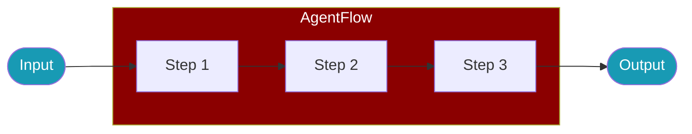

# AgentFlow

<Badge>v1.5.5+</Badge>

`AgentFlow` is the primary class for step-based workflow execution in PraisonAI TypeScript. It enables complex multi-agent pipelines with routing, parallel execution, and context sharing.

<Note>
`AgentFlow` replaces `Workflow` and `Pipeline` as the recommended class name. The old names still work as silent aliases.
</Note>



## Quick Start

<Steps>
  <Step title="Install">
    ```bash
    npm install praisonai
    ```
  </Step>
  <Step title="Create Agents">
    ```typescript
    import { Agent, AgentFlow } from 'praisonai';

    const researcher = new Agent({ instructions: "Research the topic" });
    const writer = new Agent({ instructions: "Write based on research" });
    ```
  </Step>
  <Step title="Create Flow">
    ```typescript
    const flow = new AgentFlow('content-pipeline')
      .agent(researcher, "Research AI trends")
      .agent(writer, "Write article based on research");

    const { output } = await flow.run("AI in 2025");
    ```
  </Step>
</Steps>

## Usage Patterns

<Tabs>
  <Tab title="Agent Steps">
    ```typescript
    import { Agent, AgentFlow } from 'praisonai';

    const researcher = new Agent({ instructions: "Research topics" });
    const writer = new Agent({ instructions: "Write content" });

    const flow = new AgentFlow('research-pipeline')
      .agent(researcher, "Research the topic")
      .agent(writer, "Write based on research");

    const { output } = await flow.run("AI trends");
    ```
  </Tab>
  <Tab title="Custom Steps">
    ```typescript
    const flow = new AgentFlow('data-pipeline')
      .step('fetch', async (input) => {
        return await fetchData(input);
      })
      .step('process', async (data) => {
        return processData(data);
      })
      .step('save', async (result) => {
        return await saveResult(result);
      });

    const { output } = await flow.run(inputData);
    ```
  </Tab>
  <Tab title="With Context">
    ```typescript
    const flow = new AgentFlow('analysis')
      .addStep({
        name: 'analyze',
        execute: async (input, context) => {
          const result = await agent.chat(input);
          context.set('analysis', result);
          return result;
        }
      })
      .addStep({
        name: 'report',
        execute: async (input, context) => {
          const analysis = context.get('analysis');
          return generateReport(analysis, input);
        }
      });
    ```
  </Tab>
</Tabs>

## Step Configuration

<ParamField path="name" type="string" required>
  Step identifier
</ParamField>

<ParamField path="execute" type="function" required>
  Async function that processes input and returns output
</ParamField>

<ParamField path="condition" type="function">
  Optional condition to skip the step
</ParamField>

<ParamField path="onError" type="'fail' | 'skip' | 'retry'" default="fail">
  Error handling behavior
</ParamField>

<ParamField path="maxRetries" type="number" default="0">
  Maximum retry attempts
</ParamField>

## Workflow Patterns

### Sequential Pipeline

```typescript
const flow = new AgentFlow('content-creation')
  .step('research', async (topic) => researcher.chat(`Research: ${topic}`))
  .step('write', async (research) => writer.chat(`Write about: ${research}`))
  .step('edit', async (draft) => editor.chat(`Edit: ${draft}`));

const { output } = await flow.run('AI in healthcare');
```

### Parallel Execution

```typescript
import { parallel } from 'praisonai';

const [sentiment, summary, keywords] = await parallel([
  async () => sentimentAgent.chat(document),
  async () => summaryAgent.chat(document),
  async () => keywordAgent.chat(document)
]);
```

### Conditional Routing

```typescript
import { route } from 'praisonai';

const result = await route([
  {
    condition: () => query.includes('technical'),
    execute: async () => techAgent.chat(query)
  },
  {
    condition: () => query.includes('billing'),
    execute: async () => billingAgent.chat(query)
  }
], async () => generalAgent.chat(query));
```

## Examples

### Research Pipeline

```typescript
import { Agent, AgentFlow } from 'praisonai';

const researcher = new Agent({
  name: 'Researcher',
  instructions: 'Research topics and gather information.'
});

const writer = new Agent({
  name: 'Writer',
  instructions: 'Write clear, engaging content.'
});

const editor = new Agent({
  name: 'Editor',
  instructions: 'Review and improve writing quality.'
});

const contentPipeline = new AgentFlow('content-creation')
  .agent(researcher, 'Research the topic')
  .agent(writer, 'Write an article')
  .agent(editor, 'Edit and polish');

const { output, results } = await contentPipeline.run('AI in healthcare');

console.log('Final article:', output);
console.log('Step results:', results);
```

### Error Handling

```typescript
const resilientFlow = new AgentFlow('resilient')
  .addStep({
    name: 'primary',
    execute: async (input) => primaryAgent.chat(input),
    onError: 'skip',
    maxRetries: 2
  })
  .addStep({
    name: 'fallback',
    condition: (context) => context.get('primary') === undefined,
    execute: async (input) => fallbackAgent.chat(input)
  });
```

## Backward Compatibility

<Check>
All old names work as silent aliases with no deprecation warnings.
</Check>

```typescript
// All of these are equivalent
import { AgentFlow, Workflow, Pipeline } from 'praisonai';

const flow1 = new AgentFlow('my-flow');
const flow2 = new Workflow('my-flow');
const flow3 = new Pipeline('my-flow');

// They are the same class
console.log(AgentFlow === Workflow);   // true
console.log(AgentFlow === Pipeline);   // true
```

## Related

<CardGroup cols={2}>
  <Card title="AgentTeam" icon="users" href="/docs/js/agent-team">
    Multi-agent orchestration
  </Card>
  <Card title="Workflow Hooks" icon="hook" href="/docs/js/workflow-hooks">
    Lifecycle hooks for workflows
  </Card>
</CardGroup>
