AgentFlow enables complex multi-step pipelines with routing, parallel execution, and context sharing between steps.

<Note>
`AgentFlow` replaces `Workflow` and `Pipeline` as the recommended class name. The old names still work as silent aliases.

```mermaid
graph LR
    subgraph "AgentFlow"
        S1[📋 Step 1]
        S2[⚙️ Step 2]
        S3[✅ Step 3]
    end
    
    Input([📥 Input]) --> S1
    S1 --> S2
    S2 --> S3
    S3 --> Output([📤 Output])
    
    classDef step fill:#8B0000,stroke:#7C90A0,color:#fff
    classDef io fill:#189AB4,stroke:#7C90A0,color:#fff
    
    class S1,S2,S3 step
    class Input,Output io
```

</Note>



## Quick Start

<Steps>

<Step title="Install">
```bash
npm install praisonai
```
</Step>

<Step title="Create Flow">
```typescript
import { Agent, AgentFlow } from 'praisonai';

const researcher = new Agent({
  instructions: 'Research the topic'
});

const writer = new Agent({
  instructions: 'Write based on research'
});

const flow = new AgentFlow('content-pipeline')
  .agent(researcher, 'Research AI trends')
  .agent(writer, 'Write article based on research');

const { output } = await flow.run('AI in 2025');
```
</Step>

</Steps>

---

## How It Works


| Component | Description |
|-----------|-------------|
| Steps | Individual processing units (agents or functions) |
| Context | Shared state between steps |
| Output | Final result from the last step |
| Results | All intermediate step results |

---

## Configuration Options

### Step Configuration

```typescript
flow.addStep({
  name: 'process',
  execute: async (input, context) => {
    return processData(input);
  },
  condition: (context) => context.get('shouldRun'),
  onError: 'retry',
  maxRetries: 3
});
```

| Option | Type | Default | Description |
|--------|------|---------|-------------|
| `name` | `string` | required | Step identifier |
| `execute` | `function` | required | Async function to process input |
| `condition` | `function` | `undefined` | Condition to run the step |
| `onError` | `'fail' \| 'skip' \| 'retry'` | `'fail'` | Error handling behavior |
| `maxRetries` | `number` | `0` | Maximum retry attempts |

---

## Common Patterns

<Tabs>

<Tab title="Agent Steps">
```typescript
import { Agent, AgentFlow } from 'praisonai';

const researcher = new Agent({ instructions: 'Research topics' });
const writer = new Agent({ instructions: 'Write content' });

const flow = new AgentFlow('research-pipeline')
  .agent(researcher, 'Research the topic')
  .agent(writer, 'Write based on research');

const { output } = await flow.run('AI trends');
```
</Tab>

<Tab title="Custom Steps">
```typescript
const flow = new AgentFlow('data-pipeline')
  .step('fetch', async (input) => {
    return await fetchData(input);
  })
  .step('process', async (data) => {
    return processData(data);
  })
  .step('save', async (result) => {
    return await saveResult(result);
  });

const { output } = await flow.run(inputData);
```
</Tab>

<Tab title="With Context">
```typescript
const flow = new AgentFlow('analysis')
  .step('analyze', async (input, context) => {
    const result = await agent.chat(input);
    context.set('analysis', result);
    return result;
  })
  .step('report', async (input, context) => {
    const analysis = context.get('analysis');
    return generateReport(analysis, input);
  });
```
</Tab>

<Tab title="Conditional Steps">
```typescript
const flow = new AgentFlow('conditional')
  .addStep({
    name: 'primary',
    execute: async (input) => primaryAgent.chat(input),
    onError: 'skip'
  })
  .addStep({
    name: 'fallback',
    condition: (context) => context.get('primary') === undefined,
    execute: async (input) => fallbackAgent.chat(input)
  });
```
</Tab>

</Tabs>

---

## Workflow Helpers

### Parallel Execution

```typescript
import { parallel } from 'praisonai';

const [sentiment, summary, keywords] = await parallel([
  async () => sentimentAgent.chat(document),
  async () => summaryAgent.chat(document),
  async () => keywordAgent.chat(document)
]);
```

### Conditional Routing

```typescript
import { route } from 'praisonai';

const result = await route([
  {
    condition: () => query.includes('technical'),
    execute: async () => techAgent.chat(query)
  },
  {
    condition: () => query.includes('billing'),
    execute: async () => billingAgent.chat(query)
  }
], async () => generalAgent.chat(query));  // Default fallback
```

### Loop Pattern

```typescript
import { loop } from 'praisonai';

const result = await loop(
  async (context) => improverAgent.chat(context.get('draft')),
  (result) => result.includes('DONE'),  // Condition to stop
  { maxIterations: 5 }
);
```

---

## Best Practices

<AccordionGroup>
  <Accordion title="Use context for data sharing">
    Store intermediate results in context rather than return values.
    ```typescript
    context.set('research', researchData);
    // Later steps can access via context.get('research')
    ```
  </Accordion>
  
  <Accordion title="Handle errors gracefully">
    Use onError and maxRetries for resilient flows.
    ```typescript
    .addStep({
      name: 'api-call',
      execute: async (input) => callApi(input),
      onError: 'retry',
      maxRetries: 3
    })
    ```
  </Accordion>
  
  <Accordion title="Use conditions for branching">
    Skip steps conditionally based on context state.
    ```typescript
    .addStep({
      name: 'optional',
      condition: (ctx) => ctx.get('needsProcessing'),
      execute: async (input) => process(input)
    })
    ```
  </Accordion>
</AccordionGroup>

---

## Backward Compatibility

<Check>
All old names work as silent aliases with no deprecation warnings.
</Check>

```typescript
// All of these are equivalent
import { AgentFlow, Workflow, Pipeline } from 'praisonai';

const flow1 = new AgentFlow('my-flow');
const flow2 = new Workflow('my-flow');
const flow3 = new Pipeline('my-flow');

// They are the same class
console.log(AgentFlow === Workflow);   // true
console.log(AgentFlow === Pipeline);   // true
```

---

## Related

<CardGroup cols={2}>
  <Card title="AgentTeam" icon="users" href="/docs/js/agent-team">
    Multi-agent orchestration
  </Card>
  <Card title="AgentOS" icon="rocket" href="/docs/js/agentos">
    Deploy as web service
  </Card>
  <Card title="Workflow Hooks" icon="webhook" href="/docs/js/workflow-hooks">
    Lifecycle hooks for workflows
  </Card>
</CardGroup>
