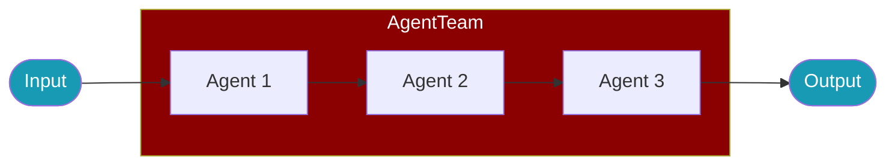

# AgentTeam

<Badge>v1.5.5+</Badge>

`AgentTeam` is the primary class for multi-agent orchestration in PraisonAI TypeScript. It coordinates multiple agents working together sequentially or in parallel.

<Note>
`AgentTeam` replaces `Agents` and `PraisonAIAgents` as the recommended class name. The old names still work as silent aliases.
</Note>



## Quick Start

<Steps>
  <Step title="Install">
    ```bash
    npm install praisonai
    ```
  </Step>
  <Step title="Create Agents">
    ```typescript
    import { Agent, AgentTeam } from 'praisonai';

    const researcher = new Agent({ instructions: "Research the topic" });
    const writer = new Agent({ instructions: "Write based on research" });
    ```
  </Step>
  <Step title="Create Team">
    ```typescript
    const team = new AgentTeam([researcher, writer]);
    const results = await team.start();
    ```
  </Step>
</Steps>

## Usage Patterns

<Tabs>
  <Tab title="Array Syntax">
    ```typescript
    import { Agent, AgentTeam } from 'praisonai';

    const agent1 = new Agent({ instructions: "Analyze data" });
    const agent2 = new Agent({ instructions: "Summarize analysis" });

    // Simple array syntax
    const team = new AgentTeam([agent1, agent2]);
    await team.start();
    ```
  </Tab>
  <Tab title="Config Object">
    ```typescript
    const team = new AgentTeam({
      agents: [agent1, agent2],
      process: 'sequential',  // or 'parallel'
      verbose: true
    });
    ```
  </Tab>
  <Tab title="Parallel Execution">
    ```typescript
    const team = new AgentTeam({
      agents: [analyst1, analyst2, analyst3],
      process: 'parallel'
    });

    // All agents run simultaneously
    const results = await team.start();
    ```
  </Tab>
</Tabs>

## Configuration

<ParamField path="agents" type="Agent[]" required>
  Array of Agent instances to orchestrate
</ParamField>

<ParamField path="tasks" type="string[]">
  Custom tasks for each agent (overrides agent instructions)
</ParamField>

<ParamField path="process" type="'sequential' | 'parallel'" default="sequential">
  Execution mode
</ParamField>

<ParamField path="verbose" type="boolean" default="true">
  Enable logging output
</ParamField>

## Examples

### Research Pipeline

```typescript
import { Agent, AgentTeam } from 'praisonai';

const researcher = new Agent({
  name: "Researcher",
  instructions: "Research topics thoroughly and gather key facts."
});

const analyst = new Agent({
  name: "Analyst",
  instructions: "Analyze research findings and identify patterns."
});

const writer = new Agent({
  name: "Writer",
  instructions: "Write clear, engaging content based on analysis."
});

const pipeline = new AgentTeam([researcher, analyst, writer]);
const results = await pipeline.start();

console.log("Research:", results[0]);
console.log("Analysis:", results[1]);
console.log("Article:", results[2]);
```

### Parallel Analysis

```typescript
const sentimentAgent = new Agent({ instructions: "Analyze sentiment" });
const summaryAgent = new Agent({ instructions: "Summarize content" });
const keywordsAgent = new Agent({ instructions: "Extract keywords" });

const team = new AgentTeam({
  agents: [sentimentAgent, summaryAgent, keywordsAgent],
  process: 'parallel',
  tasks: [
    "Analyze: 'The product is amazing but expensive'",
    "Summarize: 'The product is amazing but expensive'",
    "Extract keywords: 'The product is amazing but expensive'"
  ]
});

const [sentiment, summary, keywords] = await team.start();
```

## Backward Compatibility

<Check>
All old names work as silent aliases with no deprecation warnings.
</Check>

```typescript
// All of these are equivalent
import { AgentTeam, Agents, PraisonAIAgents } from 'praisonai';

const team1 = new AgentTeam([agent1, agent2]);
const team2 = new Agents([agent1, agent2]);
const team3 = new PraisonAIAgents([agent1, agent2]);

// They are the same class
console.log(AgentTeam === Agents);           // true
console.log(AgentTeam === PraisonAIAgents);  // true
```

## Related

<CardGroup cols={2}>
  <Card title="Agent" icon="robot" href="/docs/js/agent">
    Single agent documentation
  </Card>
  <Card title="AgentFlow" icon="diagram-project" href="/docs/js/agent-flow">
    Step-based workflows
  </Card>
</CardGroup>
