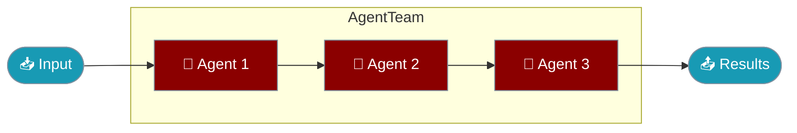
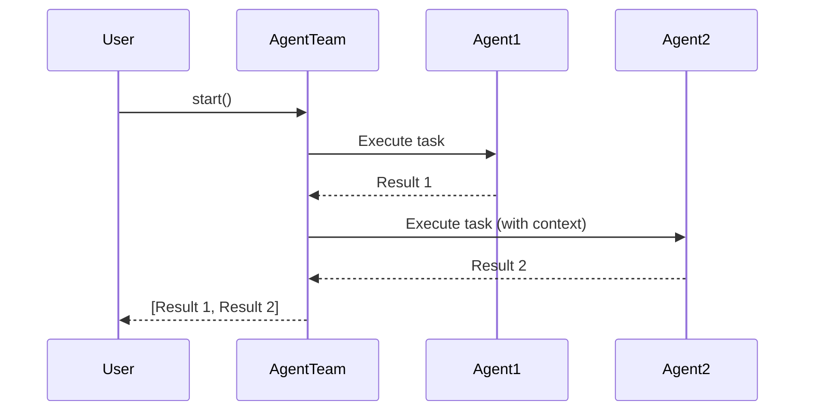
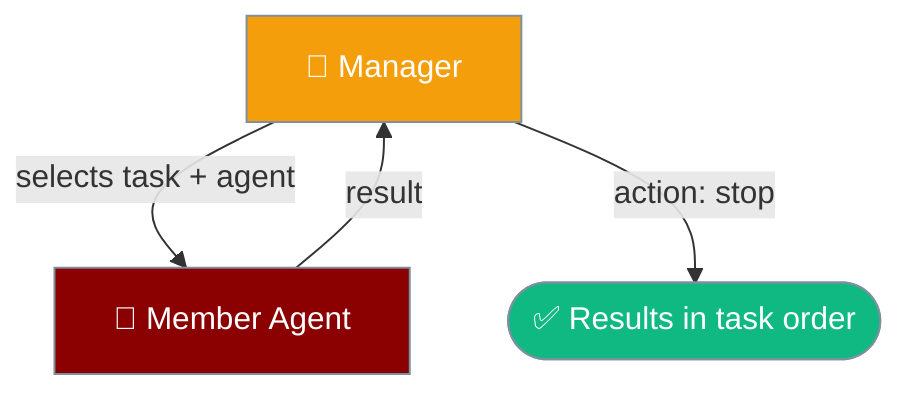
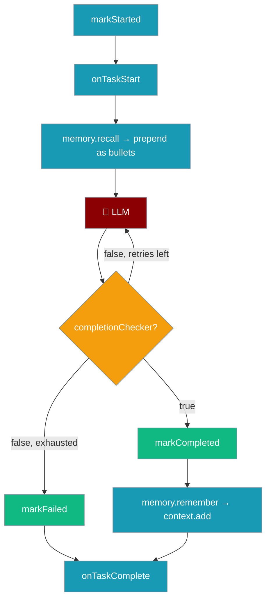

AgentTeam coordinates multiple agents working together, executing tasks sequentially or in parallel.

<Note>
`AgentTeam` replaces `Agents` and `PraisonAIAgents` as the recommended class name. The old names still work as silent aliases.
</Note>

<Note>
Seven team-level options are now honoured — `memory`, `context`, `hooks`, `execution`, `planning`, `managerLlm`, and `runOn` (which is **refused** with a `TypeError`, matching Python). Eight more (`knowledge`, `guardrails`, `web`, `reflection`, `caching`, `learn`, `autonomy`, `toolsRunOn`) are accepted for Python-SDK parity but emit a `[praisonai] … not yet honoured` notice. See the [Parity Notices](/docs/features/typescript-parity-notices) page for the full list.
</Note>


```mermaid
graph LR
    subgraph "AgentTeam"
        A1[🤖 Agent 1]
        A2[🤖 Agent 2]
        A3[🤖 Agent 3]
    end
    
    Input([📥 Input]) --> A1
    A1 --> A2
    A2 --> A3
    A3 --> Output([📤 Results])
    
    classDef agent fill:#8B0000,stroke:#7C90A0,color:#fff
    classDef io fill:#189AB4,stroke:#7C90A0,color:#fff
    
    class A1,A2,A3 agent
    class Input,Output io
    classDef agent fill:#8B0000,color:#fff
    classDef tool fill:#189AB4,color:#fff
```

## Quick Start

<Steps>

<Step title="Simple Usage">
```bash
npm install praisonai
```
</Step>

<Step title="With Configuration">
```typescript
import { Agent, AgentTeam } from 'praisonai';

const researcher = new Agent({
  name: 'Researcher',
  instructions: 'Research the topic thoroughly'
});

const writer = new Agent({
  name: 'Writer',
  instructions: 'Write based on research findings'
});

const team = new AgentTeam({
  agents: [researcher, writer]
});

const results = await team.start();
```
</Step>

</Steps>

---

## How It Works


```mermaid
sequenceDiagram
    participant User
    participant AgentTeam
    participant Agent1
    participant Agent2
    
    User->>AgentTeam: start()
    AgentTeam->>Agent1: Execute task
    Agent1-->>AgentTeam: Result 1
    AgentTeam->>Agent2: Execute task (with context)
    Agent2-->>AgentTeam: Result 2
    AgentTeam-->>User: [Result 1, Result 2]
```

| Mode | Behavior |
|------|----------|
| Sequential | Each agent runs after the previous completes, sharing context |
| Parallel | All agents run simultaneously, results collected together |

---

## Configuration Options

```typescript
import { Agent, AgentTeam } from 'praisonai';

const team = new AgentTeam({
  agents: [agent1, agent2],
  tasks: ['Research AI trends', 'Write summary'],
  process: 'sequential',
  verbose: true,
  pretty: true
});
```

| Option | Type | Default | Description |
|--------|------|---------|-------------|
| `agents` | `Agent[]` | required | Array of agents to orchestrate |
| `tasks` | `string[]` | `[]` | Custom tasks for each agent |
| `process` | `'sequential' \| 'parallel' \| 'hierarchical'` | `'sequential'` | Execution mode |
| `verbose` | `boolean` | `true` | Enable logging output |
| `pretty` | `boolean` | `false` | Enable formatted output |
| `llm` | `string` | Agent default | Default LLM for all agents |
| `memory` | `boolean \| string \| MemoryConfig \| TeamMemoryStore \| { userId?, config?, ... }` | `false` | One shared store for the team — recalled entries are appended to each task prompt as bullet lines, and each task's result is written back. |
| `context` | `boolean \| string \| ContextManagerConfig \| ContextManager` | `false` | One `ContextManager` for the run — every task sees everything the team produced, not just the previous result. |
| `hooks` | `{ onTaskStart?, onTaskComplete?, completionChecker? }` | – | Team lifecycle callbacks. Returning `false` from `completionChecker` retries the task. |
| `execution` | `string \| { maxIter, maxRetries } \| [preset, overrides]` | `{ maxIter: 10, maxRetries: 5 }` | Iteration/retry limits — preset (`"fast" \| "balanced" \| "thorough" \| "unlimited"`), object, or preset+overrides. Floors: `maxRetries ≥ 3`, `maxIter ≥ 1`. |
| `planning` | `boolean \| string \| { llm, autoApprove, approveFn, onReject } \| [model, overrides]` | `false` | Plan-first mode. Task descriptions become one plan request; the plan's steps replace the tasks for that run. Defaults to `gpt-4o-mini` as planner. |
| `managerLlm` | `string` | `OPENAI_MODEL_NAME` env, then `'gpt-4o-mini'` | Model for the hierarchical manager (used only with `process: 'hierarchical'`). |
| `runOn` | – | – | **Refused.** Passing `runOn` throws a `TypeError` at construction, matching Python. `runOn` hands one agent's whole loop to a managed runtime, and a team orchestrates several agents locally — there is no single loop to hand over. |

---

## Team-Level Options

Seven options now shape how the whole team runs.

<Tabs>

<Tab title="memory">
One shared store for the team — recalled entries are appended to each task's prompt as bullet lines, and each task's result is written back.

```typescript
// memory — shared in-process store
const team = new AgentTeam({
  agents: [researcher, writer],
  tasks: ['Summarise whales', 'Draft the article'],
  memory: true,
});

// memory — bring your own store
const teamWithStore = new AgentTeam({
  agents: [researcher, writer],
  memory: {
    search: async (query, limit) => [{ entry: { content: '...', role: 'assistant' }, score: 1 }],
    add: async (content, role, metadata) => undefined,
  },
});

// memory — file path
new AgentTeam({ agents, memory: '/path/to/memories.jsonl' });

// memory — userId-scoped
new AgentTeam({ agents, memory: { userId: 'me', config: store } });
```

<Note>
Recalled entries are appended as bullet lines (`• text`) with no section header. Each completed task is written back as a user + assistant turn with `{ task, userId }` metadata; `userId` defaults to `"praison"`.
</Note>
</Tab>

<Tab title="context">
One `ContextManager` for the run — every task is handed the accumulated context of all earlier tasks, not just the previous result.

```typescript
// context — third task sees "reply(task one)\n\nreply(task two)…"
const team = new AgentTeam({
  agents: [worker],
  tasks: ['task one', 'task two', 'task three'],
  context: true,
});
```
</Tab>

<Tab title="hooks">
Team lifecycle callbacks. Returning `false` from `completionChecker` retries the task.

```typescript
new AgentTeam({
  agents: [...],
  tasks: [...],
  hooks: {
    onTaskStart: (task, taskId) => { /* task: TeamTaskRef */ },
    onTaskComplete: (task, output) => { /* output: TaskOutput */ },
    completionChecker: (task, agentOutput) => agentOutput.length > 0, // false → retry
  },
});
// snake_case keys on_task_start, on_task_complete, completion_checker are also accepted
```
</Tab>

<Tab title="execution">
Iteration and retry limits, as a preset, an object, or `[preset, overrides]`.

```typescript
new AgentTeam({ agents, execution: 'fast' });        // maxIter 5,  maxRetries 3 (floor)
new AgentTeam({ agents, execution: 'balanced' });    // maxIter 10, maxRetries 5
new AgentTeam({ agents, execution: 'thorough' });    // maxIter 20, maxRetries 5
new AgentTeam({ agents, execution: 'unlimited' });   // maxIter 100, maxRetries 10
new AgentTeam({ agents, execution: { maxIter: 10, maxRetries: 7 } });
new AgentTeam({ agents, execution: ['balanced', { maxRetries: 8 }] });
// snake_case max_iter / max_retries also accepted
```

<Note>
Floors are enforced silently: `maxRetries` is lifted to `3` if lower, `maxIter` to `1` if lower.
</Note>
</Tab>

<Tab title="planning">
Plan first: the task descriptions become one request, a planner turns it into steps, and the steps are what run.

```typescript
new AgentTeam({ agents, tasks: ['research whales'], planning: true });   // planner = gpt-4o-mini
new AgentTeam({ agents, planning: 'gpt-4o' });                           // string names planner LLM
new AgentTeam({ agents, planning: { llm: 'gpt-4o', autoApprove: true, approveFn: (plan) => true, onReject: (plan) => {} } });
new AgentTeam({ agents, planning: ['gpt-4o', { autoApprove: false }] });

// After start(), inspect the plan and todo list
team.getPlan();      // Plan | undefined
team.getTodoList();  // TodoList | undefined
```

<Note>
Plan steps replace the tasks for that run only — a later `start()` re-plans from the original tasks. `planning.tools` and `planning.reasoning` are not available on the TypeScript `PlanningAgent` yet and emit parity notices.
</Note>
</Tab>

<Tab title="managerLlm">
Model for the hierarchical manager. With `process: 'hierarchical'` a Manager agent on this model decides which task runs next and which member runs it.

```typescript
const team = new AgentTeam({
  agents: [
    new Agent({ name: 'alpha', instructions: 'a', llm: 'alpha-model' }),
    new Agent({ name: 'beta',  instructions: 'b', llm: 'beta-model' }),
  ],
  tasks: ['task one', 'task two'],
  process: 'hierarchical',
  managerLlm: 'gpt-4o',
});
// Manager replies with JSON: { task_id, agent_name, action: 'execute' | 'stop' }
// Loop is bounded by MAX_INVALID_SELECTIONS = 3, MAX_TASK_RESELECTIONS = 3, plus execution.maxIter
// Results always stay in task order regardless of delegation order
```
</Tab>

<Tab title="runOn (refused)">
`runOn` is refused on a team: it hands one agent's whole loop to a managed runtime, and a team orchestrates several agents locally — there is no single loop to hand over.

```typescript
new AgentTeam({ agents, runOn: 'openai' });
// TypeError: AgentTeam(runOn="openai") is not supported: runOn= hands one agent's whole
// loop to a managed runtime, and a AgentTeam orchestrates several agents locally.
//   To run every step's tools in one shared sandbox: AgentTeam(toolsRunOn: "openai")
//   To host a single agent's loop, put runOn on that Agent.

new AgentTeam({ agents, runOn: 'openai', toolsRunOn: 'docker' });
// TypeError: ...points the tools at two machines...
```
</Tab>

</Tabs>

---

## Hierarchical Process

With `process: 'hierarchical'`, a Manager agent decides task order and delegation.


```mermaid
graph TB
    Manager[🧠 Manager] -->|selects task + agent| Member[🤖 Member Agent]
    Member -->|result| Manager
    Manager -->|action: stop| Done([✅ Results in task order])

    classDef manager fill:#F59E0B,stroke:#7C90A0,color:#fff
    classDef agent fill:#8B0000,stroke:#7C90A0,color:#fff
    classDef done fill:#10B981,stroke:#7C90A0,color:#fff

    class Manager manager
    class Member agent
    class Done done
```

The manager is built under the hood on `managerLlm` and replies with pinned JSON:

```json
{ "task_id": 0, "agent_name": "alpha", "action": "execute" }
```

`action` is `"execute" | "stop"`. On a parse error the whole run breaks and no member task runs (Python parity). Outcomes (`HierarchicalOutcome`): `'completed'`, `'stopped'`, `'max-iterations'`, `'invalid-selections'`, `'manager-error'`. Results always come back in task order regardless of the order the manager delegated.

---

## Read-Only Accessors

After `start()`, inspect what the team assembled.

| Accessor | Returns | Description |
|----------|---------|-------------|
| `team.getSharedMemory()` | `TeamMemoryStore \| undefined` | The shared memory store, if `memory` was set |
| `team.getContextManager()` | `ContextManager \| undefined` | The run's context manager, if `context` was set |
| `team.getPlan()` | `Plan \| undefined` | The generated plan, if `planning` was set |
| `team.getTodoList()` | `TodoList \| undefined` | The plan's todo list, if `planning` was set |

---

## How the Retry Loop Works

`completionChecker` returning `false` triggers a retry, bounded by `execution.maxRetries`.


```mermaid
graph TB
    Start[markStarted] --> OnStart[onTaskStart]
    OnStart --> Recall[memory.recall → prepend as bullets]
    Recall --> LLM[🤖 LLM]
    LLM --> Check{completionChecker?}
    Check -->|false, retries left| LLM
    Check -->|false, exhausted| Failed[markFailed]
    Check -->|true| Completed[markCompleted]
    Completed --> Remember[memory.remember → context.add]
    Failed --> OnComplete[onTaskComplete]
    Remember --> OnComplete

    classDef step fill:#189AB4,stroke:#7C90A0,color:#fff
    classDef llm fill:#8B0000,stroke:#7C90A0,color:#fff
    classDef check fill:#F59E0B,stroke:#7C90A0,color:#fff
    classDef done fill:#10B981,stroke:#7C90A0,color:#fff

    class Start,OnStart,Recall,Remember,OnComplete step
    class LLM llm
    class Check check
    class Completed,Failed done
```

The default `completionChecker` accepts any non-empty answer. On final failure the task is marked `{ status: 'failed' }` — the task still ends and the run continues. This is the same rule as Python.

---

## Common Patterns

<Tabs>

<Tab title="Array Syntax">
```typescript
import { Agent, AgentTeam } from 'praisonai';

const agent1 = new Agent({ instructions: 'Analyze data' });
const agent2 = new Agent({ instructions: 'Summarize analysis' });

// Simple array syntax
const team = new AgentTeam([agent1, agent2]);
const results = await team.start();
```
</Tab>

<Tab title="Sequential">
```typescript
const team = new AgentTeam({
  agents: [researcher, analyst, writer],
  process: 'sequential'
});

// Research → Analysis → Writing
const results = await team.start();
```
</Tab>

<Tab title="Parallel">
```typescript
const team = new AgentTeam({
  agents: [sentimentAgent, summaryAgent, keywordsAgent],
  process: 'parallel',
  tasks: [
    'Analyze sentiment: "Great product!"',
    'Summarize: "Great product!"',
    'Extract keywords: "Great product!"'
  ]
});

// All run simultaneously
const [sentiment, summary, keywords] = await team.start();
```
</Tab>

<Tab title="With Custom Tasks">
```typescript
const team = new AgentTeam({
  agents: [agent1, agent2],
  tasks: [
    'Research the latest AI developments',
    'Write a blog post based on the research'
  ]
});

const results = await team.start();
```
</Tab>

</Tabs>

---

## Best Practices

<AccordionGroup>
  <Accordion title="Use sequential for dependent tasks">
    When agents need context from previous agents, use sequential mode.
    ```typescript
    const team = new AgentTeam({
      agents: [researcher, writer],
      process: 'sequential'  // Writer gets research context
    });
    ```
  </Accordion>
  
  <Accordion title="Use parallel for independent analysis">
    When tasks are independent, parallel mode is faster.
    ```typescript
    const team = new AgentTeam({
      agents: [analyzer1, analyzer2, analyzer3],
      process: 'parallel'  // All analyze simultaneously
    });
    ```
  </Accordion>
  
  <Accordion title="Match tasks to agents">
    Provide one task per agent for explicit control.
    ```typescript
    const team = new AgentTeam({
      agents: [agent1, agent2, agent3],
      tasks: ['Task 1', 'Task 2', 'Task 3']
    });
    ```
  </Accordion>
</AccordionGroup>

---

## Backward Compatibility

<Check>
All old names work as silent aliases with no deprecation warnings.
</Check>

```typescript
// All of these are equivalent
import { AgentTeam, Agents, PraisonAIAgents } from 'praisonai';

const team1 = new AgentTeam([agent1, agent2]);
const team2 = new Agents([agent1, agent2]);
const team3 = new PraisonAIAgents([agent1, agent2]);

// They are the same class
console.log(AgentTeam === Agents);           // true
console.log(AgentTeam === PraisonAIAgents);  // true
```

---

## Related

<CardGroup cols={2}>
  <Card title="Agent" icon="robot" href="/js/agent">
    Single agent documentation
  </Card>
  <Card title="AgentFlow" icon="diagram-project" href="/js/agent-flow">
    Step-based workflows
  </Card>
  <Card title="AgentOS" icon="rocket" href="/js/agentos">
    Deploy as web service
  </Card>
</CardGroup>
