AgentTeam coordinates multiple agents working together, executing tasks sequentially or in parallel.

<Note>
`AgentTeam` replaces `Agents` and `PraisonAIAgents` as the recommended class name. The old names still work as silent aliases.

```mermaid
graph LR
    subgraph "AgentTeam"
        A1[🤖 Agent 1]
        A2[🤖 Agent 2]
        A3[🤖 Agent 3]
    end
    
    Input([📥 Input]) --> A1
    A1 --> A2
    A2 --> A3
    A3 --> Output([📤 Results])
    
    classDef agent fill:#8B0000,stroke:#7C90A0,color:#fff
    classDef io fill:#189AB4,stroke:#7C90A0,color:#fff
    
    class A1,A2,A3 agent
    class Input,Output io
```

</Note>



## Quick Start

<Steps>

<Step title="Install">
```bash
npm install praisonai
```
</Step>

<Step title="Create Team">
```typescript
import { Agent, AgentTeam } from 'praisonai';

const researcher = new Agent({
  name: 'Researcher',
  instructions: 'Research the topic thoroughly'
});

const writer = new Agent({
  name: 'Writer',
  instructions: 'Write based on research findings'
});

const team = new AgentTeam({
  agents: [researcher, writer]
});

const results = await team.start();
```
</Step>

</Steps>

---

## How It Works


| Mode | Behavior |
|------|----------|
| Sequential | Each agent runs after the previous completes, sharing context |
| Parallel | All agents run simultaneously, results collected together |

---

## Configuration Options

```typescript
import { Agent, AgentTeam } from 'praisonai';

const team = new AgentTeam({
  agents: [agent1, agent2],
  tasks: ['Research AI trends', 'Write summary'],
  process: 'sequential',
  verbose: true,
  pretty: true
});
```

| Option | Type | Default | Description |
|--------|------|---------|-------------|
| `agents` | `Agent[]` | required | Array of agents to orchestrate |
| `tasks` | `string[]` | `[]` | Custom tasks for each agent |
| `process` | `'sequential' \| 'parallel'` | `'sequential'` | Execution mode |
| `verbose` | `boolean` | `true` | Enable logging output |
| `pretty` | `boolean` | `false` | Enable formatted output |
| `llm` | `string` | Agent default | Default LLM for all agents |

---

## Common Patterns

<Tabs>

<Tab title="Array Syntax">
```typescript
import { Agent, AgentTeam } from 'praisonai';

const agent1 = new Agent({ instructions: 'Analyze data' });
const agent2 = new Agent({ instructions: 'Summarize analysis' });

// Simple array syntax
const team = new AgentTeam([agent1, agent2]);
const results = await team.start();
```
</Tab>

<Tab title="Sequential">
```typescript
const team = new AgentTeam({
  agents: [researcher, analyst, writer],
  process: 'sequential'
});

// Research → Analysis → Writing
const results = await team.start();
```
</Tab>

<Tab title="Parallel">
```typescript
const team = new AgentTeam({
  agents: [sentimentAgent, summaryAgent, keywordsAgent],
  process: 'parallel',
  tasks: [
    'Analyze sentiment: "Great product!"',
    'Summarize: "Great product!"',
    'Extract keywords: "Great product!"'
  ]
});

// All run simultaneously
const [sentiment, summary, keywords] = await team.start();
```
</Tab>

<Tab title="With Custom Tasks">
```typescript
const team = new AgentTeam({
  agents: [agent1, agent2],
  tasks: [
    'Research the latest AI developments',
    'Write a blog post based on the research'
  ]
});

const results = await team.start();
```
</Tab>

</Tabs>

---

## Best Practices

<AccordionGroup>
  <Accordion title="Use sequential for dependent tasks">
    When agents need context from previous agents, use sequential mode.
    ```typescript
    const team = new AgentTeam({
      agents: [researcher, writer],
      process: 'sequential'  // Writer gets research context
    });
    ```
  </Accordion>
  
  <Accordion title="Use parallel for independent analysis">
    When tasks are independent, parallel mode is faster.
    ```typescript
    const team = new AgentTeam({
      agents: [analyzer1, analyzer2, analyzer3],
      process: 'parallel'  // All analyze simultaneously
    });
    ```
  </Accordion>
  
  <Accordion title="Match tasks to agents">
    Provide one task per agent for explicit control.
    ```typescript
    const team = new AgentTeam({
      agents: [agent1, agent2, agent3],
      tasks: ['Task 1', 'Task 2', 'Task 3']
    });
    ```
  </Accordion>
</AccordionGroup>

---

## Backward Compatibility

<Check>
All old names work as silent aliases with no deprecation warnings.
</Check>

```typescript
// All of these are equivalent
import { AgentTeam, Agents, PraisonAIAgents } from 'praisonai';

const team1 = new AgentTeam([agent1, agent2]);
const team2 = new Agents([agent1, agent2]);
const team3 = new PraisonAIAgents([agent1, agent2]);

// They are the same class
console.log(AgentTeam === Agents);           // true
console.log(AgentTeam === PraisonAIAgents);  // true
```

---

## Related

<CardGroup cols={2}>
  <Card title="Agent" icon="robot" href="/docs/js/agent">
    Single agent documentation
  </Card>
  <Card title="AgentFlow" icon="diagram-project" href="/docs/js/agent-flow">
    Step-based workflows
  </Card>
  <Card title="AgentOS" icon="rocket" href="/docs/js/agentos">
    Deploy as web service
  </Card>
</CardGroup>
