AgentOS deploys agents, teams, and flows as production-ready HTTP APIs with built-in health checks, CORS, and Express integration.

<Note>
`AgentOS` replaces `AgentApp` as the recommended class name. The old name still works as a silent alias.

```mermaid
graph LR
    subgraph "Development"
        A[🤖 Agent]
        T[👥 AgentTeam]
        F[🔄 AgentFlow]
    end
    
    subgraph "Production"
        OS[🚀 AgentOS]
    end
    
    subgraph "Endpoints"
        API["/api/chat"]
        Health["/health"]
        Agents["/api/agents"]
    end
    
    A --> OS
    T --> OS
    F --> OS
    OS --> API
    OS --> Health
    OS --> Agents
    
    classDef dev fill:#189AB4,stroke:#7C90A0,color:#fff
    classDef prod fill:#10B981,stroke:#7C90A0,color:#fff
    classDef endpoint fill:#6366F1,stroke:#7C90A0,color:#fff
    
    class A,T,F dev
    class OS prod
    class API,Health,Agents endpoint
```

</Note>



## Quick Start

<Steps>

<Step title="Install">
```bash
npm install praisonai express
```
</Step>

<Step title="Create Server">
```typescript
import { AgentOS, Agent } from 'praisonai';

const agent = new Agent({
  name: 'assistant',
  instructions: 'You are a helpful assistant'
});

const app = new AgentOS({
  name: 'My AI App',
  agents: [agent]
});

await app.serve({ port: 8000 });
```
</Step>

<Step title="Test">
```bash
curl -X POST http://localhost:8000/api/chat \
  -H "Content-Type: application/json" \
  -d '{"message": "Hello!"}'
```
</Step>

</Steps>

---

## How It Works


| Step | Description |
|------|-------------|
| 1 | Client sends HTTP request to AgentOS endpoint |
| 2 | AgentOS routes to the appropriate agent |
| 3 | Agent processes the message and returns a response |
| 4 | AgentOS formats and returns the response as JSON |

---

## Configuration Options

```typescript
import { AgentOS, Agent } from 'praisonai';

const app = new AgentOS({
  name: 'My AI App',
  agents: [agent],
  teams: [team],      // Optional: AgentTeam instances
  flows: [flow],      // Optional: AgentFlow instances
  config: {
    host: '0.0.0.0',
    port: 8000,
    corsOrigins: ['*'],
    apiPrefix: '/api',
    debug: false,
    timeout: 60
  }
});
```

| Option | Type | Default | Description |
|--------|------|---------|-------------|
| `name` | `string` | `"PraisonAI App"` | Application name |
| `agents` | `Agent[]` | `[]` | Agents to serve |
| `teams` | `AgentTeam[]` | `[]` | Teams to serve |
| `flows` | `AgentFlow[]` | `[]` | Flows to serve |
| `config.host` | `string` | `"0.0.0.0"` | Server host |
| `config.port` | `number` | `8000` | Server port |
| `config.corsOrigins` | `string[]` | `["*"]` | Allowed CORS origins |
| `config.apiPrefix` | `string` | `"/api"` | API route prefix |
| `config.debug` | `boolean` | `false` | Enable debug mode |
| `config.timeout` | `number` | `60` | Request timeout (seconds) |

---

## API Endpoints

| Endpoint | Method | Description |
|----------|--------|-------------|
| `/` | GET | App info (name, status, agent count) |
| `/health` | GET | Health check (`{ status: 'healthy' }`) |
| `/api/agents` | GET | List available agents |
| `/api/chat` | POST | Chat with an agent |
| `/api/teams` | GET | List available teams |
| `/api/flows` | GET | List available flows |

### Chat Request

```bash
curl -X POST http://localhost:8000/api/chat \
  -H "Content-Type: application/json" \
  -d '{
    "message": "Hello!",
    "agent_name": "assistant",
    "session_id": "user-123"
  }'
```

### Chat Response

```json
{
  "response": "Hello! How can I help you today?",
  "agent_name": "assistant",
  "session_id": "user-123"
}
```

---

## Common Patterns

<Tabs>

<Tab title="Single Agent">
```typescript
import { AgentOS, Agent } from 'praisonai';

const agent = new Agent({
  instructions: 'You are a helpful assistant'
});

const app = new AgentOS({ agents: [agent] });
await app.serve();
```
</Tab>

<Tab title="Multi-Agent">
```typescript
import { AgentOS, Agent } from 'praisonai';

const researcher = new Agent({ 
  name: 'researcher',
  instructions: 'Research topics' 
});
const writer = new Agent({ 
  name: 'writer',
  instructions: 'Write content' 
});

const app = new AgentOS({
  agents: [researcher, writer],
  name: 'content-team'
});
await app.serve();
```
</Tab>

<Tab title="With Teams">
```typescript
import { AgentOS, Agent, AgentTeam } from 'praisonai';

const agent = new Agent({
  instructions: 'You are a helpful assistant'
});

const team = new AgentTeam({
  agents: [agent],
  process: 'sequential'
});

const app = new AgentOS({
  agents: [agent],
  teams: [team]
});
await app.serve();
```
</Tab>

<Tab title="Custom API Prefix">
```typescript
const app = new AgentOS({
  agents: [agent],
  config: {
    apiPrefix: '/v1'
  }
});

// Endpoints now at /v1/chat, /v1/agents, etc.
```
</Tab>

</Tabs>

---

## Best Practices

<AccordionGroup>
  <Accordion title="Use environment variables for port">
    Read port from environment for deployment flexibility.
    ```typescript
    await app.serve({
      port: parseInt(process.env.PORT || '8000')
    });
    ```
  </Accordion>
  
  <Accordion title="Configure CORS for production">
    Restrict CORS origins in production instead of using '*'.
    ```typescript
    config: {
      corsOrigins: ['https://yourdomain.com']
    }
    ```
  </Accordion>
  
  <Accordion title="Stop server gracefully">
    Use the stop() method for clean shutdown.
    ```typescript
    process.on('SIGTERM', async () => {
      await app.stop();
      process.exit(0);
    });
    ```
  </Accordion>
</AccordionGroup>

---

## Backward Compatibility

<Check>
`AgentApp` works as a silent alias with no deprecation warnings.
</Check>

```typescript
// Both are equivalent
import { AgentOS, AgentApp } from 'praisonai';

const app1 = new AgentOS({ agents: [agent] });
const app2 = new AgentApp({ agents: [agent] });

// They are the same class
console.log(AgentOS === AgentApp); // true
```

Additional config aliases:
- `managers` → `teams` (deprecated)
- `workflows` → `flows` (deprecated)

---

## Related

<CardGroup cols={2}>
  <Card title="Agent" icon="robot" href="/docs/js/agent">
    Single agent documentation
  </Card>
  <Card title="AgentTeam" icon="users" href="/docs/js/agent-team">
    Multi-agent orchestration
  </Card>
  <Card title="AgentFlow" icon="diagram-project" href="/docs/js/agent-flow">
    Step-based workflows
  </Card>
  <Card title="Server Adapters" icon="server" href="/docs/js/server-adapters">
    Express, Hono, Next.js adapters
  </Card>
</CardGroup>
