# AgentOS

<Badge>v1.5.5+</Badge>

`AgentOS` deploys agents, teams, and flows as production-ready HTTP APIs with built-in health checks, CORS, and auto-documentation.

<Note>
`AgentOS` replaces `AgentApp` as the recommended class name. The old name still works as a silent alias.

```mermaid
graph LR
    subgraph "Development"
        A[🤖 Agent]
        T[👥 AgentTeam]
        F[🔄 AgentFlow]
    end
    
    subgraph "Production"
        OS[🚀 AgentOS]
    end
    
    subgraph "Endpoints"
        API["/api/chat"]
        Health["/health"]
        Docs["/docs"]
    end
    
    A --> OS
    T --> OS
    F --> OS
    OS --> API
    OS --> Health
    OS --> Docs
    
    classDef dev fill:#189AB4,stroke:#7C90A0,color:#fff
    classDef prod fill:#10B981,stroke:#7C90A0,color:#fff
    classDef endpoint fill:#6366F1,stroke:#7C90A0,color:#fff
    
    class A,T,F dev
    class OS prod
    class API,Health,Docs endpoint
```

</Note>



## Quick Start

<Steps>

<Step title="Install">
```bash
npm install praisonai
```
</Step>

<Step title="Create Server">
```typescript
import { AgentOS, Agent } from 'praisonai';

const agent = new Agent({
  instructions: "You are a helpful assistant"
});

const app = new AgentOS({
  agents: [agent],
  name: "my-assistant"
});

await app.serve({ port: 8080 });
```
</Step>

<Step title="Test">
```bash
curl -X POST http://localhost:8080/api/chat \
  -H "Content-Type: application/json" \
  -d '{"message": "Hello!"}'
```
</Step>

</Steps>

## Usage Patterns

<Tabs>

<Tab title="Single Agent">
```typescript
import { AgentOS, Agent } from 'praisonai';

const agent = new Agent({
  instructions: "You are a helpful assistant"
});

const app = new AgentOS({ agents: [agent] });
await app.serve();
```
</Tab>

<Tab title="Multi-Agent">
```typescript
import { AgentOS, Agent } from 'praisonai';

const researcher = new Agent({ 
  instructions: "Research topics" 
});
const writer = new Agent({ 
  instructions: "Write content" 
});

const app = new AgentOS({
  agents: [researcher, writer],
  name: "content-team"
});
await app.serve();
```
</Tab>

<Tab title="With Tools">
```typescript
import { AgentOS, Agent } from 'praisonai';

const getWeather = (city: string) => `Weather in ${city}: 22°C`;

const agent = new Agent({
  instructions: "You are a weather assistant",
  tools: [getWeather]
});

const app = new AgentOS({ agents: [agent] });
await app.serve();
```
</Tab>

</Tabs>

## API Endpoints

| Endpoint | Method | Purpose |
|----------|--------|---------|
| `/` | GET | App info and status |
| `/health` | GET | Health check |
| `/api/agents` | GET | List available agents |
| `/api/chat` | POST | Chat with default agent |
| `/api/chat/:agentId` | POST | Chat with specific agent |
| `/docs` | GET | OpenAPI documentation |

### Chat Request

```bash
curl -X POST http://localhost:8080/api/chat \
  -H "Content-Type: application/json" \
  -d '{
    "message": "Hello!",
    "sessionId": "user-123"
  }'
```

### Response

```json
{
  "response": "Hello! How can I help you today?",
  "sessionId": "user-123",
  "agentId": "agent-1"
}
```

## Configuration

<ParamField path="agents" type="Agent[]" required>
  Array of agents to deploy
</ParamField>

<ParamField path="name" type="string" default="praison-agents">
  Application name
</ParamField>

<ParamField path="cors" type="boolean | CorsOptions" default="true">
  CORS configuration
</ParamField>

<ParamField path="metadata" type="object">
  Optional metadata for the app
</ParamField>

### Serve Options

<ParamField path="port" type="number" default="8080">
  Server port
</ParamField>

<ParamField path="host" type="string" default="0.0.0.0">
  Server host
</ParamField>

## Examples

### Customer Support Bot

```typescript
import { AgentOS, Agent } from 'praisonai';

const supportAgent = new Agent({
  name: "Support",
  instructions: `You are a customer support agent.
  - Be helpful and polite
  - Ask clarifying questions
  - Provide solutions`
});

const app = new AgentOS({
  agents: [supportAgent],
  name: "support-bot",
  cors: {
    origin: ["https://myapp.com"],
    credentials: true
  }
});

await app.serve({ port: 3000 });
```

### Multi-Agent API

```typescript
import { AgentOS, Agent } from 'praisonai';

const codeAgent = new Agent({
  name: "coder",
  instructions: "Help with coding questions"
});

const mathAgent = new Agent({
  name: "calculator",
  instructions: "Help with math problems"
});

const app = new AgentOS({
  agents: [codeAgent, mathAgent]
});

await app.serve();

// POST /api/chat/coder - Code questions
// POST /api/chat/calculator - Math questions
```

## CLI

```bash
# Start the server
npx praisonai-ts serve --port 8080

# With agent config
npx praisonai-ts serve --config agents.yaml
```

## Backward Compatibility

<Check>
`AgentApp` works as a silent alias with no deprecation warnings.
</Check>

```typescript
// Both are equivalent
import { AgentOS, AgentApp } from 'praisonai';

const app1 = new AgentOS({ agents: [agent] });
const app2 = new AgentApp({ agents: [agent] });

// They are the same class
console.log(AgentOS === AgentApp); // true
```

## Related

<CardGroup cols={2}>
  <Card title="Agent" icon="robot" href="/docs/js/agent">
    Single agent documentation
  </Card>
  <Card title="AgentTeam" icon="users" href="/docs/js/agent-team">
    Multi-agent orchestration
  </Card>
  <Card title="Server Adapters" icon="server" href="/docs/js/server-adapters">
    Express, Hono, Next.js adapters
  </Card>
</CardGroup>
