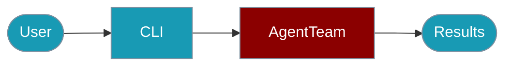

The PraisonAI TypeScript CLI runs multi-agent orchestration directly from the terminal.



## Quick Start

<Steps>

<Step title="Simple Usage">
```bash
praisonai-ts agents run --config agents.yaml
```
</Step>

<Step title="With Configuration">
```bash
praisonai-ts agents run \
  --agents "researcher,writer" \
  --task "Research and write about AI" \
  --process parallel
```
</Step>

</Steps>

---

## Commands Overview

```bash
# Run multiple agents
praisonai-ts agents run --config agents.yaml

# Run with inline definitions
praisonai-ts agents run --agents "researcher,writer" --task "Research and write about AI"
```

## agents run

Run multiple agents in sequence or parallel.

### Basic Usage

```bash
praisonai-ts agents run --config agents.yaml
```

### With Inline Agents

```bash
praisonai-ts agents run \
  --agents "Researcher:Research the topic,Writer:Write based on research" \
  --task "AI trends in 2024"
```

### Options

| Option | Description | Default |
|--------|-------------|---------|
| `--config`, `-c` | Path to agents YAML config | - |
| `--agents`, `-a` | Inline agent definitions (name:instructions) | - |
| `--task`, `-t` | Task to execute | - |
| `--process`, `-p` | Process mode: sequential, parallel | `sequential` |
| `--model`, `-m` | LLM model for all agents | `gpt-4o-mini` |
| `--verbose`, `-v` | Enable verbose output | `true` |
| `--json` | Output as JSON | `false` |

### Examples

```bash
# Sequential pipeline
praisonai-ts agents run \
  --agents "Researcher:Research AI,Analyst:Analyze findings,Writer:Write report" \
  --task "AI market analysis" \
  --process sequential

# Parallel execution
praisonai-ts agents run \
  --agents "Analyst1:Analyze market A,Analyst2:Analyze market B" \
  --task "Compare markets" \
  --process parallel

# With config file
praisonai-ts agents run --config ./my-agents.yaml

# JSON output
praisonai-ts agents run \
  --agents "Agent1:Task 1,Agent2:Task 2" \
  --task "Complete workflow" \
  --json
```

## Configuration File Format

### agents.yaml

```yaml
agents:
  - name: Researcher
    instructions: |
      You are a research specialist.
      Find accurate information on the given topic.
    model: gpt-4o-mini
    
  - name: Writer
    instructions: |
      You are a content writer.
      Write engaging content based on research.
    model: gpt-4o-mini

process: sequential
verbose: true
```

### With Tasks

```yaml
agents:
  - name: Researcher
    instructions: Research the topic
  - name: Writer
    instructions: Write based on research

tasks:
  - Research AI developments in 2024
  - Write a 500-word summary

process: sequential
```

### With Tools

```yaml
agents:
  - name: WebResearcher
    instructions: Search the web for information
    tools:
      - web_search
      - read_url
      
  - name: DataAnalyst
    instructions: Analyze the collected data
    tools:
      - analyze_data
```

## JSON Output Format

```json
{
  "success": true,
  "data": {
    "results": [
      {
        "agent": "Researcher",
        "output": "Research findings..."
      },
      {
        "agent": "Writer",
        "output": "Written article..."
      }
    ],
    "process": "sequential",
    "agentCount": 2
  },
  "meta": {
    "duration_ms": 5432,
    "model": "gpt-4o-mini"
  }
}
```

## Process Modes

### Sequential

Agents run one after another. Each agent receives the previous agent's output:

```bash
praisonai-ts agents run \
  --agents "Step1:First task,Step2:Second task,Step3:Third task" \
  --process sequential
```

Output flow:
```
Step1 → output → Step2 → output → Step3 → final output
```

### Parallel

All agents run simultaneously:

```bash
praisonai-ts agents run \
  --agents "Worker1:Task A,Worker2:Task B,Worker3:Task C" \
  --process parallel
```

Output flow:
```
Worker1 → output1
Worker2 → output2  (all run at same time)
Worker3 → output3
```

## Environment Variables

```bash
# API Keys
export OPENAI_API_KEY=sk-...
export ANTHROPIC_API_KEY=sk-ant-...

# Default model
export PRAISONAI_MODEL=gpt-4o-mini

# Behavior
export PRAISON_VERBOSE=true
```

## Scripting Examples

### Bash Pipeline

```bash
#!/bin/bash

# Run agents and process results
RESULT=$(praisonai-ts agents run \
  --agents "Researcher:Find data,Analyst:Analyze data" \
  --task "Market analysis" \
  --json)

# Extract specific agent output
RESEARCH=$(echo $RESULT | jq -r '.data.results[0].output')
ANALYSIS=$(echo $RESULT | jq -r '.data.results[1].output')

echo "Research: $RESEARCH"
echo "Analysis: $ANALYSIS"
```

### Error Handling

```bash
#!/bin/bash

if ! praisonai-ts agents run --config agents.yaml; then
  echo "Agent execution failed"
  exit 1
fi
```

## Common Patterns

### Research → Write Pipeline

```bash
praisonai-ts agents run \
  --agents "Researcher:Research thoroughly,Writer:Write engaging content" \
  --task "Write about quantum computing"
```

### Multi-Perspective Analysis

```bash
praisonai-ts agents run \
  --agents "Optimist:Find positives,Pessimist:Find risks,Analyst:Balance views" \
  --task "Analyze the new product launch" \
  --process sequential
```

### Parallel Data Collection

```bash
praisonai-ts agents run \
  --agents "NewsAgent:Get news,SocialAgent:Get social trends,DataAgent:Get statistics" \
  --task "Gather information about AI" \
  --process parallel
```

## Related

<CardGroup cols={2}>
  <Card title="Agents" icon="users" href="/docs/js/agents">
    Multi-agent class documentation
  </Card>
  <Card title="Agent CLI" icon="terminal" href="/docs/js/agent-cli">
    Single-agent CLI
  </Card>
  <Card title="AgentTeam" icon="users" href="/docs/js/agent-team">
    AgentTeam orchestration
  </Card>
</CardGroup>
