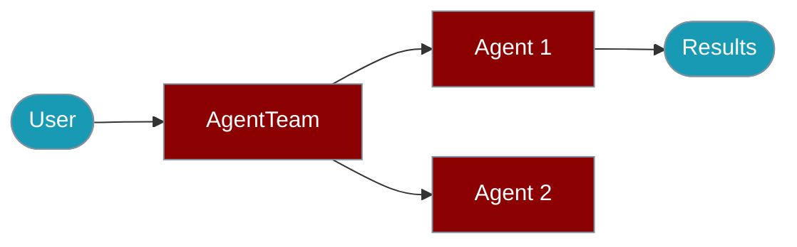

# Agents (Multi-Agent Orchestration)

<Note>
`AgentTeam` is now the primary class name (v1.5.5+). `Agents` is a silent alias for backward compatibility. See [AgentTeam](/docs/js/agent-team) for the latest documentation.
</Note>

The `Agents` class enables multi-agent orchestration, allowing multiple agents to work together sequentially or in parallel.



## Quick Start

<Steps>

<Step title="Simple Usage">
```typescript
import { Agent, AgentTeam } from 'praisonai';

// Create agents
const researcher = new Agent({ instructions: "Research the topic thoroughly" });
const writer = new Agent({ instructions: "Write based on the research" });

// Orchestrate with array syntax
const agents = new AgentTeam([researcher, writer]);
const results = await agents.start();
```
</Step>

<Step title="Install">
```bash
npm install praisonai
```
</Step>

</Steps>

---

## Basic Usage

### Array Syntax (Recommended)

```typescript
import { Agent, AgentTeam } from 'praisonai';

const agent1 = new Agent({ instructions: "Analyze the data" });
const agent2 = new Agent({ instructions: "Summarize the analysis" });

// Simple array syntax
const agents = new AgentTeam([agent1, agent2]);
await agents.start();
```

### Config Object Syntax

```typescript
const agents = new AgentTeam({
  agents: [agent1, agent2],
  process: 'sequential',  // or 'parallel'
  verbose: true
});
```

## Process Modes

### Sequential (Default)

Agents run one after another, with each agent receiving the output of the previous:

```typescript
const researcher = new Agent({ 
  name: "Researcher",
  instructions: "Research AI trends" 
});

const writer = new Agent({ 
  name: "Writer",
  instructions: "Write an article based on the research" 
});

const agents = new AgentTeam({
  agents: [researcher, writer],
  process: 'sequential'
});

const results = await agents.start();
// researcher runs first, writer receives researcher's output
```

### Parallel

All agents run simultaneously:

```typescript
const analyst1 = new Agent({ instructions: "Analyze market A" });
const analyst2 = new Agent({ instructions: "Analyze market B" });
const analyst3 = new Agent({ instructions: "Analyze market C" });

const agents = new AgentTeam({
  agents: [analyst1, analyst2, analyst3],
  process: 'parallel'
});

const results = await agents.start();
// All analysts run at the same time
```

## Configuration Options

```typescript
interface AgentsConfig {
  // Required
  agents: Agent[];              // Array of Agent instances
  
  // Optional
  tasks?: string[];             // Custom tasks for each agent
  process?: 'sequential' | 'parallel';  // Execution mode
  verbose?: boolean;            // Enable logging
  pretty?: boolean;             // Pretty output formatting
}
```

## Custom Tasks

Override agent instructions with specific tasks:

```typescript
const agents = new AgentTeam({
  agents: [researcher, writer],
  tasks: [
    "Research the history of artificial intelligence",
    "Write a 500-word summary of the research"
  ]
});
```

## Examples

### Research Pipeline

```typescript
import { Agent, AgentTeam } from 'praisonai';

const researcher = new Agent({
  name: "Researcher",
  instructions: "You are a thorough researcher. Find key facts and data."
});

const analyst = new Agent({
  name: "Analyst", 
  instructions: "You analyze research findings and identify patterns."
});

const writer = new Agent({
  name: "Writer",
  instructions: "You write clear, engaging content based on analysis."
});

const pipeline = new AgentTeam([researcher, analyst, writer]);
const results = await pipeline.start();

console.log("Research:", results[0]);
console.log("Analysis:", results[1]);
console.log("Article:", results[2]);
```

### Parallel Analysis

```typescript
const sentimentAgent = new Agent({
  instructions: "Analyze the sentiment of the text"
});

const summaryAgent = new Agent({
  instructions: "Summarize the main points"
});

const keywordsAgent = new Agent({
  instructions: "Extract key topics and keywords"
});

const agents = new AgentTeam({
  agents: [sentimentAgent, summaryAgent, keywordsAgent],
  process: 'parallel',
  tasks: [
    "Analyze: 'The product is amazing but expensive'",
    "Summarize: 'The product is amazing but expensive'",
    "Extract keywords: 'The product is amazing but expensive'"
  ]
});

const [sentiment, summary, keywords] = await agents.start();
```

### With Tools

```typescript
const searchWeb = (query: string) => `Results for: ${query}`;
const analyzeData = (data: string) => `Analysis of: ${data}`;

const researcher = new Agent({
  instructions: "Research using web search",
  tools: [searchWeb]
});

const analyst = new Agent({
  instructions: "Analyze the research data",
  tools: [analyzeData]
});

const agents = new AgentTeam([researcher, analyst]);
await agents.start();
```

## Accessing Results

```typescript
const agents = new AgentTeam([agent1, agent2, agent3]);
const results = await agents.start();

// Results is an array matching agent order
results.forEach((result, index) => {
  console.log(`Agent ${index + 1}: ${result}`);
});
```

## Legacy Compatibility

`Agents` is an alias for `AgentTeam`:

```typescript
// Both are equivalent
import { AgentTeam, Agents } from 'praisonai';

const a1 = new AgentTeam([agent1, agent2]);
const a2 = new Agents([agent1, agent2]);

// They are the same class
console.log(AgentTeam === Agents); // true
```

## Related

<CardGroup cols={2}>
  <Card title="AgentTeam" icon="users" href="/docs/js/agent-team">
    Recommended team orchestration
  </Card>
  <Card title="Agent" icon="robot" href="/docs/js/agent">
    Single agent API
  </Card>
  <Card title="Agents CLI" icon="terminal" href="/docs/js/agents-cli">
    CLI commands
  </Card>
</CardGroup>

