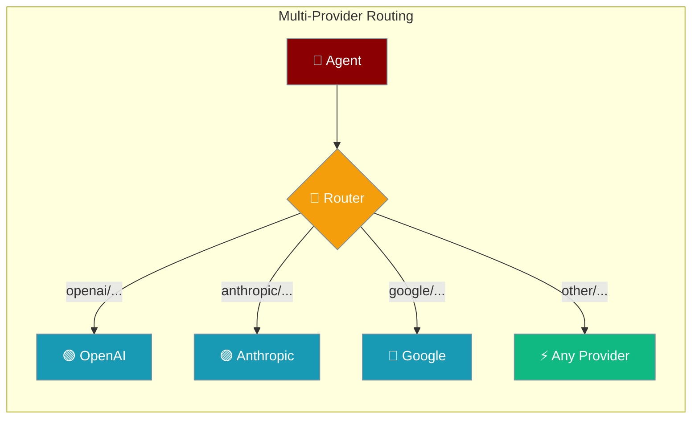
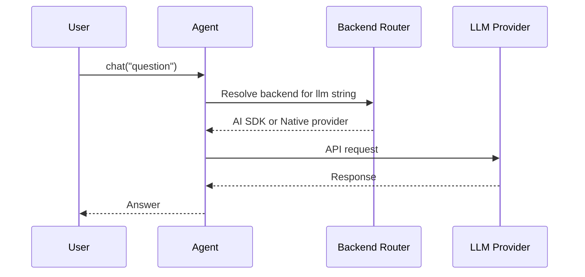

Switch between any LLM provider — OpenAI, Anthropic, Google, and more — without changing your agent code.



## Quick Start

<Steps>
<Step title="Simple Usage">
```bash
npm install praisonai
```
</Step>

<Step title="With Configuration">
```typescript
import { Agent } from 'praisonai';

const agent = new Agent({
  instructions: 'You are a helpful assistant.',
  llm: 'openai/gpt-4o-mini'
});

const response = await agent.chat('Hello, how are you?');
console.log(response);
```
</Step>

<Step title="Switch Providers with One Line">
```typescript
import { Agent } from 'praisonai';

const agent = new Agent({
  instructions: 'You are a helpful assistant.',
  llm: 'anthropic/claude-3-5-sonnet-latest'
});

const response = await agent.chat('Explain AI in one sentence');
console.log(response);
```
</Step>
</Steps>

---

## How It Works



---

## Supported Providers

| Provider | Model String | Example |
|----------|-------------|---------|
| OpenAI | `openai/model` | `openai/gpt-4o`, `openai/gpt-4o-mini` |
| Anthropic | `anthropic/model` | `anthropic/claude-3-5-sonnet-latest` |
| Google | `google/model` | `google/gemini-2.0-flash` |
| Groq | `groq/model` | `groq/llama-3.3-70b-versatile` |
| Mistral | `mistral/model` | `mistral/mistral-large-latest` |
| Cohere | `cohere/model` | `cohere/command-r-plus` |
| DeepSeek | `deepseek/model` | `deepseek/deepseek-chat` |
| xAI | `xai/model` | `xai/grok-2` |

---

## Common Patterns

### Agent with Tools

```typescript
import { Agent } from 'praisonai';

function getWeather(city: string): string {
  return JSON.stringify({ city, temperature: 22, condition: 'sunny' });
}

const agent = new Agent({
  instructions: 'You help users check the weather.',
  llm: 'openai/gpt-4o-mini',
  tools: [getWeather]
});

const response = await agent.chat('What is the weather in Paris?');
console.log(response);
```

### Structured Output

```typescript
import { Agent } from 'praisonai';
import { z } from 'zod';

const PersonSchema = z.object({
  name: z.string(),
  age: z.number(),
  city: z.string()
});

const agent = new Agent({
  instructions: 'Extract person information from text.',
  llm: 'openai/gpt-4o-mini',
  outputSchema: PersonSchema
});

const result = await agent.chat('John is 30 years old and lives in Paris');
```

### Multi-Agent Pipeline

```typescript
import { Agent } from 'praisonai';

const researcher = new Agent({
  name: 'researcher',
  instructions: 'Research topics thoroughly.',
  llm: 'anthropic/claude-3-5-sonnet-latest'
});

const writer = new Agent({
  name: 'writer',
  instructions: 'Write engaging content based on research.',
  llm: 'openai/gpt-4o'
});

const research = await researcher.chat('Research the history of AI');
const article = await writer.chat(`Write an article based on: ${research}`);
console.log(article);
```

### Environment Variables

```bash
export OPENAI_API_KEY=sk-...
export ANTHROPIC_API_KEY=sk-ant-...
export GOOGLE_API_KEY=AIza...
export GROQ_API_KEY=gsk_...

# Override backend resolver
export PRAISONAI_BACKEND=ai-sdk   # Force AI SDK for all providers
export PRAISONAI_BACKEND=native   # Force native providers only
export PRAISONAI_BACKEND=auto     # Auto-select (default)
```

---

## Best Practices

<AccordionGroup>
  <Accordion title="Use the provider/model string format">
    Always use `"provider/model"` strings (`"openai/gpt-4o-mini"`) rather than provider-specific config objects. Switching providers is a one-line change.
  </Accordion>

  <Accordion title="Install provider packages only when needed">
    Core PraisonAI bundles OpenAI support. For other providers install `@ai-sdk/anthropic`, `@ai-sdk/google`, etc. only when you use them.
  </Accordion>

  <Accordion title="Match model to task">
    For quick tasks use `openai/gpt-4o-mini` or `google/gemini-2.0-flash`. For complex reasoning use `anthropic/claude-3-5-sonnet-latest` or `openai/gpt-4o`. Mix providers across agents in multi-agent workflows.
  </Accordion>

  <Accordion title="Store API keys in environment variables">
    Never hard-code API keys. Use environment variables (`OPENAI_API_KEY`, `ANTHROPIC_API_KEY`, etc.). For production deployments use a secrets manager.
  </Accordion>
</AccordionGroup>

---

## Related

<CardGroup cols={2}>
  <Card title="Providers" icon="plug" href="/docs/js/providers">
    Full provider reference and configuration
  </Card>
  <Card title="Structured Output" icon="code" href="/docs/js/structured-output">
    Type-safe JSON responses
  </Card>
</CardGroup>
