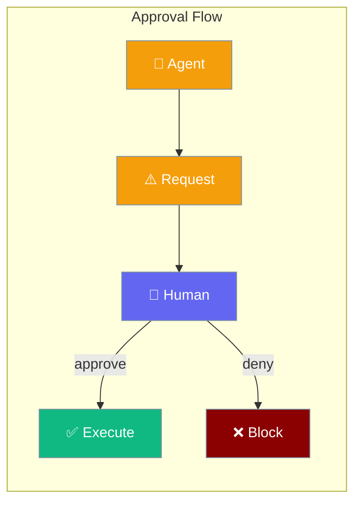
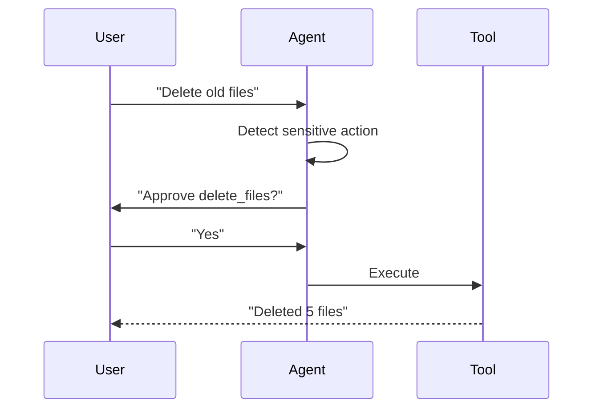

Agents can request human approval before taking sensitive actions.



## Quick Start

<Steps>

<Step title="Enable Approval">
```typescript
import { Agent } from 'praisonai';

const agent = new Agent({
  instructions: 'You can execute commands',
  approval: true  // Requires approval for all tool calls
});

// Agent will pause and ask for approval
await agent.chat('Delete the temp files');
// → "Approve action: delete_files? [y/n]"
```
</Step>

<Step title="Auto-Approve Patterns">
```typescript
const agent = new Agent({
  approval: {
    autoApprove: ['read_*', 'search_*'],  // Safe patterns
    autoDeny: ['delete_*', 'rm_*']        // Dangerous patterns
  }
});
```
</Step>

</Steps>

---

## User Interaction Flow



---

## Configuration Levels

```typescript
// Level 1: Bool - Require approval for everything
const agent = new Agent({
  approval: true
});

// Level 2: Array - Require for specific tools
const agent = new Agent({
  approval: ['delete', 'execute', 'send']
});

// Level 3: Dict - Auto-approve/deny patterns
const agent = new Agent({
  approval: {
    autoApprove: ['read_*', 'list_*'],
    autoDeny: ['delete_*'],
    timeout: 60000
  }
});

// Level 4: Instance - Custom handler
import { ApprovalManager } from 'praisonai';

const approver = new ApprovalManager({
  handler: async (request) => {
    return await askUserViaSlack(request);
  }
});
```

---

## Approval Options

| Option | Description |
|--------|-------------|
| `autoApprove` | Patterns to auto-approve |
| `autoDeny` | Patterns to auto-deny |
| `timeout` | Time to wait for response (ms) |
| `handler` | Custom approval function |

---

## Best Practices

<AccordionGroup>
  <Accordion title="Auto-approve safe actions">
    Reading data is usually safe to auto-approve.
  </Accordion>
  
  <Accordion title="Auto-deny dangerous patterns">
    Block delete, execute, and similar risky operations.
  </Accordion>
  
  <Accordion title="Set reasonable timeouts">
    Default to 60 seconds; adjust based on your workflow.
  </Accordion>
</AccordionGroup>

---

## Related

<CardGroup cols={2}>
  <Card title="Guardrails" icon="shield" href="/docs/js/guardrails">
    Input/output validation
  </Card>
  <Card title="Security" icon="lock" href="/docs/js/security">
    Security features
  </Card>
</CardGroup>
