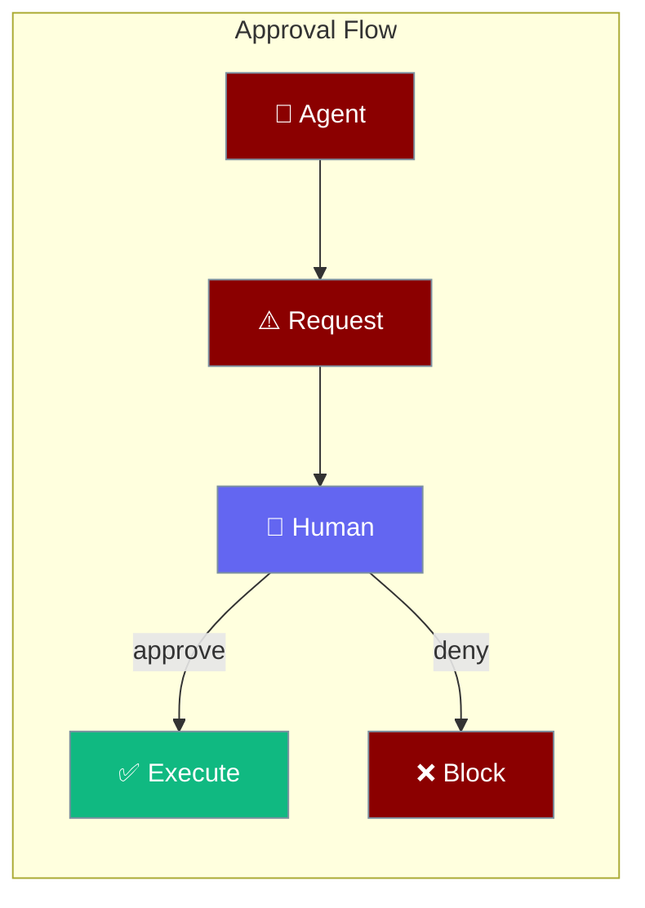
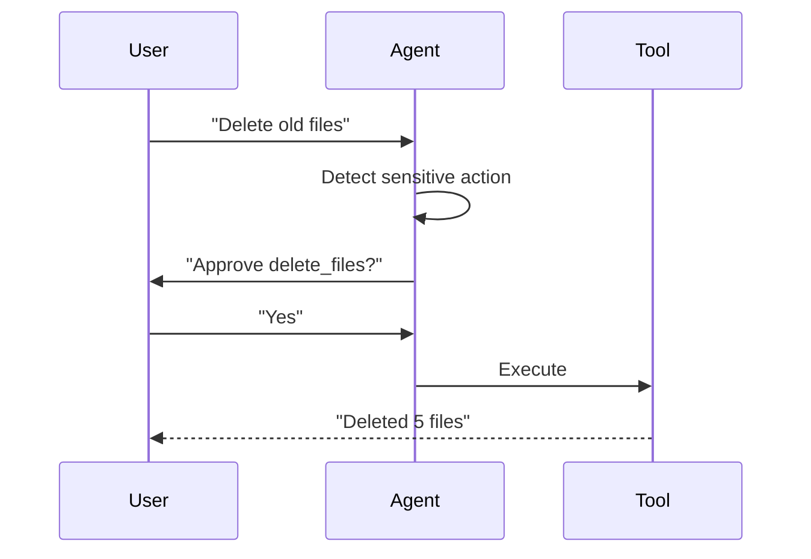

Agents can request human approval before running a tool.


```mermaid
graph LR
    subgraph "Approval Flow"
        A[🤖 Agent] --> B[⚠️ Request]
        B --> C[👤 Human]
        C -->|approve| D[✅ Execute]
        C -->|deny| E[❌ Block]
    end

    classDef agent fill:#8B0000,stroke:#7C90A0,color:#fff
    classDef human fill:#6366F1,stroke:#7C90A0,color:#fff
    classDef result fill:#10B981,stroke:#7C90A0,color:#fff
    classDef blocked fill:#8B0000,stroke:#7C90A0,color:#fff

    class A,B agent
    class C human
    class D result
    class E blocked
```

## Quick Start

<Steps>

<Step title="Simple Usage">
Set `approval: true` to gate every tool behind an interactive `y`/`n` prompt on the terminal.

```typescript
import { Agent } from 'praisonai';

const agent = new Agent({
  instructions: 'You can execute commands',
  approval: true  // gate every tool call behind a CLI prompt
});

await agent.chat('Delete the temp files');
// → 🔐 Tool "delete_files" requires approval.
//      Input: { "path": "/tmp" }
//
//    Approve? (y/n):
```
</Step>

<Step title="With an ApprovalManager">
Pass an `ApprovalManager` to add auto-approve / auto-deny rules and a custom handler.

```typescript
import { Agent, ApprovalManager } from 'praisonai';

const approver = new ApprovalManager();
approver.addAutoApprove(/^(read|list|search)_/);  // safe patterns
approver.addAutoDeny(/^delete_/);                 // dangerous patterns

const agent = new Agent({
  instructions: 'You can execute commands',
  approval: approver
});
```
</Step>

</Steps>

<Info>
`approval` accepts **only** `boolean | ApprovalManager`. Per-tool rules live on the `ApprovalManager` (via `addAutoApprove` / `addAutoDeny`), not on the agent.
</Info>

---

## User Interaction Flow


```mermaid
sequenceDiagram
    participant User
    participant Agent
    participant Tool

    User->>Agent: "Delete old files"
    Agent->>Agent: Detect sensitive action
    Agent->>User: "Approve delete_files?"
    User->>Agent: "Yes"
    Agent->>Tool: Execute
    Tool-->>User: "Deleted 5 files"
```

---

## How `approval: true` behaves

`approval: true` builds an `ApprovalManager` for you and wires `createCLIApprovalPrompt()` as its handler, so the default is a blocking `y`/`n` prompt on stdin.

Without a handler, `requestApproval()` waits on `respond()` — which nobody calls in a plain CLI session — so it would otherwise stall until the 5-minute default-deny timeout. Wiring the prompt is what keeps the default usable.

<Note>
**Denials are fed back to the model, not thrown.** When a call is denied, the agent returns this string as the tool result so the model can course-correct and continue the run:

```
Error: Tool call "<toolName>" was denied by the approval gate.
```
</Note>

---

## Correlation with `toolInvocationId`

The gate passes the LLM's `tool_call.id` as `toolInvocationId` on every approval request. Handlers and out-of-band UIs use it to correlate a decision back to the exact pending call — never positionally. This keeps multiple in-flight tool calls disambiguated.

```typescript
approver.onApprovalRequest(async (request) => {
  // request.toolInvocationId === the LLM's tool_call.id
  return await askUser(request.toolName, request.input);
});
```

---

## Custom Handler

Register handlers with `onApprovalRequest`. The first handler to resolve `true` approves; if all resolve `false`, the call is denied.

```typescript
import { Agent, ApprovalManager } from 'praisonai';

const approver = new ApprovalManager({ defaultTimeout: 60_000 });

approver.onApprovalRequest(async (request) => {
  // request: { requestId, toolInvocationId, toolName, input, timestamp, reason? }
  return await askUserViaSlack(request);
});

approver.addAutoApprove(/^(read|list|search)_/);  // auto-approve safe reads
approver.addAutoDeny(/^delete_/);                 // auto-deny deletions

const agent = new Agent({
  instructions: 'You can execute commands',
  approval: approver
});
```

Auto-deny is checked **first** (safety), then auto-approve, then handlers.

---

## Configuration Options

`ApprovalManager` constructor options:

| Option | Type | Default | Description |
|--------|------|---------|-------------|
| `defaultTimeout` | `number` (ms) | `300000` (5 min) | Time to wait for a decision before default-denying. |

`ApprovalManager` instance methods:

| Method | Signature | Description |
|--------|-----------|-------------|
| `onApprovalRequest` | `(handler: (req) => Promise<boolean>) => void` | Register a handler. First to resolve `true` approves. |
| `addAutoApprove` | `(toolName: string \| RegExp, inputPattern?) => void` | Auto-approve matching calls. Checked after auto-deny. |
| `addAutoDeny` | `(toolName: string \| RegExp, inputPattern?) => void` | Auto-deny matching calls. Checked first (safety). |
| `requestApproval` | `({ toolInvocationId?, toolName, input, reason?, timeout? }) => Promise<boolean>` | The gate itself. |
| `respond` | `(response) => void` | Answer a pending request from an out-of-band UI. |
| `getPendingRequests` | `() => ToolApprovalRequest[]` | List requests awaiting a decision. |
| `cancel` | `(requestId: string) => void` | Cancel one pending request (resolves denied). |
| `cancelAll` | `() => void` | Cancel all pending requests. |

---

## Advanced

### Per-tool wrapper: `withApproval`

Wrap a single tool so it gates itself. Throws `ToolApprovalDeniedError` on deny unless you provide `onDenied`.

```typescript
import { withApproval } from 'praisonai';
import { promises as fs } from 'fs';

const deleteFile = withApproval({
  name: 'deleteFile',
  needsApproval: true,
  execute: async (args: { path: string }) => {
    await fs.unlink(args.path);
    return { success: true };
  },
  onDenied: () => ({ success: false })  // optional fallback instead of throwing
});
```

### Global manager: `getApprovalManager` / `setApprovalManager`

`withApproval` uses a process-global manager when none is passed. Configure it once.

```typescript
import { getApprovalManager, setApprovalManager, ApprovalManager, createCLIApprovalPrompt } from 'praisonai';

const manager = new ApprovalManager();
manager.onApprovalRequest(createCLIApprovalPrompt());
setApprovalManager(manager);

// later, anywhere in the process
const shared = getApprovalManager();
```

### Dangerous-pattern helpers

Pre-built regexes and checkers flag risky inputs so you can require approval only when needed.

```typescript
import { isDangerous, createDangerousPatternChecker, DANGEROUS_PATTERNS } from 'praisonai';

isDangerous('rm -rf /');  // → true

const needsApproval = createDangerousPatternChecker([/\bwipe\b/i]);
```

`DANGEROUS_PATTERNS` exposes `fileDelete`, `dbDestructive`, `shellDangerous`, and `networkSensitive`.

### Events

`ApprovalManager` is an event emitter — subscribe with `.on(...)` to drive an out-of-band UI (e.g. a web dashboard that answers via `respond()`).

| Event | Fired when |
|-------|-----------|
| `approval-request` | A call awaits a decision. |
| `approval-response` | `respond()` resolves a request. |
| `auto-approved` | An `addAutoApprove` rule matched. |
| `auto-denied` | An `addAutoDeny` rule matched. |
| `timeout` | No decision arrived before `defaultTimeout`. |

### Errors

| Error | Thrown when |
|-------|-------------|
| `ToolApprovalDeniedError` | A `withApproval` tool is denied and no `onDenied` is set. |
| `ToolApprovalTimeoutError` | An approval request exceeds its timeout. |

<Note>
**Python parity:** the Python `approval` API exposes `ApprovalDecision.scope` (`"once" | "session" | "always"`) and `ApprovalDecision.feedback`. The TypeScript gate re-prompts every call and returns a fixed refusal string — there is no scope or per-decision feedback channel yet.
</Note>

---

## Best Practices

<AccordionGroup>
  <Accordion title="Auto-approve safe actions">
    Reading data is usually safe. `approver.addAutoApprove(/^(read|list|search)_/)` skips the prompt for read-only tools.
  </Accordion>

  <Accordion title="Auto-deny dangerous patterns">
    Auto-deny is checked first. Block deletions and destructive commands with `approver.addAutoDeny(/^delete_/)`.
  </Accordion>

  <Accordion title="Set reasonable timeouts">
    The default is 5 minutes and default-denies on timeout. Lower it for interactive flows: `new ApprovalManager({ defaultTimeout: 60_000 })`.
  </Accordion>

  <Accordion title="Correlate with toolInvocationId">
    In UIs with concurrent calls, always route decisions by `request.toolInvocationId`, never by order — positional matching authorises the wrong call.
  </Accordion>
</AccordionGroup>

---

## Related

<CardGroup cols={2}>
  <Card title="Guardrails" icon="shield" href="/js/guardrails">
    Input/output validation
  </Card>
  <Card title="Security" icon="lock" href="/js/security">
    Security features
  </Card>
</CardGroup>
