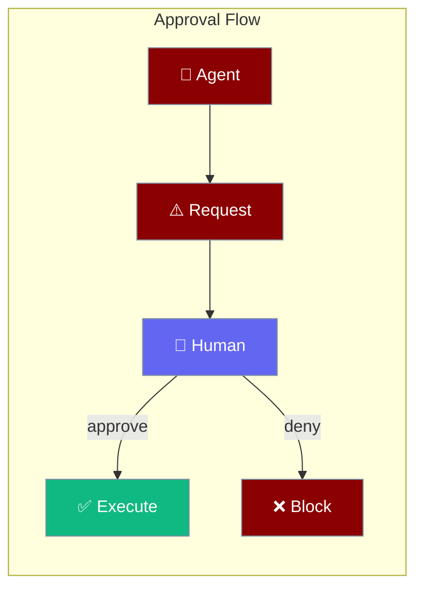
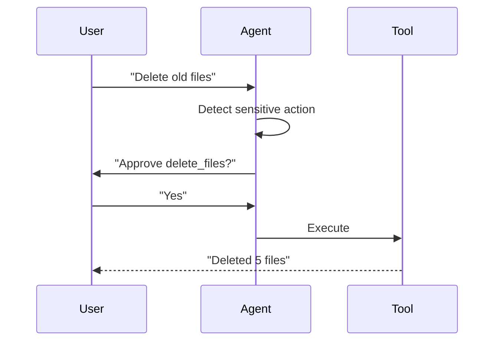
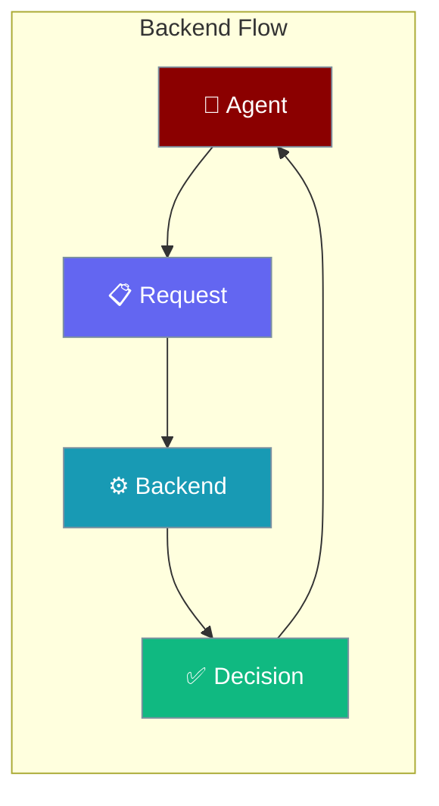
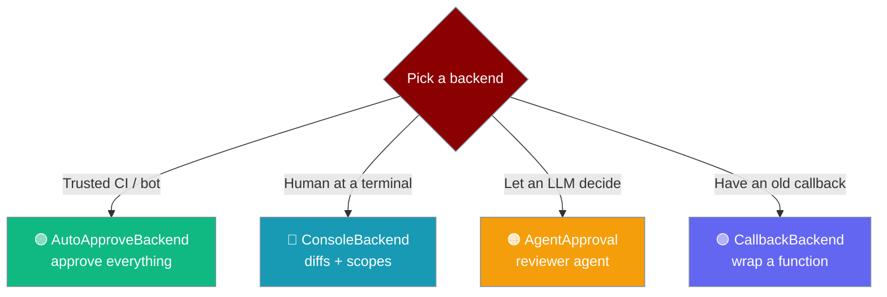
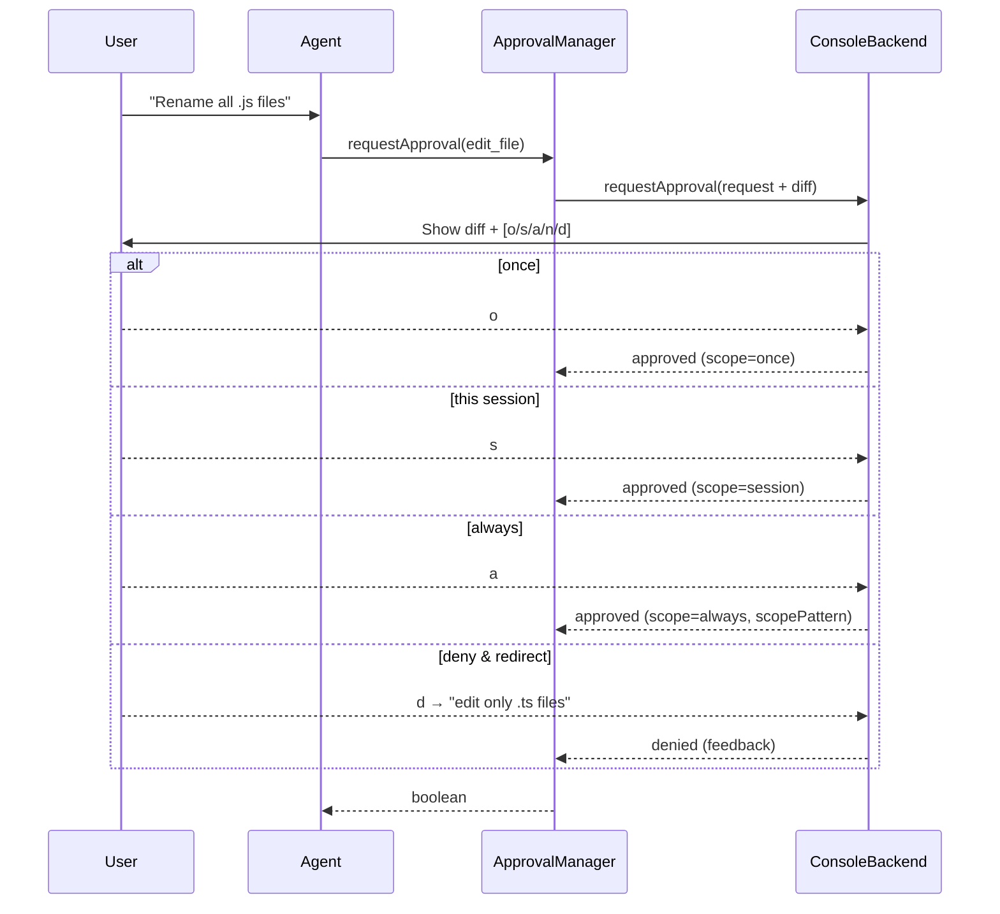

Agents can request human approval before running a tool.


```mermaid
graph LR
    subgraph "Approval Flow"
        A[🤖 Agent] --> B[⚠️ Request]
        B --> C[👤 Human]
        C -->|approve| D[✅ Execute]
        C -->|deny| E[❌ Block]
    end

    classDef agent fill:#8B0000,stroke:#7C90A0,color:#fff
    classDef human fill:#6366F1,stroke:#7C90A0,color:#fff
    classDef result fill:#10B981,stroke:#7C90A0,color:#fff
    classDef blocked fill:#8B0000,stroke:#7C90A0,color:#fff

    class A,B agent
    class C human
    class D result
    class E blocked
```

## Quick Start

<Steps>

<Step title="Simple Usage">
Set `approval: true` to gate every tool behind an interactive `y`/`n` prompt on the terminal.

```typescript
import { Agent } from 'praisonai';

const agent = new Agent({
  instructions: 'You can execute commands',
  approval: true  // gate every tool call behind a CLI prompt
});

await agent.chat('Delete the temp files');
// → 🔐 Tool "delete_files" requires approval.
//      Input: { "path": "/tmp" }
//
//    Approve? (y/n):
```
</Step>

<Step title="With an ApprovalManager">
Pass an `ApprovalManager` to add auto-approve / auto-deny rules and a custom handler.

```typescript
import { Agent, ApprovalManager } from 'praisonai';

const approver = new ApprovalManager();
approver.addAutoApprove(/^(read|list|search)_/);  // safe patterns
approver.addAutoDeny(/^delete_/);                 // dangerous patterns

const agent = new Agent({
  instructions: 'You can execute commands',
  approval: approver
});
```
</Step>

</Steps>

<Info>
`approval` accepts **only** `boolean | ApprovalManager`. Per-tool rules live on the `ApprovalManager` (via `addAutoApprove` / `addAutoDeny`), not on the agent.
</Info>

---

## User Interaction Flow


```mermaid
sequenceDiagram
    participant User
    participant Agent
    participant Tool

    User->>Agent: "Delete old files"
    Agent->>Agent: Detect sensitive action
    Agent->>User: "Approve delete_files?"
    User->>Agent: "Yes"
    Agent->>Tool: Execute
    Tool-->>User: "Deleted 5 files"
```

---

## How `approval: true` behaves

`approval: true` builds an `ApprovalManager` for you and wires `createCLIApprovalPrompt()` as its handler, so the default is a blocking `y`/`n` prompt on stdin.

Without a handler, `requestApproval()` waits on `respond()` — which nobody calls in a plain CLI session — so it would otherwise stall until the 5-minute default-deny timeout. Wiring the prompt is what keeps the default usable.

<Note>
**Denials are fed back to the model, not thrown.** When a call is denied, the agent returns this string as the tool result so the model can course-correct and continue the run:

```
Error: Tool call "<toolName>" was denied by the approval gate.
```
</Note>

---

## Correlation with `toolInvocationId`

The gate passes the LLM's `tool_call.id` as `toolInvocationId` on every approval request. Handlers and out-of-band UIs use it to correlate a decision back to the exact pending call — never positionally. This keeps multiple in-flight tool calls disambiguated.

```typescript
approver.onApprovalRequest(async (request) => {
  // request.toolInvocationId === the LLM's tool_call.id
  return await askUser(request.toolName, request.input);
});
```

---

## Custom Handler

Register handlers with `onApprovalRequest`. The first handler to resolve `true` approves; if all resolve `false`, the call is denied.

```typescript
import { Agent, ApprovalManager } from 'praisonai';

const approver = new ApprovalManager({ defaultTimeout: 60_000 });

approver.onApprovalRequest(async (request) => {
  // request: { requestId, toolInvocationId, toolName, input, timestamp, reason? }
  return await askUserViaSlack(request);
});

approver.addAutoApprove(/^(read|list|search)_/);  // auto-approve safe reads
approver.addAutoDeny(/^delete_/);                 // auto-deny deletions

const agent = new Agent({
  instructions: 'You can execute commands',
  approval: approver
});
```

Auto-deny is checked **first** (safety), then auto-approve, then handlers.

---

## Configuration Options

`ApprovalManager` constructor options:

| Option | Type | Default | Description |
|--------|------|---------|-------------|
| `defaultTimeout` | `number` (ms) | `300000` (5 min) | Time to wait for a decision before default-denying. |

`ApprovalManager` instance methods:

| Method | Signature | Description |
|--------|-----------|-------------|
| `onApprovalRequest` | `(handler: (req) => Promise<boolean>) => void` | Register a handler. First to resolve `true` approves. |
| `addAutoApprove` | `(toolName: string \| RegExp, inputPattern?) => void` | Auto-approve matching calls. Checked after auto-deny. |
| `addAutoDeny` | `(toolName: string \| RegExp, inputPattern?) => void` | Auto-deny matching calls. Checked first (safety). |
| `requestApproval` | `({ toolInvocationId?, toolName, input, reason?, timeout? }) => Promise<boolean>` | The gate itself. |
| `respond` | `(response) => void` | Answer a pending request from an out-of-band UI. |
| `getPendingRequests` | `() => ToolApprovalRequest[]` | List requests awaiting a decision. |
| `cancel` | `(requestId: string) => void` | Cancel one pending request (resolves denied). |
| `cancelAll` | `() => void` | Cancel all pending requests. |

---

## Advanced

### Per-tool wrapper: `withApproval`

Wrap a single tool so it gates itself. Throws `ToolApprovalDeniedError` on deny unless you provide `onDenied`.

```typescript
import { withApproval } from 'praisonai';
import { promises as fs } from 'fs';

const deleteFile = withApproval({
  name: 'deleteFile',
  needsApproval: true,
  execute: async (args: { path: string }) => {
    await fs.unlink(args.path);
    return { success: true };
  },
  onDenied: () => ({ success: false })  // optional fallback instead of throwing
});
```

### Global manager: `getApprovalManager` / `setApprovalManager`

`withApproval` uses a process-global manager when none is passed. Configure it once.

```typescript
import { getApprovalManager, setApprovalManager, ApprovalManager, createCLIApprovalPrompt } from 'praisonai';

const manager = new ApprovalManager();
manager.onApprovalRequest(createCLIApprovalPrompt());
setApprovalManager(manager);

// later, anywhere in the process
const shared = getApprovalManager();
```

### Dangerous-pattern helpers

Pre-built regexes and checkers flag risky inputs so you can require approval only when needed.

```typescript
import { isDangerous, createDangerousPatternChecker, DANGEROUS_PATTERNS } from 'praisonai';

isDangerous('rm -rf /');  // → true

const needsApproval = createDangerousPatternChecker([/\bwipe\b/i]);
```

`DANGEROUS_PATTERNS` exposes `fileDelete`, `dbDestructive`, `shellDangerous`, and `networkSensitive`.

### Events

`ApprovalManager` is an event emitter — subscribe with `.on(...)` to drive an out-of-band UI (e.g. a web dashboard that answers via `respond()`).

| Event | Fired when |
|-------|-----------|
| `approval-request` | A call awaits a decision. |
| `approval-response` | `respond()` resolves a request. |
| `auto-approved` | An `addAutoApprove` rule matched. |
| `auto-denied` | An `addAutoDeny` rule matched. |
| `timeout` | No decision arrived before `defaultTimeout`. |

### Errors

| Error | Thrown when |
|-------|-------------|
| `ToolApprovalDeniedError` | A `withApproval` tool is denied and no `onDenied` is set. |
| `ToolApprovalTimeoutError` | An approval request exceeds its timeout. |

<Note>
**Two approval layers.** The `ApprovalManager → ApprovalHandler` layer is boolean-only (a handler returns `true`/`false`). A **backend** installed via `setApprovalBackend` (see below) produces a full `ApprovalBackendDecision` carrying `scope` (`'once' | 'session' | 'always'`), `scopePattern`, and `feedback` — Python parity with `praisonaiagents.approval`. The handler projects that decision down to a boolean for the manager.
</Note>

---

## Approval Backends (Python parity)

Swap the default `y`/`n` prompt for a richer backend that matches `praisonaiagents.approval` — auto-approve, a diff-aware console, an LLM reviewer, or a legacy callback.


```mermaid
graph LR
    subgraph "Backend Flow"
        A[🤖 Agent] --> B[📋 Request]
        B --> C[⚙️ Backend]
        C --> D[✅ Decision]
        D --> A
    end

    classDef agent fill:#8B0000,stroke:#7C90A0,color:#fff
    classDef request fill:#6366F1,stroke:#7C90A0,color:#fff
    classDef backend fill:#189AB4,stroke:#7C90A0,color:#fff
    classDef decision fill:#10B981,stroke:#7C90A0,color:#fff

    class A agent
    class B request
    class C backend
    class D decision
```

An `Agent` with `approval: true` builds an `ApprovalManager`; `setApprovalBackend` answers its requests.

```typescript
import { Agent, setApprovalBackend, AutoApproveBackend } from 'praisonai';

// Trusted CI: approve every tool call automatically.
setApprovalBackend(new AutoApproveBackend());

const agent = new Agent({
  instructions: 'You can execute commands',
  approval: true  // creates the ApprovalManager; the backend above answers it
});

await agent.chat('Clean up the temp directory');
```

Pass a specific `ApprovalManager` to install the backend on it instead of the process-global one.

```typescript
import { Agent, ApprovalManager, setApprovalBackend, ConsoleBackend } from 'praisonai';

const manager = new ApprovalManager();
setApprovalBackend(new ConsoleBackend(), manager);  // diffs + once/session/always

const agent = new Agent({
  instructions: 'Refactor files carefully',
  approval: manager
});

await agent.chat('Rename all .js files to .ts');
```

### Which backend?


```mermaid
graph TB
    Start{Pick a backend}
    Start -->|Trusted CI / bot| Auto[🟢 AutoApproveBackend<br/>approve everything]
    Start -->|Human at a terminal| Console[🔵 ConsoleBackend<br/>diffs + scopes]
    Start -->|Let an LLM decide| AgentB[🟠 AgentApproval<br/>reviewer agent]
    Start -->|Have an old callback| Callback[🟣 CallbackBackend<br/>wrap a function]

    classDef pick fill:#8B0000,stroke:#7C90A0,color:#fff
    classDef auto fill:#10B981,stroke:#7C90A0,color:#fff
    classDef console fill:#189AB4,stroke:#7C90A0,color:#fff
    classDef agent fill:#F59E0B,stroke:#7C90A0,color:#fff
    classDef cb fill:#6366F1,stroke:#7C90A0,color:#fff

    class Start pick
    class Auto auto
    class Console console
    class AgentB agent
    class Callback cb
```

### AutoApproveBackend

Approves every call — use in bots, CI, or trusted unattended runs.

```typescript
import { setApprovalBackend, AutoApproveBackend } from 'praisonai';

setApprovalBackend(new AutoApproveBackend());
```

<Note>
**Python parity:** `praisonaiagents.approval.AutoApproveBackend` — same always-approve behaviour.
</Note>

### ConsoleBackend

Prompts on the terminal with a coloured unified diff and once/session/always scopes.

```typescript
import { setApprovalBackend, ConsoleBackend } from 'praisonai';

setApprovalBackend(new ConsoleBackend());
// turn colours off for logs / non-TTY:
setApprovalBackend(new ConsoleBackend({ colors: false }));
```


```mermaid
sequenceDiagram
    participant User
    participant Agent
    participant ApprovalManager
    participant Backend as ConsoleBackend

    User->>Agent: "Rename all .js files"
    Agent->>ApprovalManager: requestApproval(edit_file)
    ApprovalManager->>Backend: requestApproval(request + diff)
    Backend->>User: Show diff + [o/s/a/n/d]
    alt once
        User-->>Backend: o
        Backend-->>ApprovalManager: approved (scope=once)
    else this session
        User-->>Backend: s
        Backend-->>ApprovalManager: approved (scope=session)
    else always
        User-->>Backend: a
        Backend-->>ApprovalManager: approved (scope=always, scopePattern)
    else deny & redirect
        User-->>Backend: d → "edit only .ts files"
        Backend-->>ApprovalManager: denied (feedback)
    end
    ApprovalManager-->>Agent: boolean
```

**What the user sees:**

```
────────────────────────────────────────────────────────────
🔒 Tool Approval Required
────────────────────────────────────────────────────────────
Function: edit_file
Risk Level: HIGH
Agent: refactor-bot
Diff:
--- old
+++ new
@@ ...

────────────────────────────────────────────────────────────
Allow edit_file?  [o] once   [s] this session   [a] always (edit:/path/to/file)   [n] no   [d] deny & redirect
Choice [o/s/a/n/d] (n):
```

- `y`/`yes` is accepted as `once`.
- Empty input defaults to `n` (deny).
- `d` prompts for free-text guidance returned on `decision.feedback`.
- Diffs render in ANSI unless `NO_COLOR` is set or output is not a TTY — override with `new ConsoleBackend({ colors: false })`.

| Option | Type | Default | Description |
|--------|------|---------|-------------|
| `input` | `NodeJS.ReadableStream` | `process.stdin` | Input stream for the default async reader. |
| `output` | `NodeJS.WritableStream` | `process.stdout` | Output stream for prompts. |
| `reader` | `(q: string) => Promise<string>` | built-in `readline` | Injected async reader (useful in tests). |
| `syncReader` | `(q: string) => string` | blocking `fs.readSync` on stdin | Injected sync reader; required by `requestApprovalSync` when `input` is not `process.stdin`. |
| `colors` | `boolean` | `isTTY && !NO_COLOR` | Force ANSI colours on/off. |

<Note>
**Python parity:** `praisonaiagents.approval.ConsoleBackend` — same prompt, Rich markup instead of ANSI.
</Note>

### AgentApproval

Delegates the decision to another AI agent that replies `APPROVE` or `DENY`.

```typescript
import { Agent, setApprovalBackend, AgentApproval } from 'praisonai';

const reviewer = new Agent({
  name: 'strict-reviewer',
  instructions: 'Only approve file reads. Deny everything else. Reply APPROVE or DENY.'
});

setApprovalBackend(new AgentApproval(reviewer));          // custom reviewer
// or let it create a default reviewer agent lazily:
setApprovalBackend(new AgentApproval(null, 'gpt-4o-mini'));
```

<Warning>
`requestApprovalSync` returns a **denial** in TypeScript — an LLM call cannot block the event loop. Use the async path (`requestApproval`, which `setApprovalBackend` uses). Python's `request_approval_sync` does prompt synchronously; this is a real divergence.
</Warning>

<Note>
**Python parity:** `praisonaiagents.approval.AgentApproval(approver_agent=..., llm="gpt-4o-mini")`.
</Note>

### CallbackBackend

Wraps a legacy `(toolName, arguments, riskLevel) => decision | boolean` callback.

```typescript
import { setApprovalBackend, CallbackBackend } from 'praisonai';

setApprovalBackend(new CallbackBackend((toolName, args, riskLevel) => {
  return toolName.startsWith('read_');  // boolean, decision object, or Promise
}));
```

<Note>
**Python parity:** `praisonaiagents.approval.CallbackBackend(callback)`.
</Note>

### Build your own backend

Implement `ApprovalBackend` — `requestApproval` (async) and `requestApprovalSync`. Use the `approvalRequest` / `approvalDecision` builders for Python-shaped defaults and `suggestScopePattern` for a reusable "always" pattern.

```typescript
import { setApprovalBackend, approvalDecision, suggestScopePattern } from 'praisonai';
import type { ApprovalBackend, ApprovalBackendRequest } from 'praisonai';

const myBackend: ApprovalBackend = {
  async requestApproval(request: ApprovalBackendRequest) {
    const ok = request.riskLevel !== 'critical';
    return approvalDecision({
      approved: ok,
      approver: 'policy',
      scope: ok ? 'always' : 'once',
      scopePattern: ok ? suggestScopePattern(request) : null
    });
  },
  requestApprovalSync(request: ApprovalBackendRequest) {
    return approvalDecision({ approved: request.riskLevel !== 'critical', approver: 'policy' });
  }
};

setApprovalBackend(myBackend);
```

### Wiring functions

`setApprovalBackend` installs a backend; `getApprovalBackend` reads it back.

```typescript
import { setApprovalBackend, getApprovalBackend, AutoApproveBackend, ApprovalManager } from 'praisonai';

const manager = new ApprovalManager();
setApprovalBackend(new AutoApproveBackend(), manager, { riskLevel: 'high', agentName: 'ci-bot' });

getApprovalBackend(manager);  // → the AutoApproveBackend instance
```

Adapt a backend into a plain `ApprovalHandler`, or convert a manager request into the Python shape, directly.

```typescript
import { approvalHandlerFromBackend, toApprovalBackendRequest, ConsoleBackend, ApprovalManager } from 'praisonai';

const manager = new ApprovalManager();
manager.onApprovalRequest(approvalHandlerFromBackend(new ConsoleBackend()));

// inside a handler, reshape a manager request:
manager.onApprovalRequest(async (req) => {
  const backendRequest = toApprovalBackendRequest(req, { riskLevel: 'high' });
  return backendRequest.riskLevel !== 'critical';
});
```

`approvalRequest` and `approvalDecision` build the Python-shaped objects with dataclass defaults (`approvalId` auto-fills like `uuid4().hex`).

```typescript
import { approvalRequest, approvalDecision } from 'praisonai';

const request = approvalRequest({ toolName: 'edit_file', arguments: { path: 'a.ts' }, riskLevel: 'high' });
const decision = approvalDecision({ approved: true, scope: 'session' });
```

<Warning>
`setApprovalBackend(null)` clears the backend slot — it does **not** detach the registered handler. The handler then declines (returns `false`), letting other handlers or the manager's event flow decide.
</Warning>

### Permission-target helpers

Turn a tool call into a reusable permission target or glob for `session`/`always` scopes.

| Helper | Input | Output |
|--------|-------|--------|
| `buildPermissionTarget('execute_command', { command: 'ls -la' })` | shell tool | `bash:ls -la` |
| `buildPermissionTarget('edit_file', { path: '/x.ts' })` | file tool | `edit:/x.ts` |
| `derivePattern('bash:git status -s')` | shell target | `bash:git status *` |
| `commandPrefix(['git', 'status', '-s'])` | tokens | `git status` |
| `suggestScopePattern(request)` | a request | best-effort `always` pattern |

`ARITY` maps commands (`git`, `npm`, `docker`, …) to the number of leading tokens `commandPrefix` keeps.

```typescript
import { buildPermissionTarget, derivePattern, commandPrefix, suggestScopePattern, ARITY, approvalRequest } from 'praisonai';

buildPermissionTarget('execute_command', { command: 'ls -la' });  // 'bash:ls -la'
derivePattern('bash:git status -s');                              // 'bash:git status *'
commandPrefix(['npm', 'run', 'build']);                           // 'npm run'
suggestScopePattern(approvalRequest({ toolName: 'execute_command', arguments: { command: 'git push' }, riskLevel: 'high' }));
ARITY.git;  // 2
```

### API surface

Everything exported from the `approval` module — all import flat from `praisonai`.

| Kind | Exports |
|------|---------|
| Classes | `AutoApproveBackend`, `ConsoleBackend`, `AgentApproval`, `CallbackBackend` |
| Functions | `setApprovalBackend`, `getApprovalBackend`, `approvalHandlerFromBackend`, `toApprovalBackendRequest`, `approvalRequest`, `approvalDecision`, `buildPermissionTarget`, `derivePattern`, `commandPrefix`, `suggestScopePattern` |
| Constants | `ARITY` |
| Types | `ApprovalBackend`, `ApprovalBackendRequest`, `ApprovalBackendDecision`, `ApprovalRequestInit`, `ApprovalDecisionInit`, `ApprovalScope`, `ConsoleBackendOptions`, `ConsolePromptResult`, `BackendHandlerOptions`, `ApproverAgentLike`, `LegacyApprovalCallback` |

**`ApprovalBackendRequest`** — what a custom backend receives:

| Field | Type | Description |
|-------|------|-------------|
| `toolName` | `string` | Tool requesting approval. |
| `arguments` | `Record<string, unknown>` | Arguments the tool will be called with. |
| `riskLevel` | `string` | `critical` / `high` / `medium` / `low`. |
| `agentName` | `string \| null` | Triggering agent. |
| `sessionId` | `string \| null` | Session tracker. |
| `context` | `Record<string, unknown>` | Arbitrary context — e.g. a rendered `diff`. |
| `approvalId` | `string` | Stable correlation id (auto `uuid4().hex` via `approvalRequest`). |
| `authorizedReviewers` | `string[] \| null` | Reviewer identities allowed to resolve. |
| `liveness` | `(() => boolean) \| null` | Predicate that returns `true` while the originating turn is live. |

**`ApprovalBackendDecision`** — what a backend returns:

| Field | Type | Default | Description |
|-------|------|---------|-------------|
| `approved` | `boolean` | — | Final verdict. |
| `reason` | `string` | `""` | Human-readable justification. |
| `modifiedArgs` | `Record<string, unknown>` | `{}` | Optional replacement arguments. |
| `approver` | `string \| null` | `null` | Who/what approved (user, system, console, agent, …). |
| `metadata` | `Record<string, unknown>` | `{}` | Backend-specific metadata. |
| `scope` | `'once' \| 'session' \| 'always'` | `'once'` | How long to remember the decision. |
| `scopePattern` | `string \| null` | `null` | Reusable target/pattern for session/always scopes. |
| `feedback` | `string \| null` | `null` | Free-text guidance when denying with redirect. |

**`BackendHandlerOptions`** — passed to `setApprovalBackend` / `approvalHandlerFromBackend`:

| Option | Type | Default | Description |
|--------|------|---------|-------------|
| `riskLevel` | `string` | `"medium"` | Risk stamped on requests from the manager (which carries none). |
| `agentName` | `string \| null` | `null` | Agent name stamped on requests. |

---

## Best Practices

<AccordionGroup>
  <Accordion title="Auto-approve safe actions">
    Reading data is usually safe. `approver.addAutoApprove(/^(read|list|search)_/)` skips the prompt for read-only tools.
  </Accordion>

  <Accordion title="Auto-deny dangerous patterns">
    Auto-deny is checked first. Block deletions and destructive commands with `approver.addAutoDeny(/^delete_/)`.
  </Accordion>

  <Accordion title="Set reasonable timeouts">
    The default is 5 minutes and default-denies on timeout. Lower it for interactive flows: `new ApprovalManager({ defaultTimeout: 60_000 })`.
  </Accordion>

  <Accordion title="Correlate with toolInvocationId">
    In UIs with concurrent calls, always route decisions by `request.toolInvocationId`, never by order — positional matching authorises the wrong call.
  </Accordion>
</AccordionGroup>

---

<Note>
**Reviewing task outputs, not tool calls?** See [Human-in-the-Loop Review](/js/human-in-the-loop-review) for `Task(humanInput: true)` and `reviewTaskOutput()`.
</Note>

---

## Related

<CardGroup cols={2}>
  <Card title="Python Approval Backends" icon="python" href="/features/approval-backends">
    The matching Python/CLI backends
  </Card>
  <Card title="Approval Protocol" icon="shield-check" href="/features/approval-protocol">
    Cross-SDK backend matrix and request/decision shapes
  </Card>
  <Card title="Human Review" icon="user-check" href="/js/human-in-the-loop-review">
    Approve a task's output before the next task
  </Card>
  <Card title="Guardrails" icon="shield" href="/js/guardrails">
    Input/output validation
  </Card>
</CardGroup>
