Approval enables human oversight of tool execution, requiring explicit approval before agents run potentially dangerous operations.

```mermaid
graph LR
    subgraph "Tool Approval Flow"
        A[🔧 Tool Call] --> B{🔐 Needs Approval?}
        B -->|Yes| C[⏳ Wait for Human]
        B -->|No| E[▶️ Execute]
        C -->|Approved| E
        C -->|Denied| D[❌ Reject]
        E --> F[✅ Result]
    end
    
    classDef tool fill:#6366F1,stroke:#7C90A0,color:#fff
    classDef decision fill:#F59E0B,stroke:#7C90A0,color:#fff
    classDef result fill:#10B981,stroke:#7C90A0,color:#fff
    classDef reject fill:#8B0000,stroke:#7C90A0,color:#fff
    
    class A tool
    class B,C decision
    class E,F result
    class D reject
```



## Quick Start

<Steps>

<Step title="Simple Approval Callback">
```typescript
import { registerApprovalCallback } from 'praisonai';

registerApprovalCallback(async (request) => {
  console.log(`Action: ${request.action}`);
  console.log(`Risk: ${request.risk}`);
  
  // Auto-approve low risk, prompt for others
  if (request.risk === 'low') {
    return { approved: true };
  }
  
  const answer = await askUser('Approve this action?');
  return { approved: answer === 'yes' };
});
```
</Step>

<Step title="Tool with Approval Wrapper">
```typescript
import { withApproval, getApprovalManager } from 'praisonai';

// Create tool that requires approval
const deleteFile = withApproval({
  name: 'deleteFile',
  needsApproval: true,
  execute: async (args) => {
    await fs.unlink(args.path);
    return { deleted: args.path };
  },
  onDenied: (args) => ({ error: 'Deletion denied', path: args.path })
});

// Use in agent
const result = await deleteFile({ path: '/tmp/file.txt' });
```
</Step>

<Step title="Interactive CLI Approval">
```typescript
import { getApprovalManager, createCLIApprovalPrompt } from 'praisonai';

const manager = getApprovalManager();
manager.onApprovalRequest(createCLIApprovalPrompt());

// Now all tool approval requests show interactive prompts
```
</Step>

</Steps>

---

## How It Works


| Component | Purpose |
|-----------|---------|
| `ApprovalManager` | Central hub managing all approval requests and patterns |
| `withApproval` | Wrapper to add approval requirement to any tool |
| `ApprovalHandler` | Function that decides on approval requests |
| `Auto-patterns` | Rules for automatic approve/deny without human input |

---

## Configuration Options

### ApprovalManager

```typescript
import { ApprovalManager } from 'praisonai';

const manager = new ApprovalManager({
  defaultTimeout: 300000 // 5 minutes
});
```

| Option | Type | Default | Description |
|--------|------|---------|-------------|
| `defaultTimeout` | `number` | `300000` | Timeout in ms before auto-deny (5 min) |

### ToolApprovalConfig

```typescript
import { withApproval } from 'praisonai';

const tool = withApproval({
  name: 'dangerousTool',
  description: 'Tool that does something risky',
  needsApproval: true,
  approvalTimeout: 60000,
  autoApprove: /safe-pattern/,
  autoDeny: /dangerous-pattern/,
  execute: async (input) => { /* ... */ },
  onDenied: (input) => { /* ... */ }
});
```

| Option | Type | Default | Description |
|--------|------|---------|-------------|
| `name` | `string` | - | Tool name (required) |
| `description` | `string` | - | Tool description |
| `needsApproval` | `boolean \| function` | `false` | Whether approval is needed |
| `approvalTimeout` | `number` | `300000` | Timeout in ms |
| `autoApprove` | `RegExp \| function` | - | Pattern for auto-approval |
| `autoDeny` | `RegExp \| function` | - | Pattern for auto-denial |
| `execute` | `function` | - | The actual tool function |
| `onDenied` | `function` | - | Handler when approval denied |

### ApprovalRequest

| Field | Type | Description |
|-------|------|-------------|
| `action` | `string` | Action being requested |
| `arguments` | `object` | Arguments for the action |
| `risk` | `'low' \| 'medium' \| 'high' \| 'critical'` | Risk level |
| `toolName` | `string` | Name of the tool |
| `agentName` | `string` | Agent making request |
| `description` | `string` | Description of action |

### ApprovalDecision

| Field | Type | Description |
|-------|------|-------------|
| `approved` | `boolean` | Whether action is approved |
| `reason` | `string` | Reason for decision |
| `modifiedArgs` | `object` | Optional modified arguments |

---

## Common Patterns

### Dynamic Approval Based on Input

```typescript
import { withApproval } from 'praisonai';

const writeFile = withApproval({
  name: 'writeFile',
  needsApproval: async (input) => {
    // Require approval for system paths
    return input.path.startsWith('/etc') || 
           input.path.startsWith('/usr');
  },
  execute: async (input) => {
    await fs.writeFile(input.path, input.content);
    return { written: input.path };
  }
});
```

### Auto-Approve Safe Operations

```typescript
import { getApprovalManager } from 'praisonai';

const manager = getApprovalManager();

// Auto-approve all read operations
manager.addAutoApprove(/^read/);
manager.addAutoApprove('listFiles');

// Auto-deny dangerous patterns
manager.addAutoDeny(/delete/i);
manager.addAutoDeny('formatDisk');
```

### Risk-Based Approval

```typescript
import { registerApprovalCallback } from 'praisonai';

registerApprovalCallback(async (request) => {
  switch (request.risk) {
    case 'low':
      return { approved: true };
    case 'medium':
      console.log(`Medium risk: ${request.action}`);
      return { approved: true };
    case 'high':
    case 'critical':
      console.log(`⚠️ High risk action requires manual approval`);
      const answer = await promptUser(request);
      return { approved: answer };
    default:
      return { approved: false };
  }
});
```

### Event-Based Monitoring

```typescript
import { getApprovalManager } from 'praisonai';

const manager = getApprovalManager();

manager.on('approval-request', (request) => {
  console.log(`📋 Approval requested: ${request.toolName}`);
});

manager.on('approval-response', (response) => {
  console.log(`${response.approved ? '✅' : '❌'} ${response.requestId}`);
});

manager.on('auto-approved', ({ toolName }) => {
  console.log(`⚡ Auto-approved: ${toolName}`);
});

manager.on('auto-denied', ({ toolName }) => {
  console.log(`🚫 Auto-denied: ${toolName}`);
});

manager.on('timeout', (request) => {
  console.log(`⏰ Timeout: ${request.toolName}`);
});
```

---

## Dangerous Pattern Detection

Built-in patterns for common dangerous operations:

```typescript
import { isDangerous, DANGEROUS_PATTERNS, createDangerousPatternChecker } from 'praisonai';

// Check if input is dangerous
if (isDangerous(userInput)) {
  console.log('This input contains dangerous patterns');
}

// Available patterns
console.log(DANGEROUS_PATTERNS);
// {
//   fileDelete: /\b(rm|delete|remove|unlink)\b.*\b(file|dir|folder|path)\b/i,
//   dbDestructive: /\b(DROP|DELETE|TRUNCATE|ALTER)\b/i,
//   shellDangerous: /\b(rm\s+-rf|sudo|chmod|chown|mkfs|dd\s+if=)\b/i,
//   networkSensitive: /\b(curl|wget|fetch)\b.*\b(password|token|secret|key)\b/i,
// }

// Create custom checker
const needsApproval = createDangerousPatternChecker([
  /password/i,
  /api[_-]?key/i,
]);
```

---

## CLI Commands

Manage approvals via command line:

```bash
# Check approval status
praisonai approval status

# List pending requests
praisonai approval pending

# Approve a request
praisonai approval approve <requestId>

# Deny a request
praisonai approval deny <requestId>

# Configure auto-approve
praisonai approval auto-approve readFile

# Configure auto-deny
praisonai approval auto-deny deleteFile

# Start interactive mode
praisonai approval interactive
```

---

## Best Practices

<AccordionGroup>
  <Accordion title="Default to deny for unknown actions">
    When no approval callback is registered, high-risk actions are automatically denied. Always register an approval callback for production use.
  </Accordion>
  
  <Accordion title="Use auto-patterns for common operations">
    Configure auto-approve for read-only operations and auto-deny for known dangerous patterns to reduce human intervention fatigue.
  </Accordion>
  
  <Accordion title="Set appropriate timeouts">
    Default 5-minute timeout may be too long or short. Adjust based on your use case - shorter for interactive apps, longer for batch processing.
  </Accordion>
  
  <Accordion title="Log all approval decisions">
    Use the event system to maintain an audit trail of all approval requests and decisions for compliance and debugging.
  </Accordion>
</AccordionGroup>

---

## Related

<CardGroup cols={2}>
  <Card title="Guardrails" icon="shield" href="/docs/js/guardrails">
    Input/output validation and safety
  </Card>
  <Card title="Hooks" icon="webhook" href="/docs/js/hooks">
    Lifecycle event handling
  </Card>
</CardGroup>
