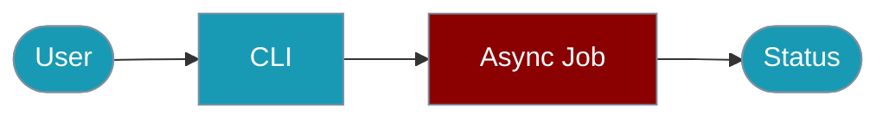

Manage async jobs using the `praisonai-ts` CLI.



## Quick Start

<Steps>

<Step title="Simple Usage">
```bash
npm install -g praisonai-ts
praisonai-ts run submit "Analyse this data"
```
</Step>

<Step title="With Configuration">
```bash
praisonai-ts run submit "Long task" --recipe news-analyzer --wait --stream
```
</Step>

</Steps>

---

## Commands Overview

| Command | Description |
|---------|-------------|
| `praisonai-ts run submit` | Submit a new job |
| `praisonai-ts run status <id>` | Get job status |
| `praisonai-ts run result <id>` | Get job result |
| `praisonai-ts run stream <id>` | Stream job progress |
| `praisonai-ts run list` | List all jobs |
| `praisonai-ts run cancel <id>` | Cancel a job |

## Submit a Job

```bash
# Basic submission
praisonai-ts run submit "Analyze this data"

# With recipe
praisonai-ts run submit "Analyze AI trends" --recipe news-analyzer

# With recipe config
praisonai-ts run submit "Analyze" --recipe analyzer --recipe-config '{"format": "json"}'

# Wait for completion
praisonai-ts run submit "Quick task" --wait

# Stream progress
praisonai-ts run submit "Long task" --stream

# With timeout
praisonai-ts run submit "Complex task" --timeout 7200

# With webhook
praisonai-ts run submit "Task" --webhook-url https://example.com/callback

# With idempotency
praisonai-ts run submit "Task" --idempotency-key order-123

# JSON output
praisonai-ts run submit "Task" --json

# Custom API URL
praisonai-ts run submit "Task" --api-url http://localhost:8080
```

### Submit Options

| Option | Description |
|--------|-------------|
| `--recipe` | Recipe name to execute |
| `--recipe-config` | Recipe config as JSON |
| `--timeout` | Timeout in seconds (default: 3600) |
| `--wait` | Wait for completion |
| `--stream` | Stream progress |
| `--idempotency-key` | Key to prevent duplicates |
| `--webhook-url` | Webhook URL for completion |
| `--session-id` | Session ID for grouping |
| `--json` | Output JSON |
| `--api-url` | Jobs API URL |

## Check Status

```bash
praisonai-ts run status run_abc123
praisonai-ts run status run_abc123 --json
```

## Get Result

```bash
praisonai-ts run result run_abc123
praisonai-ts run result run_abc123 --json
```

## Stream Progress

```bash
praisonai-ts run stream run_abc123
praisonai-ts run stream run_abc123 --json
```

## List Jobs

```bash
praisonai-ts run list
praisonai-ts run list --status running
praisonai-ts run list --json
```

## Cancel Job

```bash
praisonai-ts run cancel run_abc123
```

## Examples

### Complete Workflow

```bash
# 1. Submit job with recipe
praisonai-ts run submit "Analyze news" --recipe news-analyzer --json

# 2. Check status
praisonai-ts run status run_abc123

# 3. Stream progress
praisonai-ts run stream run_abc123

# 4. Get result
praisonai-ts run result run_abc123
```

### Scripting

```bash
#!/bin/bash

RESULT=$(praisonai-ts run submit "Analyze" --recipe analyzer --json)
JOB_ID=$(echo $RESULT | jq -r '.jobId')

while true; do
    STATUS=$(praisonai-ts run status $JOB_ID --json | jq -r '.status')
    if [ "$STATUS" = "succeeded" ] || [ "$STATUS" = "failed" ]; then
        break
    fi
    sleep 5
done

praisonai-ts run result $JOB_ID --json
```

## Related

<CardGroup cols={2}>
  <Card title="Async Jobs" icon="server" href="/docs/js/async-jobs">
    SDK documentation
  </Card>
  <Card title="Background Tasks CLI" icon="terminal" href="/docs/js/background-tasks-cli">
    Background task CLI
  </Card>
  <Card title="Jobs" icon="list" href="/docs/js/jobs">
    Jobs API overview
  </Card>
</CardGroup>
