Agents can speak and listen - convert text to speech and transcribe audio.

```mermaid
graph LR
    subgraph "Audio Processing"
        A[👤 User] --> B[🤖 Agent]
        B -->|speak| C[🔊 Audio]
        B -->|listen| D[📝 Text]
    end
    
    classDef user fill:#6366F1,stroke:#7C90A0,color:#fff
    classDef agent fill:#F59E0B,stroke:#7C90A0,color:#fff
    classDef output fill:#10B981,stroke:#7C90A0,color:#fff
    
    class A user
    class B agent
    class C,D output
```



## Quick Start

<Steps>

<Step title="Text to Speech">
```typescript
import { Agent } from 'praisonai';

const agent = new Agent({
  instructions: 'You are a helpful assistant',
  audio: true
});

// Agent response as audio
const audio = await agent.speak('Hello! How can I help you today?');
// Returns audio buffer
```
</Step>

<Step title="Speech to Text">
```typescript
// Transcribe audio file
const text = await agent.transcribe('./recording.mp3');
console.log(text);
// "This is what was said in the recording..."
```
</Step>

</Steps>

---

## User Interaction Flow

```mermaid
sequenceDiagram
    participant User
    participant Agent
    participant Audio
    
    User->>Agent: "Read this aloud"
    Agent->>Audio: Generate speech
    Audio-->>User: 🔊 Audio playback
    
    User->>Agent: [voice recording]
    Agent->>Audio: Transcribe
    Audio-->>Agent: Text content
    Agent-->>User: "You said..."
```



---

## Configuration Levels

```typescript
// Level 1: Bool - Enable with defaults
const agent = new Agent({
  audio: true
});

// Level 2: String - Specify voice
const agent = new Agent({
  audio: 'alloy'  // OpenAI voice name
});

// Level 3: Dict - Full options
const agent = new Agent({
  audio: {
    voice: 'nova',
    model: 'tts-1-hd',
    speed: 1.0,
    format: 'mp3'
  }
});

// Level 4: Instance - AudioAgent
import { AudioAgent } from 'praisonai';

const audio = new AudioAgent({
  provider: 'elevenlabs',
  voice: 'rachel'
});
```

---

## Audio Options

| Option | Description |
|--------|-------------|
| `voice` | Voice name (alloy, echo, nova, etc.) |
| `model` | TTS model (tts-1, tts-1-hd) |
| `speed` | Playback speed (0.25 to 4.0) |
| `format` | Output format (mp3, wav, opus) |

---

## Best Practices

<AccordionGroup>
  <Accordion title="Use HD for quality">
    `tts-1-hd` sounds more natural but costs more.
  </Accordion>
  
  <Accordion title="Match voice to content">
    Choose voices that match your content's tone and audience.
  </Accordion>
  
  <Accordion title="Handle long text">
    Break long text into chunks for better audio quality.
  </Accordion>
</AccordionGroup>

---

## Related

<CardGroup cols={2}>
  <Card title="Voice" icon="microphone" href="/docs/js/voice">
    Voice conversations
  </Card>
  <Card title="Realtime" icon="bolt" href="/docs/js/realtime">
    Real-time streaming
  </Card>
</CardGroup>
