Audio enables agents to generate speech from text (TTS) and transcribe audio to text (STT) using multiple AI providers.

```mermaid
graph LR
    subgraph "Audio Processing"
        A[📝 Text] -->|TTS| B[🔊 Audio]
        C[🎤 Audio] -->|STT| D[📝 Text]
    end
    
    classDef text fill:#6366F1,stroke:#7C90A0,color:#fff
    classDef audio fill:#10B981,stroke:#7C90A0,color:#fff
    
    class A,D text
    class B,C audio
```



## Quick Start

<Steps>

<Step title="Text-to-Speech">
```typescript
import { AudioAgent } from 'praisonai';

const agent = new AudioAgent({
  provider: 'openai',
  voice: 'alloy'
});

const result = await agent.speak('Hello, world!');
// result.audio contains the audio buffer

// Save to file
import fs from 'fs';
fs.writeFileSync('output.mp3', result.audio);
```
</Step>

<Step title="Speech-to-Text">
```typescript
import { AudioAgent } from 'praisonai';

const agent = new AudioAgent({ provider: 'openai' });

// From file
const result = await agent.transcribe('./audio.mp3');
console.log(result.text);

// From URL
const urlResult = await agent.transcribe('https://example.com/audio.mp3');

// From buffer
const buffer = fs.readFileSync('./audio.mp3');
const bufferResult = await agent.transcribe(buffer);
```
</Step>

<Step title="Using Low-Level Functions">
```typescript
import { generateSpeech, transcribe } from 'praisonai';

// Generate speech
const speech = await generateSpeech({
  model: 'openai/tts-1',
  text: 'Hello, world!',
  voice: 'nova'
});

// Transcribe audio
const transcription = await transcribe({
  model: 'openai/whisper-1',
  audio: await fs.readFile('audio.mp3')
});
```
</Step>

</Steps>

---

## How It Works


| Component | Purpose |
|-----------|---------|
| `AudioAgent` | High-level agent for TTS and STT |
| `generateSpeech` | Low-level speech generation function |
| `transcribe` | Low-level transcription function |
| Providers | OpenAI, ElevenLabs, Google, Deepgram, Groq |

---

## Configuration Options

### AudioAgentConfig

```typescript
import { AudioAgent } from 'praisonai';

const agent = new AudioAgent({
  name: 'MyAudioAgent',
  provider: 'openai',
  voice: 'alloy',
  model: 'tts-1',
  format: 'mp3',
  speed: 1.0,
  language: 'en',
  verbose: false
});
```

| Option | Type | Default | Description |
|--------|------|---------|-------------|
| `name` | `string` | Auto-generated | Agent name |
| `provider` | `AudioProvider` | `'openai'` | Audio provider |
| `voice` | `string` | `'alloy'` | Voice for TTS |
| `model` | `string` | Provider default | TTS model |
| `format` | `AudioFormat` | `'mp3'` | Output audio format |
| `speed` | `number` | `1.0` | Speed multiplier (0.25 to 4.0) |
| `language` | `string` | `'en'` | Language for transcription |
| `verbose` | `boolean` | `false` | Enable verbose logging |

### Providers

| Provider | TTS | STT | Default Model |
|----------|-----|-----|---------------|
| `openai` | ✅ | ✅ | `tts-1` / `whisper-1` |
| `elevenlabs` | ✅ | ❌ | `eleven_multilingual_v2` |
| `google` | ✅ | ❌ | `text-to-speech` |
| `deepgram` | ❌ | ✅ | `nova-2` |
| `groq` | ❌ | ✅ | `whisper-large-v3` |

### OpenAI Voices

| Voice | Description |
|-------|-------------|
| `alloy` | Neutral, balanced |
| `echo` | Male, natural |
| `fable` | British accent |
| `onyx` | Deep, authoritative |
| `nova` | Female, warm |
| `shimmer` | Female, expressive |

### Audio Formats

| Format | Description |
|--------|-------------|
| `mp3` | Universal compatibility |
| `opus` | Low latency streaming |
| `aac` | Apple ecosystem |
| `flac` | Lossless compression |
| `wav` | Uncompressed |
| `pcm` | Raw audio data |

---

## Common Patterns

### Different Voices

```typescript
import { AudioAgent } from 'praisonai';

const agent = new AudioAgent({ provider: 'openai' });

// Use default voice
await agent.speak('Hello with default voice');

// Override voice per call
await agent.speak('Hello with Nova', { voice: 'nova' });
await agent.speak('Hello with Onyx', { voice: 'onyx' });
```

### Adjust Speech Speed

```typescript
const agent = new AudioAgent({
  provider: 'openai',
  speed: 1.2 // 20% faster
});

// Or per call
await agent.speak('Fast speech', { speed: 1.5 });
await agent.speak('Slow speech', { speed: 0.75 });
```

### Transcription with Details

```typescript
const agent = new AudioAgent({ provider: 'openai' });

const result = await agent.transcribe('./audio.mp3', {
  language: 'en',
  timestamps: true,
  segments: true
});

console.log(result.text);
console.log(result.duration);
console.log(result.words);    // Word-level timestamps
console.log(result.segments); // Segment-level timestamps
```

### ElevenLabs High-Quality Voice

```typescript
const agent = new AudioAgent({
  provider: 'elevenlabs',
  model: 'eleven_multilingual_v2',
  voice: 'Rachel' // or voice ID
});

const result = await agent.speak('High quality multilingual speech');
```

### Agent-Like Chat Interface

```typescript
const agent = new AudioAgent({ provider: 'openai' });

// AudioAgent has a chat method that auto-detects intent
const text = await agent.chat('./recording.mp3'); // Transcribes
const audio = await agent.chat('Say hello');       // Generates speech
```

---

## Low-Level API

### generateSpeech

```typescript
import { generateSpeech } from 'praisonai';

const result = await generateSpeech({
  model: 'openai/tts-1',    // Provider/model format
  text: 'Hello, world!',
  voice: 'alloy',
  speed: 1.0,
  format: 'mp3',
  providerOptions: {}       // Provider-specific options
});

// result.audio is Uint8Array
fs.writeFileSync('output.mp3', result.audio);
```

### transcribe

```typescript
import { transcribe } from 'praisonai';

const result = await transcribe({
  model: 'openai/whisper-1',
  audio: audioBuffer,        // Uint8Array, Buffer, base64, or URL
  language: 'en',
  prompt: 'Context hint',
  temperature: 0,
  format: 'verbose_json'     // For detailed output
});

console.log(result.text);
console.log(result.segments); // With verbose_json
```

---

## Environment Variables

| Variable | Provider | Description |
|----------|----------|-------------|
| `OPENAI_API_KEY` | OpenAI | OpenAI API key |
| `ELEVENLABS_API_KEY` | ElevenLabs | ElevenLabs API key |
| `GOOGLE_API_KEY` | Google | Google Cloud API key |
| `DEEPGRAM_API_KEY` | Deepgram | Deepgram API key |
| `GROQ_API_KEY` | Groq | Groq API key |

---

## Best Practices

<AccordionGroup>
  <Accordion title="Choose the right format">
    Use MP3 for general compatibility, Opus for low-latency streaming, and WAV/FLAC when quality is paramount.
  </Accordion>
  
  <Accordion title="Provide language hints for transcription">
    Setting the language parameter improves transcription accuracy, especially for non-English content.
  </Accordion>
  
  <Accordion title="Use ElevenLabs for natural voices">
    For more natural-sounding voices, consider ElevenLabs. Their multilingual model handles emotion and accents better.
  </Accordion>
  
  <Accordion title="Stream long audio">
    For long audio transcriptions, consider chunking the audio to avoid timeout issues.
  </Accordion>
</AccordionGroup>

---

## Related

<CardGroup cols={2}>
  <Card title="Voice" icon="microphone" href="/docs/js/voice">
    Real-time voice interactions
  </Card>
  <Card title="Realtime" icon="bolt" href="/docs/js/realtime">
    Real-time agent communication
  </Card>
</CardGroup>
