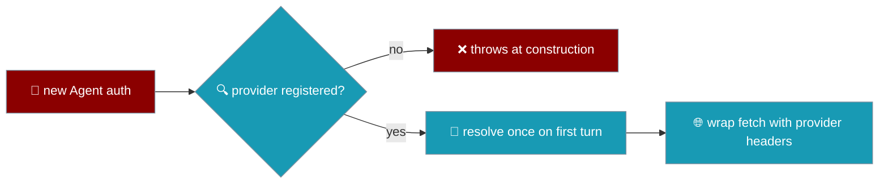

`auth` tells an Agent to bill a run against a subscription seat rather than an API key.



## Quick Start

<Steps>

<Step title="Pick a provider">
```typescript
import { Agent } from 'praisonai';

const agent = new Agent({
  instructions: 'You are helpful',
  auth: 'claude-code',
});
const reply = await agent.chat('Hello');
```
</Step>

<Step title="Let auth choose the model">
Omit `llm` and `auth` picks the provider's default model, so a subscription token never ships to the wrong endpoint.
</Step>

</Steps>

---

## Default models

When you pass `auth` without an `llm`, the agent uses the provider's default model.

| Provider | Default model |
|---|---|
| `claude-code` | `anthropic/claude-sonnet-4-5` |
| `qwen-cli` | `openai/qwen3-coder-plus` |

## How it works

The credentials are resolved once on the first turn, then every outgoing request is sent through a `fetch` wrapper that adds the provider's headers. Existing headers on a request win, so you can still override one deliberately.

Because a subscription seat belongs to one vendor, `auth` also pins the default model — falling back to API-key billing would charge the wrong account, so an unregistered provider fails at construction rather than at request time.

## When it throws

```typescript
import { Agent } from 'praisonai';

new Agent({ instructions: 'Hi', auth: 'not-a-provider' });
// Error: Unknown subscription provider 'not-a-provider'. Registered: (none).
//   A subscription store is a host concern: register one with
//   registerAuthProvider('not-a-provider', resolver).
```

<Note>
Credential stores (a Claude Code keychain entry, a Codex CLI file) are **host concerns** and are not read by the SDK. Register your own resolver with `registerAuthProvider(name, resolver)` — the TypeScript counterpart to Python's `register_subscription_provider`.
</Note>

## Related

<CardGroup cols={2}>
  <Card title="Agent" icon="robot" href="/js/agent">
    Constructor options
  </Card>
  <Card title="Model Routing" icon="route" href="/js/model-routing">
    How model names resolve
  </Card>
</CardGroup>
