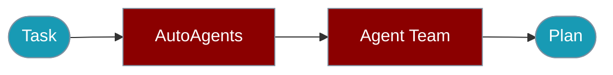

Generate multi-agent teams automatically from a plain-language task description.



## Quick Start

<Steps>

<Step title="Simple Usage">
```bash
npm install praisonai
```
```typescript
import { AutoAgents } from 'praisonai';

const auto = new AutoAgentTeam();
const team = await auto.generate('Build a web scraper that extracts product prices');
console.log('Agents:', team.agents.length);
```
</Step>

<Step title="With Configuration">
```typescript
const auto = new AutoAgentTeam({
  llm: 'openai/gpt-4o',
  pattern: 'parallel',
  verbose: true,
});
const team = await auto.generate('Create a data pipeline');
```
</Step>

</Steps>

---

## Installation

```bash
npm install praisonai
```

## Basic Usage

```typescript
import { AutoAgents } from 'praisonai';

const auto = new AutoAgentTeam();

const team = await auto.generate('Build a web scraper that extracts product prices');

console.log('Agents:', team.agents.length);
console.log('Tasks:', team.tasks.length);
console.log('Pattern:', team.pattern);
```

## With Configuration

```typescript
import { AutoAgents } from 'praisonai';

const auto = new AutoAgentTeam({
  llm: 'openai/gpt-4o',
  pattern: 'parallel',
  singleAgent: false,
  verbose: true
});

const team = await auto.generate('Create a data pipeline');
```

## Pattern Recommendation

```typescript
import { AutoAgents } from 'praisonai';

const auto = new AutoAgentTeam();

// Get recommended pattern for a task
const pattern = auto.recommendPattern('Run tasks in parallel');
console.log(pattern); // 'parallel'

const pattern2 = auto.recommendPattern('Route requests to different handlers');
console.log(pattern2); // 'routing'
```

## Complexity Analysis

```typescript
import { AutoAgents } from 'praisonai';

const auto = new AutoAgentTeam();

const simple = auto.analyzeComplexity('Write code');
console.log(simple); // 'simple'

const complex = auto.analyzeComplexity(
  'Build a multi-step data pipeline with validation, transformation, and multiple output formats'
);
console.log(complex); // 'complex'
```

## Available Patterns

```typescript
import { AutoAgents } from 'praisonai';

// Sequential - tasks run one after another
const sequential = new AutoAgentTeam({ pattern: 'sequential' });

// Parallel - tasks run simultaneously
const parallel = new AutoAgentTeam({ pattern: 'parallel' });

// Routing - tasks routed based on conditions
const routing = new AutoAgentTeam({ pattern: 'routing' });

// Orchestrator-workers - one agent coordinates others
const orchestrator = new AutoAgentTeam({ pattern: 'orchestrator-workers' });

// Evaluator-optimizer - iterative improvement
const evaluator = new AutoAgentTeam({ pattern: 'evaluator-optimizer' });
```

## Single Agent Mode

```typescript
import { AutoAgents } from 'praisonai';

const auto = new AutoAgentTeam({ singleAgent: true });

const result = await auto.generate('Simple task');
console.log('Agents:', result.agents.length); // 1
```

## Team Structure

```typescript
interface TeamStructure {
  agents: AgentConfig[];
  tasks: TaskConfig[];
  pattern: 'sequential' | 'parallel' | 'hierarchical';
}

interface AgentConfig {
  name: string;
  role: string;
  goal: string;
  backstory?: string;
  instructions?: string;
  tools?: string[];
}

interface TaskConfig {
  description: string;
  expectedOutput?: string;
  agent?: string;
}
```

## Factory Function

```typescript
import { createAutoAgents } from 'praisonai';

const auto = createAutoAgentTeam({
  pattern: 'sequential',
  verbose: true
});
```

---

## Related

<CardGroup cols={2}>
  <Card title="AutoAgents CLI" icon="terminal" href="/docs/js/auto-agents-cli">
    CLI commands
  </Card>
  <Card title="AgentTeam" icon="users" href="/docs/js/agent-team">
    Run generated teams
  </Card>
</CardGroup>
