Agents can operate at different autonomy levels - from suggesting actions to fully autonomous.

```mermaid
graph LR
    subgraph "Autonomy Levels"
        A[💬 Suggest] --> B[📝 Auto Edit]
        B --> C[🚀 Full Auto]
    end
    
    classDef suggest fill:#6366F1,stroke:#7C90A0,color:#fff
    classDef edit fill:#F59E0B,stroke:#7C90A0,color:#fff
    classDef auto fill:#10B981,stroke:#7C90A0,color:#fff
    
    class A suggest
    class B edit
    class C auto
```



## Quick Start

<Steps>

<Step title="Suggest Mode (Safest)">
```typescript
import { Agent } from 'praisonai';

const agent = new Agent({
  instructions: 'You help with code',
  autonomy: 'suggest'  // Only suggests, never acts
});

await agent.chat('Fix the bug in app.js');
// → "I suggest changing line 42 to..."
```
</Step>

<Step title="Full Auto Mode">
```typescript
const agent = new Agent({
  instructions: 'You complete tasks autonomously',
  autonomy: 'full_auto'
});

await agent.chat('Update the readme');
// → Agent edits the file directly
```
</Step>

</Steps>

---

## User Interaction Flow


---

## Configuration Levels

```typescript
// Level 1: String - Named mode
const agent = new Agent({
  autonomy: 'suggest'  // 'suggest', 'auto_edit', 'full_auto'
});

// Level 2: Dict - With limits
const agent = new Agent({
  autonomy: {
    mode: 'auto_edit',
    maxEdits: 10,
    requireConfirmation: true
  }
});

// Level 3: Instance - Full control
import { AutonomyManager } from 'praisonai';

const manager = new AutonomyManager({
  mode: 'full_auto',
  policies: {
    allowFileEdits: true,
    allowCommands: false
  }
});
```

---

## Autonomy Modes

| Mode | Behavior |
|------|----------|
| `suggest` | Only suggests, never acts |
| `auto_edit` | Asks before making changes |
| `full_auto` | Acts without asking |

---

## API Reference

<Card title="AgentConfig" icon="code" href="/docs/sdk/reference/typescript/classes/AgentConfig">
  Agent configuration including autonomy
</Card>

---

## Best Practices

<AccordionGroup>
  <Accordion title="Start with suggest">
    Begin in suggest mode until you trust the agent's decisions.
  </Accordion>
  
  <Accordion title="Use auto_edit for productivity">
    Auto-edit balances speed with human oversight.
  </Accordion>
  
  <Accordion title="Reserve full_auto for safe tasks">
    Only use full_auto for well-tested, low-risk workflows.
  </Accordion>
</AccordionGroup>

---

## Related

<CardGroup cols={2}>
  <Card title="Approval" icon="shield-check" href="/docs/js/approval">
    Human approval
  </Card>
  <Card title="Guardrails" icon="shield" href="/docs/js/guardrails">
    Safety limits
  </Card>
</CardGroup>
