Autonomy modes control how much freedom agents have to execute actions without human approval.

```mermaid
graph LR
    subgraph "Autonomy Modes"
        A[🤖 Agent Action] --> B{Mode?}
        B -->|Suggest| C[⚠️ Ask Always]
        B -->|Auto Edit| D[✏️ Auto Files]
        B -->|Full Auto| E[⚡ Auto All]
    end
    
    classDef action fill:#6366F1,stroke:#7C90A0,color:#fff
    classDef decision fill:#F59E0B,stroke:#7C90A0,color:#fff
    classDef mode fill:#10B981,stroke:#7C90A0,color:#fff
    
    class A action
    class B decision
    class C,D,E mode
```



## Quick Start

<Steps>

<Step title="Create Autonomy Manager">
```typescript
import { createAutonomyManager } from 'praisonai';

const manager = createAutonomyManager({
  mode: 'suggest'
});

console.log(manager.getSummary());
```
</Step>

<Step title="Request Action Approval">
```typescript
import { createAutonomyManager, cliApprovalPrompt } from 'praisonai';

const manager = createAutonomyManager({ mode: 'suggest' });
manager.setPromptCallback(cliApprovalPrompt);

const decision = await manager.requestApproval({
  type: 'file_write',
  description: 'Create new configuration file',
  target: './config.json'
});

if (decision.approved) {
  // Proceed with action
}
```
</Step>

<Step title="Set Autonomy Mode">
```typescript
import { createAutonomyManager } from 'praisonai';

const manager = createAutonomyManager();

// Conservative - requires approval for most actions
manager.setMode('suggest');

// Balanced - auto-approves file operations
manager.setMode('auto_edit');

// Aggressive - auto-approves most actions
manager.setMode('full_auto');
```
</Step>

</Steps>

---

## How It Works

```mermaid
graph TB
    subgraph "Decision Flow"
        A[Action Request] --> B{Max Actions?}
        B -->|Exceeded| C[❌ Deny]
        B -->|OK| D{Remembered?}
        D -->|Yes| E[Use Remembered]
        D -->|No| F{Auto Pattern?}
        F -->|Approve| G[✅ Approve]
        F -->|Deny| C
        F -->|No Match| H{Needs Approval?}
        H -->|No| G
        H -->|Yes| I[Prompt User]
        I --> J{User Decision}
        J -->|Yes| G
        J -->|No| C
    end
    
    classDef start fill:#6366F1,stroke:#7C90A0,color:#fff
    classDef decision fill:#F59E0B,stroke:#7C90A0,color:#fff
    classDef approve fill:#10B981,stroke:#7C90A0,color:#fff
    classDef deny fill:#8B0000,stroke:#7C90A0,color:#fff
    
    class A start
    class B,D,F,H,J decision
    class E,G approve
    class C deny
```



---

## Autonomy Modes


| Mode | Description | Best For |
|------|-------------|----------|
| `suggest` | Requires approval for most actions | Sensitive environments |
| `auto_edit` | Auto-approves file read/write | Development workflows |
| `full_auto` | Auto-approves all except package install | Trusted automation |

### Mode Policies

| Action Type | suggest | auto_edit | full_auto |
|-------------|---------|-----------|-----------|
| `file_read` | ✅ Auto | ✅ Auto | ✅ Auto |
| `file_write` | ⚠️ Approval | ✅ Auto | ✅ Auto |
| `file_delete` | ⚠️ Approval | ⚠️ Approval | ✅ Auto |
| `shell_command` | ⚠️ Approval | ⚠️ Approval | ✅ Auto |
| `network_request` | ⚠️ Approval | ✅ Auto | ✅ Auto |
| `git_operation` | ⚠️ Approval | ⚠️ Approval | ✅ Auto |
| `install_package` | ⚠️ Approval | ⚠️ Approval | ⚠️ Approval |

---

## Configuration Options

### AutonomyConfig

```typescript
import { createAutonomyManager } from 'praisonai';

const manager = createAutonomyManager({
  mode: 'suggest',
  rememberDecisions: true,
  maxAutoActions: 100,
  policies: [
    { 
      action: 'file_write', 
      requiresApproval: true,
      autoApprovePatterns: ['*.tmp', '*.log'],
      autoDenyPatterns: ['/etc/*', '/system/*']
    }
  ]
});
```

| Option | Type | Default | Description |
|--------|------|---------|-------------|
| `mode` | `AutonomyMode` | `'suggest'` | Base autonomy mode |
| `rememberDecisions` | `boolean` | `true` | Remember user decisions |
| `maxAutoActions` | `number` | `100` | Max auto-approved actions before pause |
| `policies` | `ApprovalPolicy[]` | - | Custom action policies |

### ApprovalPolicy

| Option | Type | Description |
|--------|------|-------------|
| `action` | `ActionType` | Action type this policy applies to |
| `requiresApproval` | `boolean` | Whether approval is needed |
| `autoApprovePatterns` | `string[]` | Glob patterns for auto-approval |
| `autoDenyPatterns` | `string[]` | Glob patterns for auto-denial |

### ActionType

| Type | Description |
|------|-------------|
| `file_read` | Reading files |
| `file_write` | Writing/creating files |
| `file_delete` | Deleting files |
| `shell_command` | Running shell commands |
| `network_request` | Making HTTP requests |
| `git_operation` | Git commands (commit, push, etc.) |
| `install_package` | Installing packages (always requires approval) |

---

## Common Patterns

### Custom Approval Policy

```typescript
import { createAutonomyManager } from 'praisonai';

const manager = createAutonomyManager({ mode: 'suggest' });

// Auto-approve writes to temp directory
manager.addPolicy({
  action: 'file_write',
  requiresApproval: true,
  autoApprovePatterns: ['/tmp/*', '*.log', '*.tmp'],
  autoDenyPatterns: ['/etc/*', '/usr/*', '*.exe']
});
```

### Track Action Counts

```typescript
const manager = createAutonomyManager({
  maxAutoActions: 50
});

// ... many actions later

console.log(`Actions taken: ${manager.getActionCount()}`);

// Hit limit - reset to continue
if (manager.getActionCount() >= 50) {
  manager.resetActionCount();
}
```

### Clear Remembered Decisions

```typescript
const manager = createAutonomyManager({
  rememberDecisions: true
});

// User approves file_write once, future writes auto-approved

// Clear when switching contexts
manager.clearRemembered();
```

### Custom Approval Prompt

```typescript
import { createAutonomyManager, type ActionRequest } from 'praisonai';

const manager = createAutonomyManager({ mode: 'suggest' });

manager.setPromptCallback(async (request: ActionRequest) => {
  // Custom UI prompt
  const approved = await showModal({
    title: `Approve ${request.type}?`,
    message: request.description,
    target: request.target
  });
  
  return approved;
});
```

---

## CLI Commands

```bash
# Check current status
praisonai autonomy status

# Set mode
praisonai autonomy set suggest
praisonai autonomy set auto_edit
praisonai autonomy set full_auto

# View policies for a mode
praisonai autonomy policies suggest
praisonai autonomy policies auto_edit

# Reset to defaults
praisonai autonomy reset

# JSON output
praisonai autonomy status --json
```

---

## Best Practices

<AccordionGroup>
  <Accordion title="Start with suggest mode">
    Begin with the most restrictive mode and only increase autonomy after building trust with the agent's behavior.
  </Accordion>
  
  <Accordion title="Use pattern-based auto-approval">
    Configure `autoApprovePatterns` for known-safe operations to reduce approval fatigue while maintaining security.
  </Accordion>
  
  <Accordion title="Set reasonable action limits">
    Use `maxAutoActions` to prevent runaway automation and force periodic human review.
  </Accordion>
  
  <Accordion title="Package installs always need approval">
    The `install_package` action requires approval even in `full_auto` mode - this is intentional for security.
  </Accordion>
</AccordionGroup>

---

## Related

<CardGroup cols={2}>
  <Card title="Approval" icon="shield-check" href="/docs/js/approval">
    Human-in-the-loop tool approval
  </Card>
  <Card title="Guardrails" icon="shield" href="/docs/js/guardrails">
    Input/output validation
  </Card>
</CardGroup>
