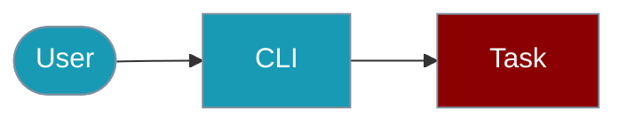

## Quick Start

<Steps>

<Step title="Simple Usage">
```bash
praisonai-ts background run my-recipe
```
</Step>

<Step title="With Configuration">
```bash
praisonai-ts background run my-recipe --timeout 600
```
</Step>

</Steps>

---
Background task CLI (TypeScript)

Manage background tasks using the praisonai-ts CLI.

## Installation

```bash
npm install -g praisonai-ts
```

## Commands Overview

| Command | Description |
|---------|-------------|
| `praisonai-ts background list` | List all background tasks |
| `praisonai-ts background status <id>` | Get task status |
| `praisonai-ts background cancel <id>` | Cancel a running task |
| `praisonai-ts background clear` | Clear completed tasks |
| `praisonai-ts background submit` | Submit a recipe as background task |

## Submit a Recipe

```bash
# Basic submission
praisonai-ts background submit --recipe my-recipe

# With input data
praisonai-ts background submit --recipe my-recipe --input '{"query": "test"}'

# With config overrides
praisonai-ts background submit --recipe my-recipe --config '{"maxTokens": 1000}'

# With session ID
praisonai-ts background submit --recipe my-recipe --session-id session_123

# With timeout
praisonai-ts background submit --recipe my-recipe --timeout 600

# JSON output
praisonai-ts background submit --recipe my-recipe --json
```

### Submit Options

| Option | Description |
|--------|-------------|
| `--recipe` | Recipe name to execute (required) |
| `--input, -i` | Input data as JSON string |
| `--config, -c` | Config overrides as JSON string |
| `--session-id, -s` | Session ID for conversation continuity |
| `--timeout` | Timeout in seconds (default: 300) |
| `--json` | Output JSON for scripting |

## List Tasks

```bash
# List all tasks
praisonai-ts background list

# Filter by status
praisonai-ts background list --status running

# JSON output
praisonai-ts background list --json
```

## Check Status

```bash
# Get status
praisonai-ts background status task_abc123

# JSON output
praisonai-ts background status task_abc123 --json
```

## Cancel Task

```bash
# Cancel task
praisonai-ts background cancel task_abc123
```

## Clear Completed

```bash
# Clear completed tasks
praisonai-ts background clear

# Clear all tasks
praisonai-ts background clear --all
```

## Examples

### Complete Workflow

```bash
# 1. Submit a recipe
praisonai-ts background submit --recipe news-monitor --json

# 2. Check status
praisonai-ts background status task_abc123

# 3. List all tasks
praisonai-ts background list

# 4. Clear completed
praisonai-ts background clear
```

### Scripting with JSON

```bash
#!/bin/bash

# Submit and capture task ID
RESULT=$(praisonai-ts background submit --recipe my-recipe --json)
TASK_ID=$(echo $RESULT | jq -r '.taskId')

echo "Submitted task: $TASK_ID"

# Poll for completion
while true; do
    STATUS=$(praisonai-ts background status $TASK_ID --json | jq -r '.status')
    if [ "$STATUS" = "completed" ] || [ "$STATUS" = "failed" ]; then
        break
    fi
    sleep 5
done

echo "Task finished: $STATUS"
```

## Related

<CardGroup cols={2}>
  <Card title="Background Tasks" icon="layer-group" href="/docs/js/background-tasks">
    SDK documentation
  </Card>
  <Card title="Async Jobs CLI" icon="terminal" href="/docs/js/async-jobs-cli">
    Async jobs CLI
  </Card>
  <Card title="Agent" icon="robot" href="/docs/js/agent">
    Single agent API
  </Card>
</CardGroup>
