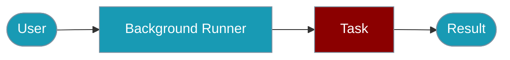

Run recipes and agents asynchronously in the background with progress tracking and cancellation.



## Quick Start

<Steps>

<Step title="Simple Usage">
```bash
npm install praisonai-ts
```
```typescript
import { recipe } from 'praisonai-ts';

const task = await recipe.runBackground('my-recipe', {
  input: { query: 'What is AI?' },
});
const result = await task.wait(600);
```
</Step>

<Step title="With Configuration">
```typescript
const task = await recipe.runBackground('my-recipe', {
  input: { query: 'What is AI?' },
  timeoutSec: 300,
  sessionId: 'session_123',
});
```
</Step>

</Steps>

---

## Basic Usage

### Running a Recipe in Background

```typescript
import { recipe } from 'praisonai-ts';

// Submit recipe as background task
const task = await recipe.runBackground('my-recipe', {
  input: { query: 'What is AI?' },
  config: { maxTokens: 1000 },
  sessionId: 'session_123',
  timeoutSec: 300,
});

console.log(`Task ID: ${task.taskId}`);
console.log(`Session: ${task.sessionId}`);

// Check status
const status = await task.status();
console.log(`Status: ${status}`);

// Wait for completion
const result = await task.wait(600);
console.log(`Result: ${result}`);

// Cancel if needed
await task.cancel();
```

### BackgroundTaskHandle Interface

```typescript
interface BackgroundTaskHandle {
  taskId: string;
  recipeName: string;
  sessionId?: string;
  
  status(): Promise<TaskStatus>;
  wait(timeout?: number): Promise<any>;
  cancel(): Promise<boolean>;
}

type TaskStatus = 'pending' | 'running' | 'completed' | 'failed' | 'cancelled';
```

## Using with Agents

```typescript
import { Agent, BackgroundRunner } from 'praisonai-ts';

// Create agent
const agent = new Agent({
  instructions: 'You are a helpful assistant',
  verbose: true,
});

// Create background runner
const runner = new BackgroundRunner({ maxConcurrentTasks: 5 });

// Submit task
const task = await runner.submit(
  () => agent.start('Analyze this data'),
  {
    name: 'analysis-task',
    timeout: 300,
  }
);

// Wait for result
const result = await runner.waitForTask(task.id);
```

## Configuration

### Safe Defaults

| Setting | Default | Description |
|---------|---------|-------------|
| `timeoutSec` | 300 | Maximum execution time (5 minutes) |
| `maxConcurrent` | 5 | Maximum concurrent tasks |
| `cleanupDelaySec` | 3600 | Time before completed tasks are cleaned up |

### Runtime Configuration

Configure in your recipe's `TEMPLATE.yaml`:

```yaml
runtime:
  background:
    enabled: true
    max_concurrent: 3
    cleanup_delay_sec: 3600
```

## Error Handling

```typescript
import { recipe, RecipeError } from 'praisonai-ts';

try {
  const task = await recipe.runBackground('my-recipe', { input: 'test' });
  const result = await task.wait(60);
} catch (error) {
  if (error instanceof RecipeError) {
    console.error(`Recipe error: ${error.message}`);
  } else if (error.name === 'TimeoutError') {
    console.error('Task timed out');
    await task.cancel();
  }
}
```

## Best Practices

<AccordionGroup>
  <Accordion title="Always set timeouts">
    - Prevent tasks from running indefinitely
  </Accordion>

  <Accordion title="Use session IDs">
    - Track related tasks across executions
  </Accordion>

  <Accordion title="Handle cancellation">
    - Clean up resources when tasks are cancelled
  </Accordion>

  <Accordion title="Monitor progress">
    - Use status checks for long-running tasks
  </Accordion>

  <Accordion title="Limit concurrency">
    - Don't overwhelm system resources
  </Accordion>

</AccordionGroup>

## Related

<CardGroup cols={2}>
  <Card title="Background Tasks CLI" icon="terminal" href="/docs/js/background-tasks-cli">
    CLI commands
  </Card>
  <Card title="Async Jobs" icon="server" href="/docs/js/async-jobs">
    Server-based jobs
  </Card>
  <Card title="Scheduler" icon="clock" href="/docs/js/scheduler">
    Periodic scheduling
  </Card>
</CardGroup>
