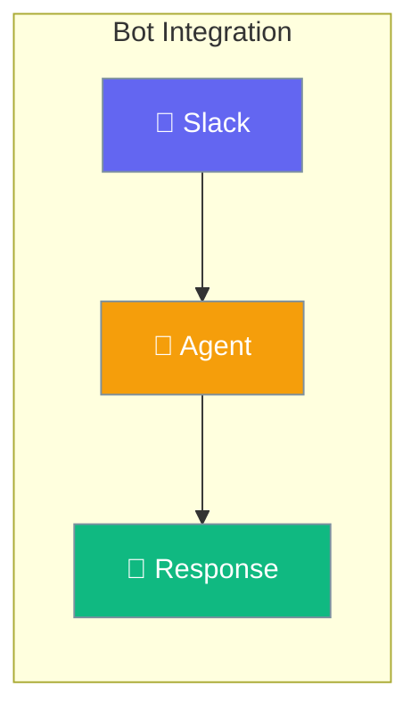
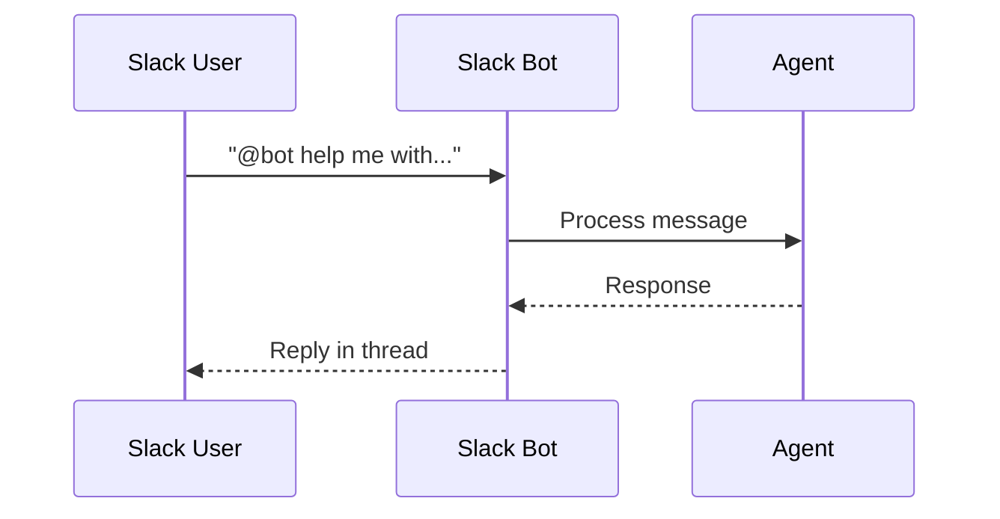

Agents can live inside Slack — chat naturally where your team works.



## Quick Start

<Steps>

<Step title="Create a Slack Bot">
```typescript
import { Agent, createSlackBot } from 'praisonai';

const agent = new Agent({
  instructions: 'You are a helpful team assistant'
});

const bot = createSlackBot({
  botToken: process.env.SLACK_BOT_TOKEN!,
  appToken: process.env.SLACK_APP_TOKEN!,
  socketMode: true
});

bot.onMessage(async (message) => {
  const response = await agent.chat(message.text);
  return { text: response, threadTs: message.ts };
});

await bot.start();
// ⚡️ Slack bot is running in Socket Mode
```
</Step>

<Step title="Handle @Mentions">
```typescript
bot.onAppMention(async (message) => {
  const response = await agent.chat(message.text);
  return { text: response, threadTs: message.ts };
});
```
</Step>

</Steps>

---

## User Interaction Flow



---

## Configuration

```typescript
import { createSlackBot } from 'praisonai';

// Webhook mode (production)
const bot = createSlackBot({
  botToken: process.env.SLACK_BOT_TOKEN!,
  signingSecret: process.env.SLACK_SIGNING_SECRET!
});

bot.onMessage(async (message) => {
  return { text: 'Hello!' };
});

await bot.listen(3000); // Start webhook server

// Socket Mode (development — no public URL needed)
const devBot = createSlackBot({
  botToken: process.env.SLACK_BOT_TOKEN!,
  appToken: process.env.SLACK_APP_TOKEN!,
  socketMode: true
});

devBot.onMessage(async (message) => {
  return { text: 'Hello!' };
});

await devBot.start();
```

| Option | Type | Required | Description |
|--------|------|:--------:|-------------|
| `botToken` | `string` | ✅ | Bot OAuth token (`xoxb-...`) |
| `appToken` | `string` | Socket Mode | App-level token (`xapp-...`) |
| `signingSecret` | `string` | Webhook | For webhook request verification |
| `socketMode` | `boolean` | — | Enable Socket Mode (default: `false`) |

---

## Send Messages Proactively

```typescript
// Send a message to any channel
await bot.sendMessage('#general', 'Daily standup reminder!', {
  threadTs: '1234567890.123456'  // optional: reply in thread
});
```

---

## Other Platforms

<Note>
The TypeScript SDK currently supports **Slack** via `createSlackBot`. Support for **Telegram**, **Discord**, and **WhatsApp** is coming soon.

For multi-platform bots today, use the [Python SDK](/features/messaging-bots) which supports all four platforms.
</Note>

---

## Environment Variables

| Variable | Description |
|----------|-------------|
| `SLACK_BOT_TOKEN` | Bot OAuth token |
| `SLACK_APP_TOKEN` | App-level token for Socket Mode |
| `SLACK_SIGNING_SECRET` | For webhook mode verification |

---

## Best Practices

<AccordionGroup>
  <Accordion title="Use Socket Mode for development">
    No public URL needed — easier for local testing.
  </Accordion>
  
  <Accordion title="Reply in threads">
    Keep conversations organized by setting `threadTs` in responses.
  </Accordion>
  
  <Accordion title="Handle errors gracefully">
    Always return a response, even if just "I couldn't process that".
  </Accordion>
</AccordionGroup>

---

## Related

<CardGroup cols={2}>
  <Card title="Agent" icon="user" href="/docs/js/agent">
    Create agents
  </Card>
  <Card title="Python Messaging Bots" icon="robot" href="/features/messaging-bots">
    Multi-platform bot support (Telegram, Discord, Slack, WhatsApp)
  </Card>
</CardGroup>
