Bots enables building AI-powered chat bots for platforms like Slack using PraisonAI agents.

```mermaid
graph LR
    subgraph "Bot Architecture"
        A[📱 Platform] -->|Message| B[🤖 Bot Adapter]
        B -->|Process| C[🧠 Agent]
        C -->|Response| B
        B -->|Reply| A
    end
    
    classDef platform fill:#6366F1,stroke:#7C90A0,color:#fff
    classDef bot fill:#F59E0B,stroke:#7C90A0,color:#fff
    classDef agent fill:#10B981,stroke:#7C90A0,color:#fff
    
    class A platform
    class B bot
    class C agent
```



## Quick Start

<Steps>

<Step title="Create Slack Bot">
```typescript
import { createSlackBot, Agent } from 'praisonai';

const agent = new Agent({
  instructions: 'You are a helpful Slack assistant'
});

const bot = createSlackBot({
  botToken: process.env.SLACK_BOT_TOKEN!,
  signingSecret: process.env.SLACK_SIGNING_SECRET!
});

bot.onMessage(async (message) => {
  const response = await agent.chat(message.text);
  return { text: response, threadTs: message.ts };
});

bot.listen(3000);
```
</Step>

<Step title="Socket Mode (No Public URL)">
```typescript
const bot = createSlackBot({
  botToken: process.env.SLACK_BOT_TOKEN!,
  appToken: process.env.SLACK_APP_TOKEN!,
  socketMode: true
});

bot.onMessage(async (message) => {
  return { text: 'Hello from Socket Mode!' };
});

await bot.start();
```
</Step>

<Step title="Handle App Mentions">
```typescript
bot.onAppMention(async (message) => {
  // Respond only when @mentioned
  return { 
    text: `Hi <@${message.user}>! How can I help?`,
    threadTs: message.ts
  };
});
```
</Step>

</Steps>

---

## How It Works


---

## Configuration Options

### SlackConfig

```typescript
import { createSlackBot } from 'praisonai';

const bot = createSlackBot({
  botToken: 'xoxb-...',
  appToken: 'xapp-...',
  signingSecret: 'your-signing-secret',
  socketMode: false
});
```

| Option | Type | Default | Description |
|--------|------|---------|-------------|
| `botToken` | `string` | - | Slack Bot Token (xoxb-...) |
| `appToken` | `string` | - | App Token for Socket Mode (xapp-...) |
| `signingSecret` | `string` | - | Signing secret for webhooks |
| `socketMode` | `boolean` | `false` | Use Socket Mode |

### SlackMessage

| Field | Type | Description |
|-------|------|-------------|
| `channel` | `string` | Channel ID |
| `user` | `string` | User ID |
| `text` | `string` | Message text |
| `threadTs` | `string` | Thread timestamp |
| `ts` | `string` | Message timestamp |
| `botId` | `string` | Bot ID (if from bot) |

### SlackResponse

| Field | Type | Description |
|-------|------|-------------|
| `text` | `string` | Response text |
| `blocks` | `any[]` | Rich formatting blocks |
| `threadTs` | `string` | Reply in thread |
| `unfurlLinks` | `boolean` | Unfurl links |
| `unfurlMedia` | `boolean` | Unfurl media |

---

## Common Patterns

### Thread Replies

```typescript
bot.onMessage(async (message) => {
  return {
    text: 'This appears in the thread',
    threadTs: message.threadTs || message.ts
  };
});
```

### Rich Formatting with Blocks

```typescript
bot.onMessage(async (message) => {
  return {
    text: 'Check this out',
    blocks: [
      {
        type: 'section',
        text: { type: 'mrkdwn', text: '*Bold* and `code`' }
      },
      {
        type: 'divider'
      },
      {
        type: 'actions',
        elements: [
          { type: 'button', text: { type: 'plain_text', text: 'Click' } }
        ]
      }
    ]
  };
});
```

### Send Proactive Messages

```typescript
await bot.sendMessage('#general', 'Hello everyone!', {
  unfurlLinks: false
});
```

### Express Middleware

```typescript
import express from 'express';

const app = express();
app.use('/slack/events', bot.getExpressMiddleware());
app.listen(3000);
```

---

## Utilities

### Parse Slack Messages

```typescript
import { parseSlackMessage } from 'praisonai';

const { mentions, links, cleanText } = parseSlackMessage(
  '<@U123> check <https://example.com|this link>'
);

console.log(mentions); // ['U123']
console.log(links);    // ['https://example.com']
console.log(cleanText); // 'check this link (https://example.com)'
```

### Verify Signatures

```typescript
import { verifySlackSignature } from 'praisonai';

const isValid = verifySlackSignature(
  signingSecret,
  req.headers['x-slack-signature'],
  req.headers['x-slack-request-timestamp'],
  rawBody
);
```

---

## Environment Variables

| Variable | Description |
|----------|-------------|
| `SLACK_BOT_TOKEN` | Bot token starting with xoxb- |
| `SLACK_APP_TOKEN` | App token for Socket Mode (xapp-) |
| `SLACK_SIGNING_SECRET` | Webhook signing secret |

---

## Best Practices

<AccordionGroup>
  <Accordion title="Use Socket Mode for development">
    Socket Mode doesn't require a public URL, making it ideal for local development.
  </Accordion>
  
  <Accordion title="Always reply in threads">
    Set `threadTs` to keep conversations organized and prevent channel flooding.
  </Accordion>
  
  <Accordion title="Handle bot messages">
    Messages from bots include `botId` - skip processing to avoid loops.
  </Accordion>
  
  <Accordion title="Use app mentions for public channels">
    In public channels, respond only to @mentions to avoid noise.
  </Accordion>
</AccordionGroup>

---

## Related

<CardGroup cols={2}>
  <Card title="Agent" icon="user" href="/docs/js/agent">
    Core agent functionality
  </Card>
  <Card title="Memory" icon="brain" href="/docs/js/memory">
    Persist conversation context
  </Card>
</CardGroup>
