Agents can live in Slack, Discord, and other platforms - chat naturally where your team works.

```mermaid
graph LR
    subgraph "Bot Integration"
        A[💬 Slack] --> B[🤖 Agent]
        B --> C[💬 Response]
    end
    
    classDef platform fill:#6366F1,stroke:#7C90A0,color:#fff
    classDef agent fill:#F59E0B,stroke:#7C90A0,color:#fff
    classDef output fill:#10B981,stroke:#7C90A0,color:#fff
    
    class A platform
    class B agent
    class C output
```



## Quick Start

<Steps>

<Step title="Create Slack Bot">
```typescript
import { Agent, SlackBot } from 'praisonai';

const agent = new Agent({
  instructions: 'You are a helpful team assistant'
});

const bot = new SlackBot({
  agent,
  token: process.env.SLACK_BOT_TOKEN,
  appToken: process.env.SLACK_APP_TOKEN
});

await bot.start();
// Bot is now live in Slack!
```
</Step>

<Step title="Handle Mentions">
```typescript
bot.on('app_mention', async (event) => {
  const response = await agent.chat(event.text);
  await bot.reply(event, response);
});
```
</Step>

</Steps>

---

## User Interaction Flow


---

## Configuration Levels

```typescript
// Level 1: Instance - Basic bot
const bot = new SlackBot({
  agent,
  token: process.env.SLACK_BOT_TOKEN
});

// Level 2: Dict - With options
const bot = new SlackBot({
  agent,
  token: process.env.SLACK_BOT_TOKEN,
  appToken: process.env.SLACK_APP_TOKEN,
  mode: 'socket'  // or 'http'
});

// Level 3: Full control - Custom handlers
const bot = new SlackBot({
  agent,
  token: process.env.SLACK_BOT_TOKEN,
  handlers: {
    message: customMessageHandler,
    reaction: customReactionHandler
  }
});
```

---

## Environment Variables

| Variable | Description |
|----------|-------------|
| `SLACK_BOT_TOKEN` | Bot OAuth token |
| `SLACK_APP_TOKEN` | App-level token for Socket Mode |
| `SLACK_SIGNING_SECRET` | For HTTP mode verification |

---

## Best Practices

<AccordionGroup>
  <Accordion title="Use Socket Mode for development">
    No public URL needed - easier for local testing.
  </Accordion>
  
  <Accordion title="Reply in threads">
    Keep conversations organized by threading responses.
  </Accordion>
  
  <Accordion title="Handle errors gracefully">
    Always respond, even if just "I couldn't process that".
  </Accordion>
</AccordionGroup>

---

## Related

<CardGroup cols={2}>
  <Card title="Agent" icon="user" href="/docs/js/agent">
    Create agents
  </Card>
  <Card title="Events" icon="bell" href="/docs/js/events">
    Event handling
  </Card>
</CardGroup>
