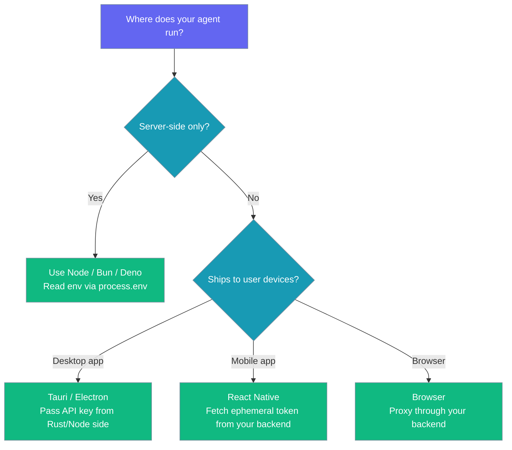

The PraisonAI TypeScript SDK runs in any JavaScript runtime — not just Node. Pass the API key through the `Agent` config, and the same code that runs on your server runs inside a Tauri app, a React Native mobile app, a browser webview, Deno, Bun, or a Cloudflare Worker.

```mermaid
graph LR
    subgraph "One codebase, many runtimes"
        Code[📝 new Agent&#40;...&#41;] --> Runtime{🌐 JS Runtime}
        Runtime --> Node[🖥️ Node.js]
        Runtime --> Tauri[💻 Tauri Desktop]
        Runtime --> RN[📱 React Native]
        Runtime --> Browser[🌍 Browser]
        Runtime --> Edge[⚡ Deno / Bun / Workers]
    end

    classDef input fill:#6366F1,stroke:#7C90A0,color:#fff
    classDef check fill:#189AB4,stroke:#7C90A0,color:#fff
    classDef output fill:#10B981,stroke:#7C90A0,color:#fff

    class Code input
    class Runtime check
    class Node,Tauri,RN,Browser,Edge output
```



## Quick Start

<Steps>
<Step title="Create an agent in a browser bundle">
Pass the API key explicitly — a browser bundle has no `process.env`.

```typescript
import { Agent } from 'praisonai';

const agent = new Agent({
  instructions: 'You are a helpful assistant',
  llm: 'gpt-4o-mini',
});

const answer = await agent.start('Say hello');
console.log(answer);
```
</Step>
</Steps>

<Warning>
Never bundle a raw API key into a shipped browser or mobile build. Route requests through your own backend or an ephemeral-token endpoint. This example assumes a trusted-device / desktop / dev context.
</Warning>

---

## Choosing Where to Run

Pick the runtime that matches how your agent ships.



---

## What Changed

The `Agent` constructor now works on runtimes without a `process` global.

Previously the constructor read `process.env.OPENAI_MODEL_NAME`, `PRAISONAI_MODEL`, `PRAISON_VERBOSE`, and `PRAISON_PRETTY` directly. On any runtime without a `process` global (Tauri webview, React Native, plain browser), the very first `new Agent(...)` threw `ReferenceError: process is not defined` — before your code ever ran.

Now those reads go through an internal `getEnv()` helper that returns `undefined` when there is no `process`. Constructors succeed, defaults apply (`gpt-4o-mini`, verbose on, pretty off), and any explicit config value still wins.

Streaming also survives: the default token sink (`writeTokenToStdout`) no-ops when `process.stdout` is unavailable, so `agent.start()` and `agent.stream()` no longer die on the first token in a webview.

---

## Runtime Interaction Flow

A single agent call streams tokens straight into your UI.

```mermaid
sequenceDiagram
    participant User as 👤 User
    participant App as 📱 App UI
    participant Agent as 🤖 Agent
    participant LLM as 🧠 LLM API

    User->>App: Tap "Ask"
    App->>Agent: new Agent&#40;{ llm, apiKey }&#41;
    Note over Agent: Constructor works — no process needed
    App->>Agent: agent.start&#40;prompt&#41;
    Agent->>LLM: HTTPS request
    LLM-->>Agent: streamed tokens
    Agent-->>App: onToken callback per token
    App-->>User: Render tokens live
```



---

## Passing API Keys Per Runtime

Read the key where each runtime keeps it, then pass it to the `Agent`.

| Runtime | Where to read the key | Pattern |
|---------|-----------------------|---------|
| **Node.js / Bun / Deno** | `process.env` (or `Deno.env`) | Unchanged — set env var as before |
| **Tauri** | Read in Rust, pass to JS via `invoke` | `new Agent({ apiKey: await invoke('get_key') })` |
| **React Native** | Fetch ephemeral token from your backend | `new Agent({ apiKey: token, llm: 'openai/gpt-4o-mini' })` |
| **Browser** | Proxy through your backend | Point `baseURL` at your own edge function |
| **Cloudflare Workers** | Worker secrets binding | Read from `env.OPENAI_API_KEY` in the handler, pass to `Agent` |

---

## Minimal Tauri Example

Read the key in Rust, hand it to the renderer, and construct the agent.

```typescript
import { invoke } from '@tauri-apps/api/core';
import { Agent } from 'praisonai';

const apiKey = await invoke<string>('get_openai_key');

const agent = new Agent({
  instructions: 'You are a coding assistant',
  llm: 'openai/gpt-4o-mini',
  apiKey,
});

await agent.start('Explain closures in one paragraph');
```

---

## Minimal React Native Example

Fetch an ephemeral token from your backend, then run the agent on-device.

```typescript
import { Agent } from 'praisonai';

async function ask(prompt: string) {
  const { token } = await fetch('https://your-backend.example/agent-token')
    .then(r => r.json());

  const agent = new Agent({
    instructions: 'You are a mobile helper',
    llm: 'openai/gpt-4o-mini',
    apiKey: token,
  });

  return await agent.start(prompt);
}
```

---

## Streaming Without stdout

Use `stream()` and render each chunk into the UI instead of the terminal.

```typescript
const agent = new Agent({
  instructions: 'You are helpful',
  llm: 'openai/gpt-4o-mini',
  apiKey,
});

const tokens: string[] = [];
for await (const chunk of agent.stream('Write a haiku')) {
  tokens.push(chunk);
  updateUI(tokens.join(''));  // your renderer
}
```

<Note>
If you call `agent.start(prompt)` with no `onToken` handler in a browser / webview, the tokens are silently discarded (they cannot be written to `process.stdout`). Use `stream()` or pass `onToken` to render them.
</Note>

---

## Best Practices

<AccordionGroup>
<Accordion title="Never ship raw API keys to a client build" icon="shield">
Proxy every request or mint an ephemeral token from your own backend. A key bundled into a browser or mobile build is public.
</Accordion>

<Accordion title="Set llm explicitly" icon="sliders">
The `gpt-4o-mini` default only applies when the env is unreachable *and* you passed no `llm`. Set `llm` so behaviour is identical across every runtime.
</Accordion>

<Accordion title="Prefer stream() in UI runtimes" icon="bolt">
The default token sink is silent when there is no `stdout`. Use `stream()` (or pass `onToken` to `start()`) to render tokens live in the UI.
</Accordion>

<Accordion title="Cancel long streams" icon="ban">
Pass an `AbortSignal` through `SimpleAgentConfig.signal` or `stream(prompt, { signal })`, and abort it when the user leaves the screen to stop the provider request.
</Accordion>
</AccordionGroup>

---

## Troubleshooting

<AccordionGroup>
<Accordion title="'process is not defined'" icon="triangle-exclamation">
You're on a pre-fix build. Update `praisonai` to the release that ships the `getEnv()` guard.
</Accordion>

<Accordion title="No LLM response, no error" icon="circle-question">
You didn't pass an `apiKey` and the runtime has no env. Check your `Agent` config.
</Accordion>

<Accordion title="Tokens don't appear" icon="eye-slash">
You called `start()` without `onToken`. Use `stream()` or supply an `onToken` callback.
</Accordion>
</AccordionGroup>

---

## Related

<CardGroup cols={2}>
  <Card title="TypeScript SDK" icon="scroll" href="/docs/js/typescript">TypeScript SDK overview</Card>
  <Card title="Agent" icon="robot" href="/docs/js/agent">Agent overview</Card>
  <Card title="Streaming" icon="bolt" href="/docs/js/streaming">Streaming responses</Card>
  <Card title="Providers" icon="plug" href="/docs/js/providers">LLM providers</Card>
</CardGroup>
