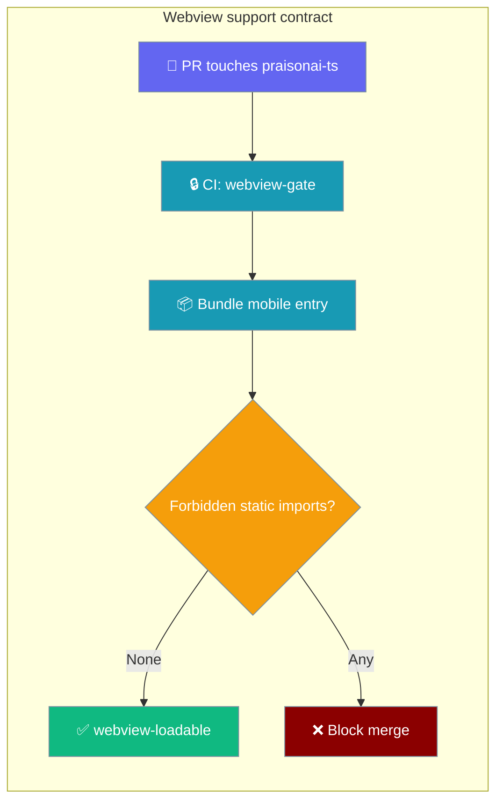
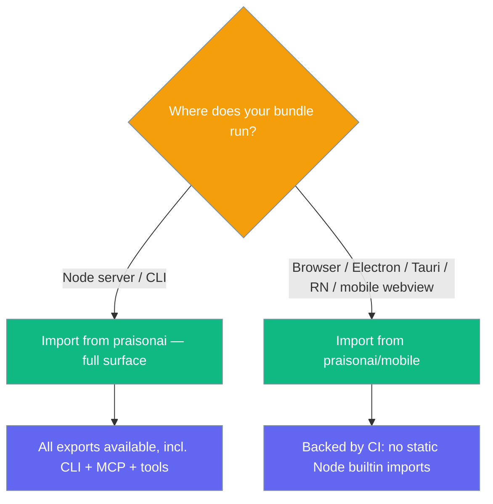

`praisonai-ts` stays loadable in a mobile / browser webview from a dedicated entry point, and CI fails the pull request that breaks it.



## Quick Start

<Steps>

<Step title="Import from the mobile entry">
```typescript
import { Agent } from 'praisonai/mobile';

const agent = new Agent({ instructions: "You are a helpful assistant" });
const response = await agent.chat("Hello from a webview!");
console.log(response);
```
</Step>

<Step title="Install">
```bash
npm install praisonai
```
</Step>

</Steps>

<Note>
Import from `praisonai/mobile` in a webview bundle — the package root (`praisonai`) re-exports the CLI, the MCP server, and the tool registry, which are not webview-safe by design.
</Note>

---

## How It Works

A **static** Node-builtin import (e.g. `import { readFile } from 'fs'`) is evaluated the moment a module loads, so in a webview it kills the whole bundle at import time — before any code runs, with no error boundary and a blank screen. CI bundles the mobile entry for the browser and fails if any forbidden builtin is imported statically.

```mermaid
sequenceDiagram
    participant Dev as Developer
    participant PR as Pull Request
    participant CI as praisonai-ts-webview
    participant Bundle as esbuild (browser target)
    Dev->>PR: add `import { readFile } from 'fs'` to Agent graph
    PR->>CI: workflow triggered (path-filtered)
    CI->>Bundle: build mobile entry for safari16, chrome108
    Bundle-->>CI: FAIL — fs imported STATICALLY
    CI-->>PR: red check "loadable in a webview"
    PR-->>Dev: block merge; regression prevented
```

---

## Webview support contract

`praisonai-ts` is guaranteed by CI to remain loadable in a mobile / browser webview from one dedicated entry point.

### Which entry is safe

Two entries are verified by CI to have no static Node-builtin imports: the mobile entry (`praisonai/mobile`) and the deep agent entry (`praisonai/agent/simple`). Use `praisonai/mobile` — it is the curated allowlist of everything that runs in a browser.

```typescript
// ✅ webview-safe (guaranteed by CI)
import { Agent } from 'praisonai/mobile';

// ✅ also verified by CI (deep agent entry)
import { Agent } from 'praisonai/agent/simple';

// ❌ pulls in CLI + MCP + tool registry; not for mobile
import { Agent } from 'praisonai';
```

<Note>
The mobile entry also re-exports `randomUUID` and `getEnv`, browser-safe replacements for the Node originals you would otherwise reach for.
</Note>

### Supported browsers

CI builds for `safari16` and `chrome108`. These are the floors — newer runtimes are fine.

| Runtime | Baseline | Why |
|---------|----------|-----|
| iOS WKWebView | Safari 16+ | iOS ships WKWebView with the OS; the floor is the oldest iOS worth supporting. |
| Android WebView | Chrome 108+ | Matches the equivalent Android WebView era. |
| Desktop Chrome / Edge | Chrome 108+ | Same target. |
| Desktop Safari | Safari 16+ | Same target. |
| Electron renderer | Chromium ≥ 108 (Electron ≥ 22) | Ships its own Chromium; anything ≥ 108 works. |
| Tauri | WebView2 (Windows) / WKWebView (macOS) / WebKitGTK (Linux) | Bound by the host OS's webview; Safari 16 / Chrome 108 is the floor. |
| React Native | — | Not a webview, but the same import-time constraints apply. |

<Warning>
Targeting an older webview (e.g. iOS 15) is outside the supported baseline. Don't file a load bug for a runtime below the floor.
</Warning>

### What CI guarantees absent from your bundle

The Agent graph is guaranteed to have **no static import** of any of these Node builtins.

<Accordion title="Forbidden Node builtins (static imports)">
`assert`, `buffer`, `child_process`, `cluster`, `crypto`, `dgram`, `dns`, `events`, `fs`, `http`, `http2`, `https`, `module`, `net`, `os`, `path`, `perf_hooks`, `process`, `querystring`, `readline`, `repl`, `stream`, `string_decoder`, `timers`, `tls`, `tty`, `url`, `util`, `v8`, `vm`, `worker_threads`, `zlib`.
</Accordion>

### Static vs dynamic — the carve-out

A **static** `import { x } from 'fs'` kills a webview bundle at import time — that is what the gate blocks. A **dynamic** `await import('readline')` inside a function only fails if that function is called. `readline` is reached only from the CLI approval prompt, which a phone never calls, so it is allowed. Build your own path that calls it in a webview and that is on you — the gate cannot see it.

### Which import to use



### Reproducing the check locally

```bash
cd src/praisonai-ts
npm install --legacy-peer-deps
npm run check:webview
```

Expected output on a clean tree:

```
  ~ src/agent/simple.ts: readline imported lazily, fine while no webview path calls it
  OK   src/mobile.ts: loadable in a webview
  OK   src/agent/simple.ts: loadable in a webview
```

---

## Best Practices

<AccordionGroup>

<Accordion title="Import from praisonai/mobile in any webview bundle">
The package root re-exports the CLI, MCP server, and tool registry, which pull in Node builtins. `praisonai/mobile` is the curated, CI-verified allowlist for browsers, Electron renderers, Tauri, and React Native.
</Accordion>

<Accordion title="Use the browser-safe helpers, not the Node originals">
The mobile entry exports `randomUUID` and `getEnv`. Use them instead of `crypto.randomUUID()` or `process.env`, which are the kind of Node dependencies that would break a bundle.
</Accordion>

<Accordion title="Stay on or above the supported baseline">
CI targets Safari 16 and Chrome 108. Test against those floors; runtimes below them are unsupported and may fail for reasons the gate cannot catch.
</Accordion>

<Accordion title="Run check:webview before shipping a fork">
If you patch `praisonai-ts` in a fork, run `npm run check:webview` so a stray static Node import surfaces on your PR, not on a device.
</Accordion>

</AccordionGroup>

---

## Related

<CardGroup cols={2}>
  <Card title="Agent" icon="robot" href="/js/agent">
    The core Agent class and its full configuration.
  </Card>
  <Card title="TypeScript Agents" icon="scroll" href="/js/typescript">
    Getting started with the TypeScript SDK.
  </Card>
</CardGroup>
