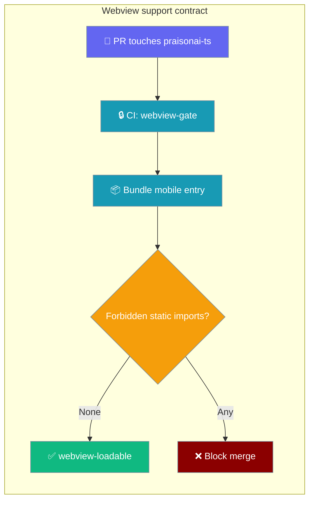
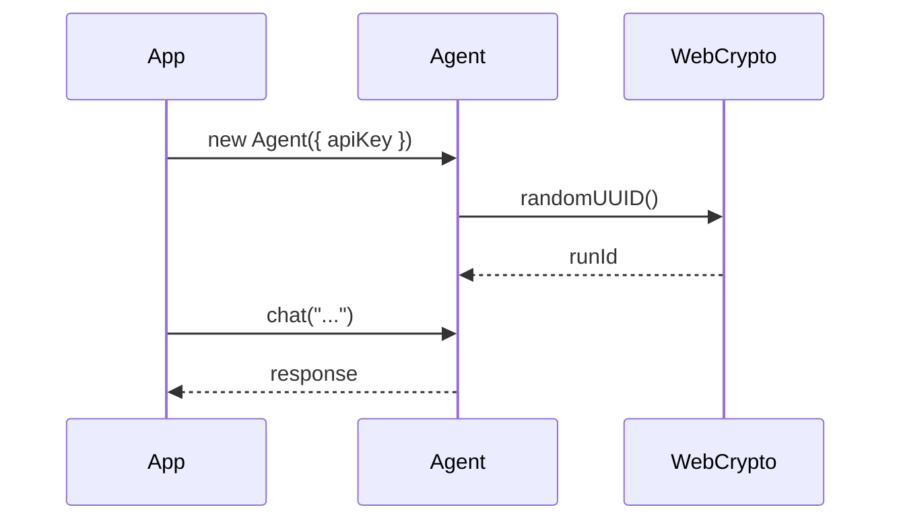
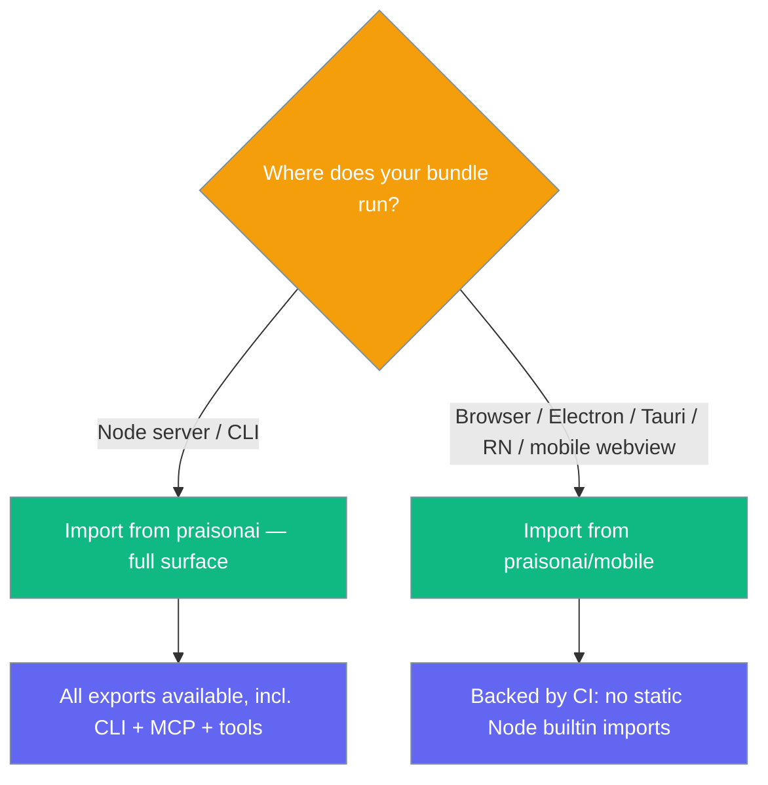
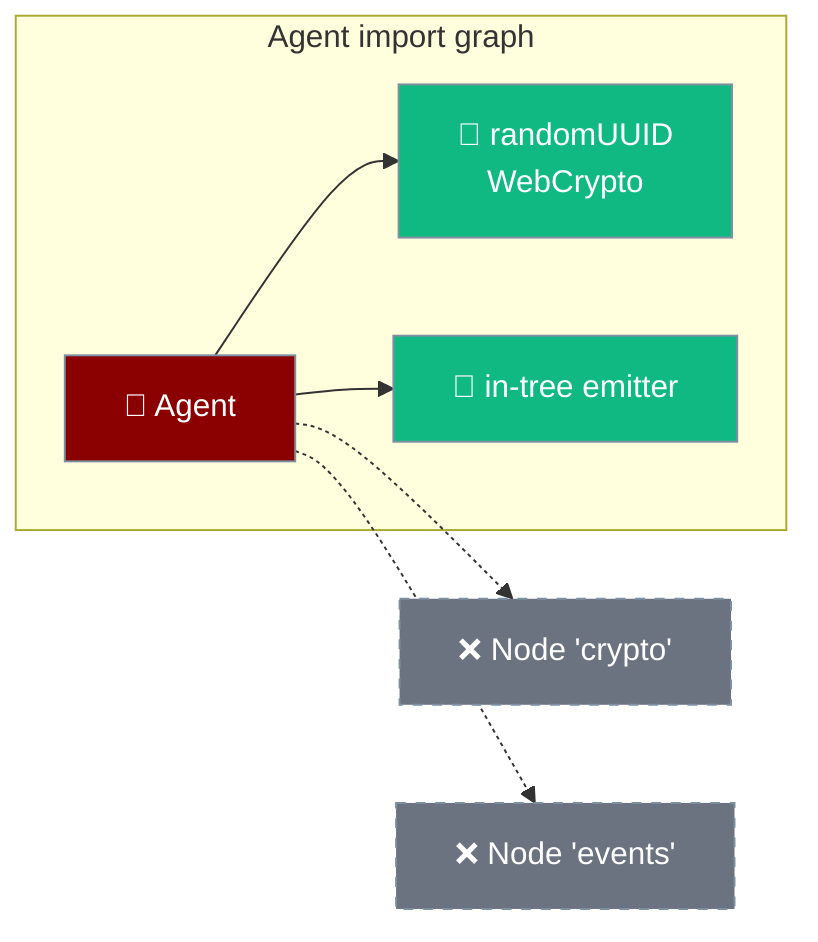

The `Agent` module runs anywhere JavaScript runs — browsers, Electron renderers, Tauri webviews, and React Native — because its import graph has no Node.js builtins. `praisonai-ts` stays loadable in a mobile / browser webview from a dedicated entry point, and CI fails any pull request that breaks it.



## Quick Start

<Steps>

<Step title="Create an agent (runs identically in Node and a browser)">
```ts
import { Agent } from 'praisonai';

const agent = new Agent({
  instructions: "You are a helpful assistant",
  apiKey: process?.env?.OPENAI_API_KEY ?? window.__OPENAI_KEY,
});

const reply = await agent.chat("Hello from anywhere!");
console.log(reply);
console.log(agent.getRunId()); // RFC-4122 v4 UUID from WebCrypto
```
</Step>

<Step title="Import from the mobile entry (webview bundles)">
```typescript
import { Agent } from 'praisonai/mobile';

const agent = new Agent({ instructions: "You are a helpful assistant" });
const response = await agent.chat("Hello from a webview!");
console.log(response);
```
</Step>

<Step title="Install">
```bash
npm install praisonai
```
</Step>

</Steps>

<Note>
Import from `praisonai/mobile` in a webview bundle — the package root (`praisonai`) re-exports the CLI, the MCP server, and the tool registry, which are not webview-safe by design.
</Note>

---

## How It Works

A **static** Node-builtin import (e.g. `import { readFile } from 'fs'`) is evaluated the moment a module loads, so in a webview it kills the whole bundle at import time — before any code runs, with no error boundary and a blank screen. CI bundles the mobile entry for the browser and fails if any forbidden builtin is imported statically.

<Note>
CI now runs `npm run build` before the gate, so the gate sees the compiled `dist/esm/…` artifacts too, not just the TypeScript sources. This closes a historic hole where the gate reported OK on an input that was not what actually shipped.
</Note>

```mermaid
sequenceDiagram
    participant Dev as Developer
    participant PR as Pull Request
    participant CI as praisonai-ts-webview
    participant Bundle as esbuild (browser target)
    Dev->>PR: add `import { readFile } from 'fs'` to Agent graph
    PR->>CI: workflow triggered (path-filtered)
    CI->>Bundle: build mobile entry for safari16, chrome108
    Bundle-->>CI: FAIL — fs imported STATICALLY
    CI-->>PR: red check "loadable in a webview"
    PR-->>Dev: block merge; regression prevented
```

<Note>
The gate now runs *two* esbuild builds per entry — one at the historical `safari16`/`chrome108` targets to inspect the bundle (metafile), and one at `FLOOR_TARGET = chrome58` to prove the entry parses at the Android 8 WebView floor. The second is why a top-level `await` anywhere on the graph — including one prepended by the esm-shim createRequire banner — fails the gate.
</Note>

The Agent constructs the same way in every runtime — credentials are read at call time, and random IDs come from WebCrypto.



---

## Webview support contract

`praisonai-ts` is guaranteed by CI to remain loadable in a mobile / browser webview from one dedicated entry point.

### Which entry is safe

Two entries are verified by CI to have no static Node-builtin imports: the mobile entry (`praisonai/mobile`) and the deep agent entry (`praisonai/agent/simple`). Use `praisonai/mobile` — it is the curated allowlist of everything that runs in a browser.

```typescript
// ✅ webview-safe (guaranteed by CI)
import { Agent } from 'praisonai/mobile';

// ✅ also verified by CI (deep agent entry)
import { Agent } from 'praisonai/agent/simple';

// ❌ pulls in CLI + MCP + tool registry; not for mobile
import { Agent } from 'praisonai';
```

<Note>
The mobile entry also re-exports `randomUUID` and `getEnv`, browser-safe replacements for the Node originals you would otherwise reach for.
</Note>

### Supported browsers

CI builds for `safari16` and `chrome108`. These are the floors — newer runtimes are fine.

| Runtime | Bundle target | Syntax floor | Why |
|---------|---------------|--------------|-----|
| iOS WKWebView | Safari 16+ | Safari 16+ | iOS ships WKWebView with the OS; the floor is the oldest iOS worth supporting. |
| Android WebView (Play-updated) | Chrome 108+ | Chrome 58+ | Matches modern devices; the syntax floor exists because AOSP / Play-less / long-offline devices keep whatever WebView they shipped with. |
| Desktop Chrome / Edge | Chrome 108+ | Chrome 58+ | Same target. |
| Desktop Safari | Safari 16+ | Safari 16+ | Same target. |
| Electron renderer | Chromium ≥ 108 (Electron ≥ 22) | Chrome 58+ | Ships its own Chromium; anything ≥ 108 works. |
| Tauri | WebView2 (Windows) / WKWebView (macOS) / WebKitGTK (Linux) | Chrome 58 / Safari 16 | Bound by the host OS's webview; Safari 16 / Chrome 108 is the bundle floor. |
| React Native | — | — | Not a webview, but the same import-time constraints apply. |

> **Two floors, one guarantee.** CI's metafile check (Safari 16 / Chrome 108) ensures no forbidden Node builtin is imported; on top of that, a separate `chrome58` check (`FLOOR_TARGET` in `scripts/webview-gate.mjs`) proves each entry actually *parses* in a Chrome 58 engine. The two exist because a bundle can be builtin-free and still use syntax (top-level await, most notably) that a device WebView cannot parse. `praisonai/mobile` is guaranteed both — buildable AND parseable — at Android 8's WebView floor. See [Shipping to iOS and Android → WebView floor](/features/mobile/shipping-to-stores) for how `minSdkVersion: 26 => chrome58` is derived on the mobile-app side.

<Warning>
Targeting a webview below the syntax floor (e.g. iOS 15) is outside the supported baseline. Don't file a load bug for a runtime below the floor.
</Warning>

### What CI guarantees absent from your bundle

The Agent graph is guaranteed to have **no static import** of any of these Node builtins.

<Accordion title="Forbidden Node builtins (static imports)">
`assert`, `buffer`, `child_process`, `cluster`, `crypto`, `dgram`, `dns`, `events`, `fs`, `http`, `http2`, `https`, `module`, `net`, `os`, `path`, `perf_hooks`, `process`, `querystring`, `readline`, `repl`, `stream`, `string_decoder`, `timers`, `tls`, `tty`, `url`, `util`, `v8`, `vm`, `worker_threads`, `zlib`.
</Accordion>

### Static vs dynamic — the carve-out

A **static** `import { x } from 'fs'` kills a webview bundle at import time — that is what the gate blocks. A **dynamic** `await import('readline')` inside a function only fails if that function is called. `readline` is reached only from the CLI approval prompt, which a phone never calls, so it is allowed. Build your own path that calls it in a webview and that is on you — the gate cannot see it.

### Which import to use



### Reproducing the check locally

```bash
cd src/praisonai-ts
npm install --legacy-peer-deps
npm run build
npm run check:webview
```

Run `npm run build` first so the gate checks **what ships** (`dist/esm/…`), not just the sources. Expected output:

```
OK   src/mobile.ts:               loadable in a webview
OK   src/mobile.ts:               bundles for chrome58
OK   src/agent/simple.ts:         loadable in a webview
OK   src/agent/simple.ts:         bundles for chrome58
OK   dist/esm/mobile.js:          loadable in a webview
OK   dist/esm/mobile.js:          bundles for chrome58
OK   dist/esm/agent/simple.js:    loadable in a webview
OK   dist/esm/agent/simple.js:    bundles for chrome58
```

The second line per entry is the syntax-floor check. It fails with esbuild's own diagnosis (`file:line`), typically pointing at a top-level `await` — usually because a file on the graph still uses `require()`/`__dirname` and earned the esm-shim createRequire banner.

<Note>
On a fresh clone with no `dist/`, the gate prints a note and checks the sources only — handy when auditing a PR before running the build. Run `npm run build` to also gate the built artifacts.
</Note>

---

## Bundling & compatibility

The Agent import graph is free of Node.js builtins, so bundlers ship it as-is to any JS runtime.



| Bundler | Works out of the box? | Notes |
|---|---|---|
| Vite | ✅ | No polyfills needed |
| esbuild | ✅ | No polyfills needed |
| webpack 5 | ✅ | `resolve.fallback` not required for `crypto` or `events` |
| Metro (React Native) | ✅ | No shim for `crypto` or `events` needed |
| Rollup | ✅ | No plugin needed for `crypto` or `events` |

Random IDs come from **WebCrypto** (`globalThis.crypto.randomUUID`, with a `getRandomValues` fallback), and internal event dispatch uses a small in-tree emitter — the `Agent` module never imports Node's `crypto` or `events`.

---

## Configuration

Pass credentials per-agent so browsers never depend on environment variables.

```ts
import { Agent } from 'praisonai';

const agent = new Agent({
  instructions: "You are a helpful assistant",
  apiKey: window.__OPENAI_KEY,
  baseURL: "https://api.openai.com/v1",
});
```

---

## Best Practices

<AccordionGroup>

<Accordion title="Import from praisonai/mobile in any webview bundle">
The package root re-exports the CLI, MCP server, and tool registry, which pull in Node builtins. `praisonai/mobile` is the curated, CI-verified allowlist for browsers, Electron renderers, Tauri, and React Native.
</Accordion>

<Accordion title="Pass credentials per-agent in browsers">
Browsers have no environment variables. Provide `apiKey` (and `baseURL` if needed) directly on the agent instead of relying on `process.env`.
</Accordion>

<Accordion title="Use the browser-safe helpers, not the Node originals">
The mobile entry exports `randomUUID` and `getEnv`. Use them instead of `crypto.randomUUID()` or `process.env`, which are the kind of Node dependencies that would break a bundle.
</Accordion>

<Accordion title="Understand where random IDs come from">
On modern browsers and Node ≥ 19, IDs come from `globalThis.crypto.randomUUID`.
On older webviews without it, PraisonAI falls back to `getRandomValues` and still produces a valid RFC-4122 v4 UUID.
On the very oldest webviews without WebCrypto at all, IDs fall back to `Math.random()` — a weak source, but the Agent still constructs (no `ReferenceError` at import).
</Accordion>

<Accordion title="No polyfills required">
Do not add `crypto` or `events` shims to your bundler config — the Agent import graph does not reference them.
</Accordion>

<Accordion title="Stay on or above the supported baseline">
CI targets Safari 16 and Chrome 108. Test against those floors; runtimes below them are unsupported and may fail for reasons the gate cannot catch.
</Accordion>

<Accordion title="Run build + check:webview before shipping a fork">
If you patch `praisonai-ts` in a fork, run `npm run build && npm run check:webview` so a stray static Node import surfaces on your PR, not on a device. Building first means the gate inspects the shipped `dist/esm/…` artifacts, not just the sources.
</Accordion>

</AccordionGroup>

---

## Related

<CardGroup cols={2}>
  <Card title="Agent" icon="robot" href="/js/agent">
    The core Agent class and its full configuration.
  </Card>
  <Card title="Approval" icon="shield-check" href="/js/approval">
    Human-in-the-loop tool approval
  </Card>
  <Card title="TypeScript Agents" icon="scroll" href="/js/typescript">
    Getting started with the TypeScript SDK.
  </Card>
</CardGroup>
