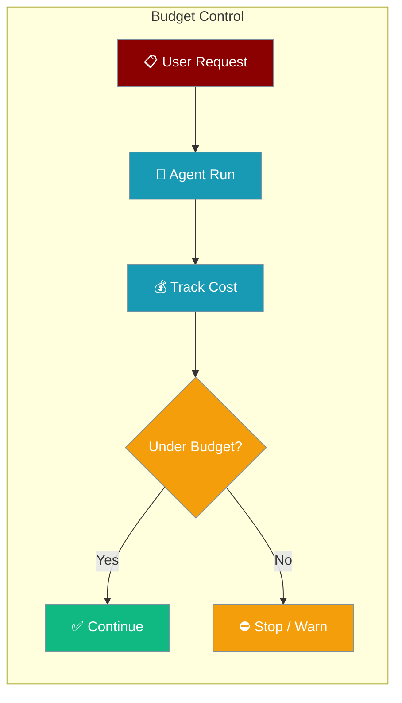
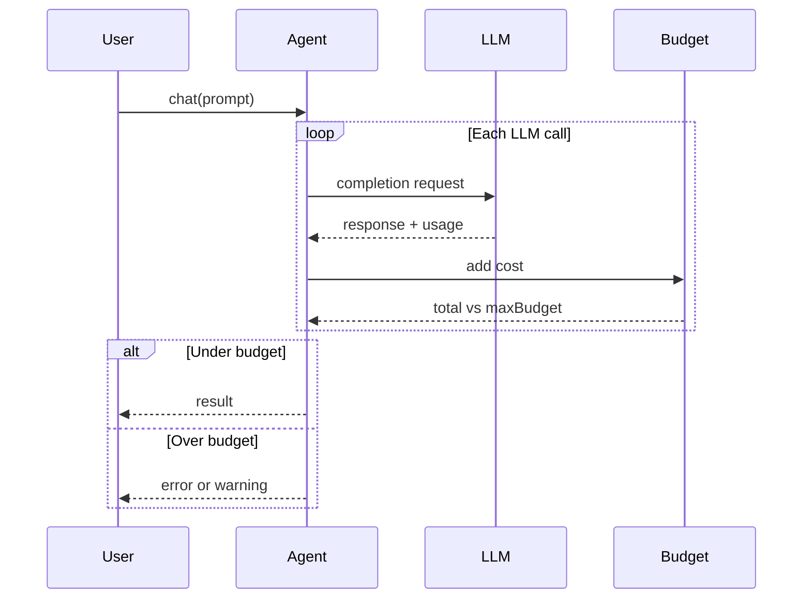

Cap how much an agent can spend per run — when the limit is hit, the agent stops and raises an error.



## Quick Start

<Steps>

<Step title="Set a USD spending cap">
```typescript
import { Agent } from 'praisonai';

const agent = new Agent({
  instructions: 'You research topics thoroughly',
  maxBudget: 0.50  // Hard USD limit per run
});

await agent.chat('Research the history of AI');
// Stops automatically when spend reaches $0.50
```
</Step>

<Step title="Warn instead of stopping">
```typescript
import { Agent } from 'praisonai';

const agent = new Agent({
  instructions: 'Analyse data carefully',
  maxBudget: 1.00,
  onBudgetExceeded: 'warn'  // Log warning but continue
});

await agent.chat('Summarise this quarterly report');
```
</Step>

</Steps>

---

## How It Works



Budget tracking adds zero overhead when `maxBudget` is not set (the default).

---

## Configuration Options

| Option | Type | Default | Description |
|--------|------|---------|-------------|
| `maxBudget` | `number \| undefined` | `undefined` | Hard USD limit per agent run. Unset disables tracking. |
| `onBudgetExceeded` | `"stop" \| "warn"` | `"stop"` | Action when the cap is reached |

<CardGroup cols={2}>
  <Card title="Execution Config" icon="code" href="/docs/js/execution">
    All execution settings including timeouts and retries
  </Card>
  <Card title="Token Management" icon="coins" href="/docs/js/token-management">
    Control and monitor token usage
  </Card>
</CardGroup>

---

## Common Patterns

**Conservative cap for production agents:**

```typescript
const agent = new Agent({
  instructions: 'You are a production research agent',
  maxBudget: 0.25,        // $0.25 hard limit
  onBudgetExceeded: 'stop'
});
```

**Development mode — warn only:**

```typescript
const agent = new Agent({
  instructions: 'You analyse reports',
  maxBudget: 2.00,
  onBudgetExceeded: 'warn'  // See full output while monitoring cost
});
```

**Team of agents with individual caps:**

```typescript
import { Agent, PraisonAIAgents } from 'praisonai';

const researcher = new Agent({
  name: 'Researcher',
  instructions: 'Research topics',
  maxBudget: 0.50
});

const writer = new Agent({
  name: 'Writer',
  instructions: 'Write content',
  maxBudget: 0.30
});

const agents = new PraisonAIAgents({ agents: [researcher, writer] });
await agents.start('Create a report on AI trends');
```

---

## Best Practices

<AccordionGroup>
  <Accordion title="Start with a conservative cap in production">
    Set `maxBudget` on any agent that runs unattended or loops over tools. $0.25–$1.00 is a sensible starting range for research agents.
  </Accordion>

  <Accordion title="Use warn mode during development">
    `onBudgetExceeded: 'warn'` lets you see full output while still logging when you would have been stopped in production.
  </Accordion>

  <Accordion title="Combine with token limits">
    Budget caps control USD spend; token limits control input/output size. Use both together for full cost control.
  </Accordion>

  <Accordion title="Set per-agent limits in multi-agent teams">
    Each agent in a team can have its own budget cap, giving you fine-grained control over which agents can spend more.
  </Accordion>
</AccordionGroup>

---

## Related

<CardGroup cols={2}>
  <Card title="Token Management" icon="coins" href="/docs/js/token-management">
    Limit and track token usage
  </Card>
  <Card title="Execution" icon="play" href="/docs/js/execution">
    Timeouts, retries, and other execution settings
  </Card>
</CardGroup>
