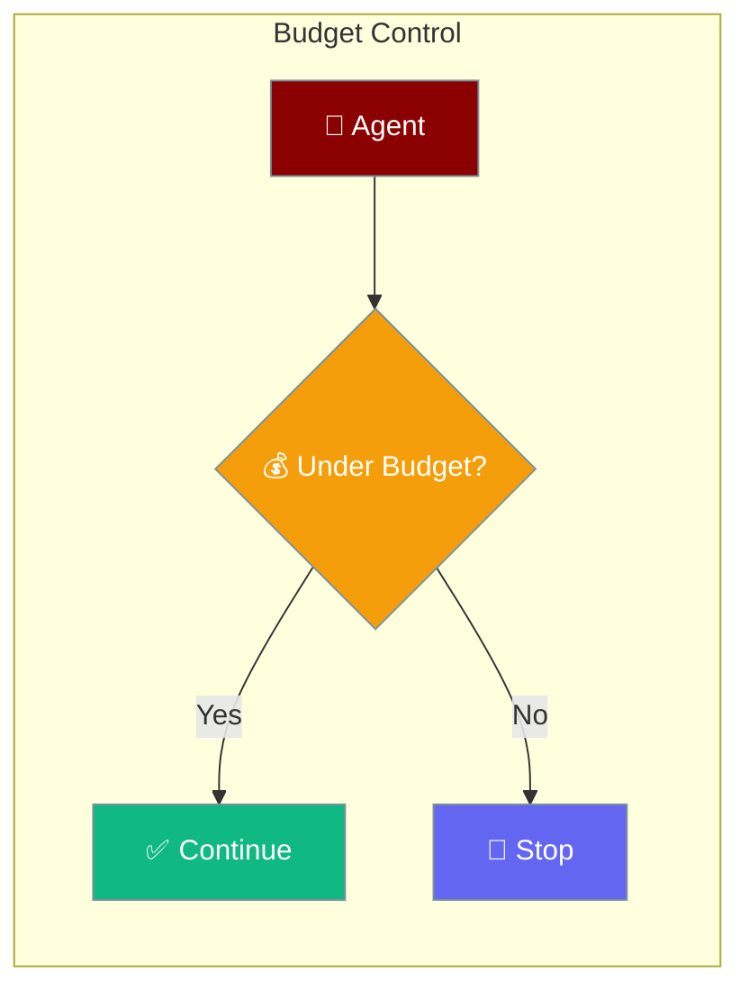
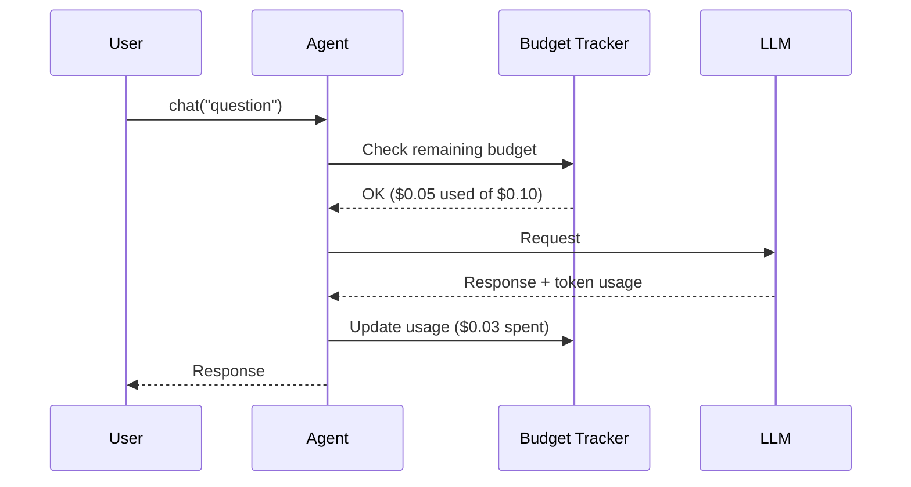

Set a maximum spend limit so agents stop before costs get out of hand.



## Quick Start

<Steps>
<Step title="Set a Dollar Budget">
```typescript
import { Agent } from 'praisonai';

const agent = new Agent({
  instructions: 'You are a helpful assistant',
  maxBudget: 0.10  // Stop after $0.10 in API costs
});

await agent.chat('Write a detailed analysis');
```
</Step>

<Step title="Set a Token Budget">
```typescript
import { Agent } from 'praisonai';

const agent = new Agent({
  instructions: 'Summarize text concisely',
  maxTokens: 500  // Limit output to 500 tokens
});

await agent.chat('Summarize this long document...');
```
</Step>

<Step title="Combined Budget">
```typescript
import { Agent } from 'praisonai';

const agent = new Agent({
  instructions: 'Answer questions',
  maxBudget: 1.00,     // $1 maximum spend
  maxTokens: 2000,     // 2000 output token limit
  verbose: true        // See cost tracking
});

await agent.chat('Explain machine learning');
```
</Step>
</Steps>

---

## How It Works



---

## Configuration Options

| Option | Type | Default | Description |
|--------|------|---------|-------------|
| `maxBudget` | `number` | `undefined` | Maximum spend in USD |
| `maxTokens` | `number` | `undefined` | Maximum output tokens per request |

---

## Common Patterns

### Stop Multi-Agent Workflows

Set budgets at the workflow level to cap total spend across all agents.

```typescript
import { Agent, AgentTeam } from 'praisonai';

const researcher = new Agent({
  name: 'researcher',
  instructions: 'Research topics'
});

const writer = new Agent({
  name: 'writer',
  instructions: 'Write articles'
});

const team = new AgentTeam({
  agents: [researcher, writer],
  maxBudget: 0.50  // Total budget for the team
});

await team.chat('Write an article about AI trends');
```

### Track Costs Across Requests

```typescript
import { Agent } from 'praisonai';

const agent = new Agent({
  instructions: 'You are helpful',
  verbose: true  // Shows token usage after each request
});

for (const question of questions) {
  await agent.chat(question);
  // Console shows cumulative cost after each turn
}
```

---

## Best Practices

<AccordionGroup>
  <Accordion title="Start with a low budget in development">
    Set `maxBudget: 0.10` while testing to avoid unexpected charges. Remove or increase the limit when moving to production.
  </Accordion>

  <Accordion title="Use maxTokens for predictable output lengths">
    For tasks where you know the output length — summaries, classifications, short answers — set `maxTokens` to match. This prevents runaway generation and keeps latency low.
  </Accordion>

  <Accordion title="Log usage with verbose mode">
    Enable `verbose: true` during development to see token counts and estimated cost after each request. Use this to calibrate your budget limits before deploying.
  </Accordion>

  <Accordion title="Set per-agent budgets in multi-agent teams">
    When multiple agents collaborate, assign budgets to individual agents so a single expensive agent cannot exhaust the entire team's allowance.
  </Accordion>
</AccordionGroup>

---

## Related

<CardGroup cols={2}>
  <Card title="Token Management" icon="coins" href="/docs/js/token-management">
    Detailed token counting and limits
  </Card>
  <Card title="Providers" icon="plug" href="/docs/js/providers">
    LLM provider pricing and models
  </Card>
</CardGroup>
