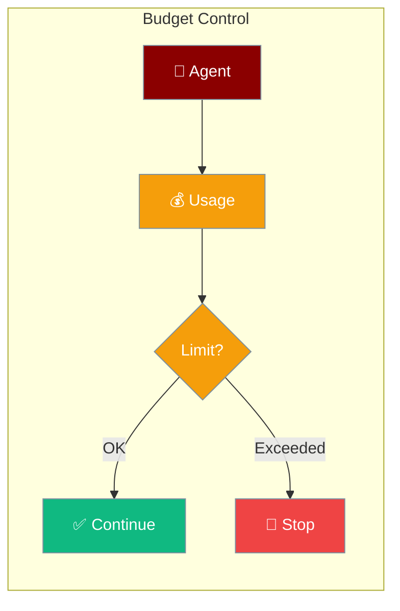
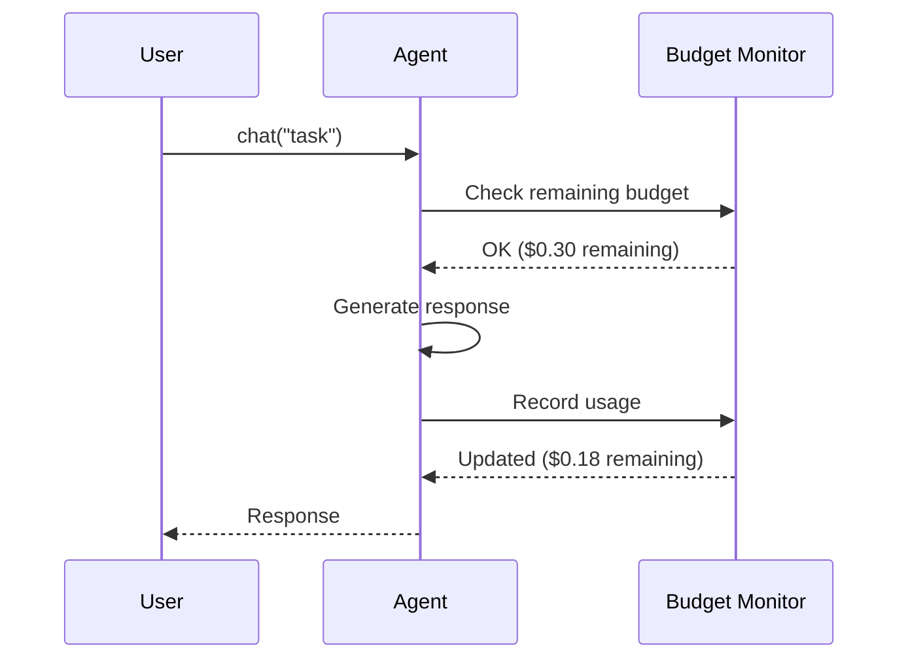

Agents can enforce spending limits to prevent runaway costs — set a max budget and the agent stops automatically.



## Quick Start

<Steps>

<Step title="Set a Cost Limit">
```typescript
import { Agent } from 'praisonai';

const agent = new Agent({
  instructions: 'You are a helpful assistant',
  maxCostUsd: 0.50  // Stop after $0.50
});

await agent.chat('Summarize this document');
```
</Step>

<Step title="Track Usage">
```typescript
import { Agent } from 'praisonai';

const agent = new Agent({
  instructions: 'You are a helpful assistant',
  maxCostUsd: 1.00
});

const response = await agent.chat('Write a report');
const usage = agent.getUsage();

console.log(`Cost: $${usage.estimatedCostUsd.toFixed(4)}`);
console.log(`Tokens: ${usage.totalTokens}`);
```
</Step>

<Step title="With Token Limits">
```typescript
import { Agent } from 'praisonai';

const agent = new Agent({
  instructions: 'Be concise',
  maxTokens: 500,    // Limit output tokens
  maxCostUsd: 0.10   // Also limit cost
});
```
</Step>

</Steps>

---

## How It Works



---

## Configuration

| Option | Type | Description |
|--------|------|-------------|
| `maxCostUsd` | `number` | Maximum cost in USD |
| `maxTokens` | `number` | Maximum output tokens |

---

## Common Patterns

### Per-Session Budget

```typescript
import { Agent } from 'praisonai';

// Each session gets $0.25 max
const agent = new Agent({
  instructions: 'You are a research assistant',
  maxCostUsd: 0.25
});

// Agent stops if budget is exceeded mid-task
await agent.chat('Research quantum computing and write a detailed summary');
```

### Monitor and Alert

```typescript
import { Agent } from 'praisonai';

const agent = new Agent({
  instructions: 'You are a helpful assistant',
  maxCostUsd: 1.00
});

await agent.chat('Write a comprehensive analysis');

const usage = agent.getUsage();
if (usage.estimatedCostUsd > 0.80) {
  console.warn('Budget nearly exhausted:', usage);
}
```

### Batch with Shared Budget

```typescript
import { Agent } from 'praisonai';

const agent = new Agent({
  instructions: 'Summarize the given text concisely',
  maxTokens: 200,   // Keep each response short
  maxCostUsd: 2.00
});

const documents = ['doc1...', 'doc2...', 'doc3...'];
for (const doc of documents) {
  const summary = await agent.chat(`Summarize: ${doc}`);
  console.log(summary);
}
```

---

## Best Practices

<AccordionGroup>
  <Accordion title="Set limits before production">
    Always configure `maxCostUsd` before deploying agents to production. Without limits, a runaway loop or unexpectedly large input can result in significant API costs.
  </Accordion>

  <Accordion title="Use token limits for predictability">
    `maxTokens` limits output length, making costs more predictable. Combine with `maxCostUsd` for both per-response and cumulative control.
  </Accordion>

  <Accordion title="Monitor usage after each run">
    Call `agent.getUsage()` after completion to track cumulative spending. Log this data to build cost forecasts over time.
  </Accordion>

  <Accordion title="Match budget to task scope">
    Simple Q&A tasks need less than $0.01. Detailed research tasks may need $0.10–$0.50. Set limits to match the expected scope, not just a large safety number.
  </Accordion>
</AccordionGroup>

---

## Related

<CardGroup cols={2}>
  <Card title="Token Management" icon="coins" href="/docs/js/token-management">
    Control token usage per request
  </Card>
  <Card title="Execution" icon="play" href="/docs/js/execution">
    Execution settings and timeouts
  </Card>
</CardGroup>
