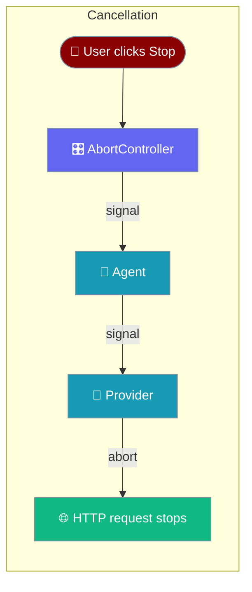
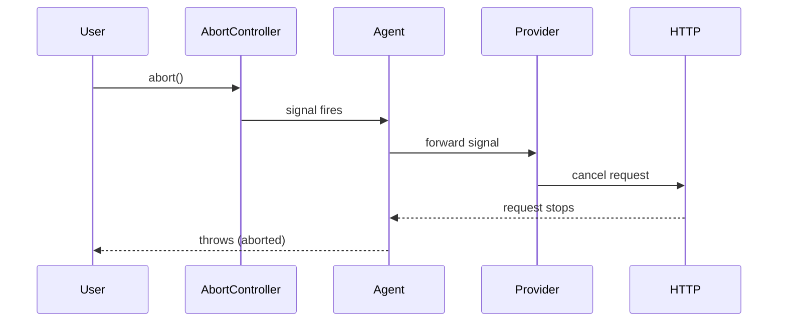
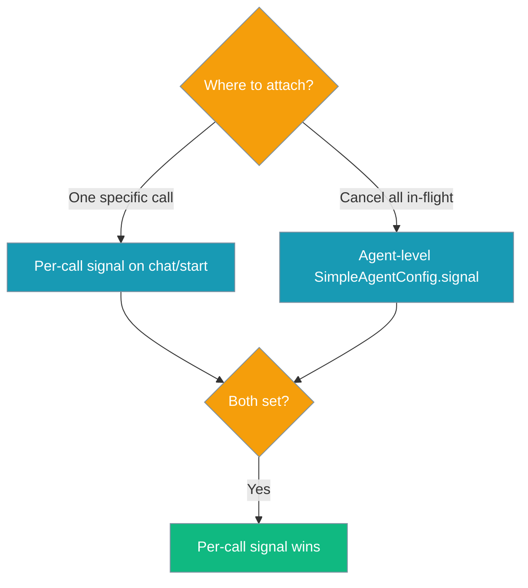

`AbortSignal` gives your UI a working Stop button — aborting cancels the underlying provider request so the user stops being billed for tokens they asked to stop.



## Quick Start

<Steps>

<Step title="Simple Usage">
Pass a trailing `signal` to `chat()` and abort it to stop the call.

```typescript
import { Agent } from 'praisonai';

const agent = new Agent({ instructions: 'You are helpful' });
const controller = new AbortController();

// Abort from anywhere (e.g. a Stop button)
setTimeout(() => controller.abort(), 100);

await agent.chat('Write a long essay', undefined, controller.signal);
```
</Step>

<Step title="Agent-level Default">
Set `signal` on the agent config so every call shares one controller. An explicit per-call signal still wins.

```typescript
import { Agent } from 'praisonai';

const controller = new AbortController();

const agent = new Agent({
  instructions: 'You are helpful',
  signal: controller.signal,   // default for every call
});

await agent.chat('Summarize this');
controller.abort();            // cancels everything in flight
```
</Step>

</Steps>

---

## How It Works

Aborting stops the request itself, not only iterator consumption — no further tokens arrive and no further billing accrues.



---

## Choosing Where to Attach the Signal

Pick per-call for a single Stop button; pick agent-level to cancel everything on the agent at once.



---

## Configuration Options

| Option | Type | Default | Description |
|--------|------|---------|-------------|
| `SimpleAgentConfig.signal` | `AbortSignal` | `undefined` | Agent-level default signal; every `chat()`/`start()` call uses it unless overridden. |
| `Agent.chat(prompt, previousResult?, signal?)` | `AbortSignal` | `undefined` | Per-call signal. Wins over the agent default. |
| `Agent.start(prompt, previousResult?, onToken?, signal?)` | `AbortSignal` | `undefined` | Per-call signal (streaming path). Wins over the agent default. |
| `GenerateTextOptions.signal` / `StreamTextOptions.signal` / `GenerateObjectOptions.signal` | `AbortSignal` | `undefined` | Provider-level (advanced): forwarded to the OpenAI/Anthropic/Google request. |
| `ToolExecutionContext.signal` | `AbortSignal` | `undefined` | Tool-loop signal — the registry throws before running an already-aborted tool. |

<CardGroup cols={2}>
  <Card title="SimpleAgentConfig" icon="code" href="/docs/sdk/reference/typescript/interfaces/SimpleAgentConfig">
    Agent configuration reference
  </Card>
  <Card title="Agent" icon="code" href="/docs/sdk/reference/typescript/classes/Agent">
    Agent class reference
  </Card>
</CardGroup>

---

## Common Patterns

### A. Simple Stop Button (per call)

```typescript
import { Agent } from 'praisonai';

const agent = new Agent({ instructions: 'You are helpful' });
const controller = new AbortController();

// Somewhere in your UI:
stopButton.onclick = () => controller.abort();

try {
  const reply = await agent.chat('Write a long essay', undefined, controller.signal);
  console.log(reply);
} catch (err) {
  if (controller.signal.aborted) console.log('Stopped by user');
  else throw err;
}
```

### B. Agent-level Default (one controller, many calls)

```typescript
import { Agent } from 'praisonai';

const controller = new AbortController();
const agent = new Agent({
  instructions: 'You are helpful',
  signal: controller.signal,   // default for every call
});

// Cancels everything currently in flight on this agent:
controller.abort();
```

### C. Per-call Override Wins Over the Agent Default

```typescript
import { Agent } from 'praisonai';

const agentSignal = new AbortController();
const callSignal = new AbortController();

const agent = new Agent({ instructions: '...', signal: agentSignal.signal });

// This call ignores agentSignal and uses callSignal instead
await agent.chat('hi', undefined, callSignal.signal);
```

---

## Streaming

Aborting a stream stops the provider request, so no further tokens arrive and no further billing accrues.

```typescript
import { Agent } from 'praisonai';

const agent = new Agent({ instructions: 'You are helpful' });
const controller = new AbortController();

// Stop the stream mid-flight
setTimeout(() => controller.abort(), 500);

await agent.start(
  'Write a 500-word story',
  undefined,
  (token) => process.stdout.write(token),  // onToken
  controller.signal,
);
```

---

## Tools

When the signal aborts *after* the model returned tool calls, the agent stops before invoking the tool, so side effects never run.

If you write custom tools, receive `ctx.signal` and check it inside long-running work:

```typescript
import { createTool } from 'praisonai';

const fetchData = createTool({
  name: 'fetch_data',
  description: 'Fetch a large dataset',
  parameters: {
    type: 'object',
    properties: { url: { type: 'string' } },
    required: ['url'],
  },
  execute: async ({ url }, ctx) => {
    ctx?.signal?.throwIfAborted();
    const res = await fetch(url, { signal: ctx?.signal });
    return await res.text();
  },
});
```

---

## Timeouts + Cancellation Together

The AI-SDK backend merges your caller signal with its own timeout controller using `AbortSignal.any` (with a manual fallback for Node < 20). Aborting either cancels the request; a caller abort is terminal and never consumes a retry.

---

## Best Practices

<AccordionGroup>
  <Accordion title="Reuse one AbortController per user action">
    Create a fresh `AbortController` for each user action (one Stop button press), not a single app-wide one. Once aborted, a controller cannot be reused.
  </Accordion>

  <Accordion title="Wrap chat() in try/catch and check the signal">
    Catch the thrown error and check `controller.signal.aborted` (or `err.name === 'AbortError'`) to tell a user cancellation apart from a real failure.
  </Accordion>

  <Accordion title="Agent-level for 'cancel everything', per-call for one request">
    Use an agent-level `signal` when you want one controller to stop every in-flight call. Use a per-call `signal` for a single specific request — it wins over the agent default.
  </Accordion>

  <Accordion title="Pass a reason to abort()">
    Call `controller.abort(reason)` — the reason surfaces in the thrown error, so your UI can show *why* the request stopped.
  </Accordion>
</AccordionGroup>

---

## Related

<CardGroup cols={2}>
  <Card title="Agent" icon="robot" href="/js/agent">
    Full agent configuration
  </Card>
  <Card title="Execution" icon="play" href="/js/execution">
    Timeouts and retries
  </Card>
</CardGroup>
