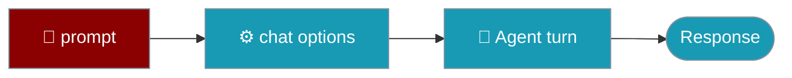

`AgentChatOptions` is the optional second argument to `agent.chat()` — settings that apply to one turn only.



## Quick Start

```typescript
import { Agent } from 'praisonai';

const agent = new Agent({ instructions: 'You are helpful' });
await agent.chat('Summarise this', { reasoningSteps: true });
```

---

## Options

| Option | Type | Notes |
|---|---|---|
| `attachments` | `readonly string[]` | Image paths, `http(s)://` or `data:` URIs. **Images only**; other inputs warn-and-skip. Ephemeral (never enters history). |
| `reasoningSteps` | `boolean` | Forces a single non-streaming completion; beats `agent.stream` and per-call `stream: true`. |
| `taskName` | `string` | Merged into `agent_start` / `agent_complete` hook contexts; read via `agent.getTaskContext()`. |
| `taskDescription` | `string` | As `taskName`. |
| `taskId` | `string` | As `taskName`. |
| `config` | `Record<string, unknown>` | Forwarded verbatim to a managed backend's `execute()`. |

## Examples

```typescript
import { Agent } from 'praisonai';

const agent = new Agent({ instructions: 'Describe and reason' });

// attachments — an image for this turn only
await agent.chat('What is in this picture?', {
  attachments: ['./photo.png', 'https://example.com/chart.png'],
});

// reasoningSteps — one non-streaming reasoning completion
await agent.chat('Prove that sqrt(2) is irrational', { reasoningSteps: true });

// task metadata — travels on the hook contexts, readable afterwards
await agent.chat('Ingest the file', {
  taskName: 'ingest',
  taskDescription: 'load the CSV',
  taskId: 'run-42',
});
console.log(agent.getTaskContext()); // { name: 'ingest', description: 'load the CSV', id: 'run-42' }

// config — forwarded to a managed backend's execute()
await agent.chat('Run this remotely', { config: { region: 'eu-west-1' } });
```

<Note>
`attachments` are **images only** (`.jpg`, `.jpeg`, `.png`, `.gif`, `.webp`). A non-image or unreadable input is reported through the warning channel and skipped — the turn is never failed. On the AI SDK backend, multimodal attachments emit a "not yet honoured" parity notice.
</Note>

## Related

<CardGroup cols={2}>
  <Card title="Agent" icon="robot" href="/js/agent">
    The chat() method
  </Card>
  <Card title="Streaming" icon="wave-sine" href="/js/streaming">
    Token and event streams
  </Card>
</CardGroup>
