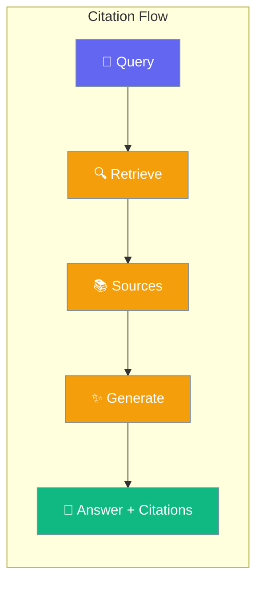

Citations provide source attribution for RAG (Retrieval Augmented Generation) answers, linking generated content to its original sources.



## Quick Start

<Steps>

<Step title="Create Citation">
```typescript
import { createCitation, formatCitation } from 'praisonai';

const citation = createCitation({
  id: '[1]',
  source: 'docs/api-reference.md',
  text: 'The API supports both REST and GraphQL endpoints...'
});

console.log(formatCitation(citation));
// [1] docs/api-reference.md: The API supports both REST and GraphQL...
```
</Step>

<Step title="Using RAG with Citations">
```typescript
import { createRAG } from 'praisonai';

const rag = createRAG({
  knowledge: myKnowledgeBase,
  config: {
    includeCitations: true,
    topK: 5
  }
});

const result = await rag.query('How do I authenticate?');
console.log(result.answer);
console.log(result.citations);
```
</Step>

<Step title="Format Context with Sources">
```typescript
import { formatContextPackForPrompt, createContextPack } from 'praisonai';

const pack = createContextPack({
  context: 'Authentication uses JWT tokens...',
  citations: [citation],
  query: 'How do I authenticate?'
});

const prompt = formatContextPackForPrompt(pack, true);
```
</Step>

</Steps>

---

## Configuration Options

### Citation

```typescript
import { createCitation } from 'praisonai';

const citation = createCitation({
  id: '[1]',           // Required: Citation reference ID
  source: 'file.md',   // Required: Source name/path
  text: 'Content...',  // Required: Cited text
  score: 0.95,         // Optional: Relevance score
  docId: 'doc-123',    // Optional: Document ID
  chunkId: 'chunk-1',  // Optional: Chunk ID
  offset: 100,         // Optional: Byte offset
  metadata: {}         // Optional: Additional metadata
});
```

| Field | Type | Default | Description |
|-------|------|---------|-------------|
| `id` | `string` | - | Citation reference ID (e.g., [1]) |
| `source` | `string` | - | Source document name or path |
| `text` | `string` | - | The cited text content |
| `score` | `number` | `0` | Relevance score (0-1) |
| `docId` | `string` | - | Document identifier |
| `chunkId` | `string` | - | Chunk identifier |
| `offset` | `number` | - | Byte offset in source |
| `metadata` | `object` | `{}` | Additional metadata |

### RAGConfig (Citation-related)

| Option | Type | Default | Description |
|--------|------|---------|-------------|
| `includeCitations` | `boolean` | `true` | Include citations in results |
| `topK` | `number` | `5` | Number of sources to retrieve |
| `minScore` | `number` | `0` | Minimum relevance score |

---

## Common Patterns

### Format Answer with Citations

```typescript
import { createRAGResult, formatAnswerWithCitations } from 'praisonai';

const result = createRAGResult({
  answer: 'Use Bearer tokens for authentication [1].',
  citations: [citation],
  query: 'How to authenticate?'
});

const formatted = formatAnswerWithCitations(result);
// Output includes answer and source list
```

### Check for Citations

```typescript
import { hasCitations, createContextPack } from 'praisonai';

const pack = createContextPack({ citations: [citation] });

if (hasCitations(pack)) {
  console.log('Context has source attribution');
}
```

### Retrieval Strategies

```typescript
import { RetrievalStrategy, createRAGConfig } from 'praisonai';

// Basic retrieval
const basicConfig = createRAGConfig({
  retrievalStrategy: RetrievalStrategy.BASIC
});

// Fusion retrieval (multiple queries)
const fusionConfig = createRAGConfig({
  retrievalStrategy: RetrievalStrategy.FUSION
});

// Hybrid retrieval (semantic + keyword)
const hybridConfig = createRAGConfig({
  retrievalStrategy: RetrievalStrategy.HYBRID
});
```

---

## Best Practices

<AccordionGroup>
  <Accordion title="Always include citations for factual claims">
    Enable `includeCitations: true` when generating factual content to maintain verifiability.
  </Accordion>
  
  <Accordion title="Use meaningful citation IDs">
    Use sequential IDs like [1], [2] for readability, or semantic IDs for programmatic access.
  </Accordion>
  
  <Accordion title="Filter by minimum score">
    Set `minScore` to filter out low-relevance sources and improve answer quality.
  </Accordion>
  
  <Accordion title="Store metadata for traceability">
    Include docId, chunkId, and offset for debugging and source verification.
  </Accordion>
</AccordionGroup>

---

## Related

<CardGroup cols={2}>
  <Card title="RAG" icon="book" href="/docs/js/rag">
    Retrieval Augmented Generation
  </Card>
  <Card title="Knowledge" icon="brain" href="/docs/js/knowledge">
    Knowledge base management
  </Card>
</CardGroup>
