Agents can cite their sources - show where information comes from.

```mermaid
graph LR
    subgraph "Citation Flow"
        A[📚 Sources] --> B[🤖 Agent]
        B --> C[💬 Answer]
        C --> D[📖 Citations]
    end
    
    classDef source fill:#6366F1,stroke:#7C90A0,color:#fff
    classDef agent fill:#F59E0B,stroke:#7C90A0,color:#fff
    classDef output fill:#10B981,stroke:#7C90A0,color:#fff
    
    class A source
    class B agent
    class C,D output
```



## Quick Start

<Steps>

<Step title="Enable Citations">
```typescript
import { Agent } from 'praisonai';

const agent = new Agent({
  instructions: 'Answer using the provided documents',
  knowledge: './docs/',
  citations: true
});

const result = await agent.chat('What is the return policy?');
console.log(result.content);
// "You can return items within 30 days [1]"
console.log(result.citations);
// [{ id: 1, source: 'returns.md', text: '...' }]
```
</Step>

<Step title="Formatted Citations">
```typescript
const agent = new Agent({
  citations: {
    format: 'inline',  // or 'footnote', 'endnotes'
    includePageNumbers: true
  }
});
```
</Step>

</Steps>

---

## User Interaction Flow


---

## Configuration Levels

```typescript
// Level 1: Bool - Enable citations
const agent = new Agent({
  citations: true
});

// Level 2: String - Citation style
const agent = new Agent({
  citations: 'inline'  // 'inline', 'footnote', 'endnotes'
});

// Level 3: Dict - Full options
const agent = new Agent({
  citations: {
    format: 'footnote',
    includePageNumbers: true,
    maxCitations: 5,
    minRelevanceScore: 0.7
  }
});
```

---

## Citation Formats

| Format | Example |
|--------|---------|
| `inline` | "Returns within 30 days [1]" |
| `footnote` | "Returns within 30 days¹" |
| `endnotes` | Citations listed at end |

---

## API Reference

<Card title="Knowledge Module" icon="code" href="/docs/sdk/reference/typescript/modules/knowledge">
  Knowledge and citation support
</Card>

---

## Best Practices

<AccordionGroup>
  <Accordion title="Use with knowledge base">
    Citations work best when agent has documents to reference.
  </Accordion>
  
  <Accordion title="Set relevance threshold">
    Use `minRelevanceScore` to ensure quality citations.
  </Accordion>
  
  <Accordion title="Limit citation count">
    Too many citations can clutter responses.
  </Accordion>
</AccordionGroup>

---

## Related

<CardGroup cols={2}>
  <Card title="Knowledge" icon="brain" href="/docs/js/knowledge">
    Knowledge base
  </Card>
  <Card title="RAG" icon="book" href="/docs/js/rag">
    Retrieval augmented generation
  </Card>
</CardGroup>
