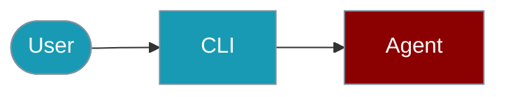

The `praisonai-ts` CLI provides a comprehensive interface for interacting with AI agents.



## Quick Start

<Steps>

<Step title="Simple Usage">
```bash
npm install -g praisonai
praisonai-ts chat "Hello"
```
</Step>

<Step title="With Configuration">
```bash
export OPENAI_API_KEY=your-key
praisonai-ts chat "Explain AI" --model openai/gpt-4o-mini
```
</Step>

</Steps>

---

---

## All Commands

| Command | Description |
|---------|-------------|
| `chat` | Chat with an AI agent |
| `run` | Run an agent with a task |
| `workflow` | Execute a multi-agent workflow |
| `auto` | Auto-generate agents from topic |
| `research` | Deep research on a topic |
| `image` | Image generation and analysis |
| `providers` | List available LLM providers |
| `tools` | List or manage tools |
| `memory` | Manage agent memory |
| `session` | Manage agent sessions |
| `knowledge` | Manage knowledge base |
| `skills` | Manage agent skills |
| `guardrail` | Content validation and safety |
| `eval` | Evaluate agent performance |
| `query-rewrite` | Rewrite queries for better search |
| `prompt-expand` | Expand prompts with more detail |
| `router` | Route requests to agents |
| `context` | Manage conversation context |
| `planning` | Task planning and todo management |
| `telemetry` | Usage monitoring and analytics |
| `vector` | Vector store management |
| `observability` | Monitoring and tracing |
| `voice` | Text-to-speech and speech-to-text |
| `db` | Database adapter management |
| `cache` | Caching management |
| `version` | Show CLI version |
| `help` | Show help information |

## Core Commands

### Chat

```bash
praisonai-ts chat "Your prompt here"
praisonai-ts chat "Write a poem" --stream
praisonai-ts chat "Explain AI" --model anthropic/claude-sonnet-4-20250514
```

### Providers

```bash
praisonai-ts providers
praisonai-ts providers --json
```

## Global Options

| Option | Description |
|--------|-------------|
| `-v, --verbose` | Enable verbose output |
| `-c, --config` | Path to config file |
| `-o, --output` | Output format (pretty, json, text) |
| `--json` | Shorthand for `--output json` |

## Environment Variables

```bash
export OPENAI_API_KEY=your-key
export ANTHROPIC_API_KEY=your-key
export GOOGLE_API_KEY=your-key
export PRAISONAI_MODEL=openai/gpt-4o-mini
```

### Loading a `.env` file

`praisonai-ts` no longer calls `dotenv.config()` for you (as of v-next, PR #4416). If you keep credentials in a `.env` file, load it yourself at the top of your entrypoint. Shell exports above keep working with no code changes.

```ts
// If you keep credentials in a .env file, load it yourself.
import 'dotenv/config';       // or: import dotenv from 'dotenv'; dotenv.config();
import { Agent } from 'praisonai';

const agent = new Agent({ instructions: 'You are a helpful assistant' });
await agent.start('Hello');
```

Prefer no `dotenv` at all? See [JS Import Safety & Runtimes](/features/js-import-safety) for per-agent credentials in browsers and webviews.

## Related


<CardGroup cols={2}>
  <Card title="Tools CLI" icon="terminal" href="/js/tools-cli">
    Command reference
  </Card>
  <Card title="Providers CLI" icon="terminal" href="/js/providers-cli">
    Command reference
  </Card>
  <Card title="Sessions CLI" icon="terminal" href="/js/sessions-cli">
    Command reference
  </Card>
  <Card title="Memory CLI" icon="terminal" href="/js/memory-cli">
    Command reference
  </Card>
  <Card title="Knowledge Base CLI" icon="terminal" href="/js/knowledge-base-cli">
    Command reference
  </Card>
  <Card title="Skills CLI" icon="terminal" href="/js/skills-cli">
    Command reference
  </Card>
  <Card title="Guardrails CLI" icon="terminal" href="/js/guardrails-cli">
    Command reference
  </Card>
  <Card title="Evaluation CLI" icon="terminal" href="/js/evaluation-cli">
    Command reference
  </Card>
</CardGroup>
