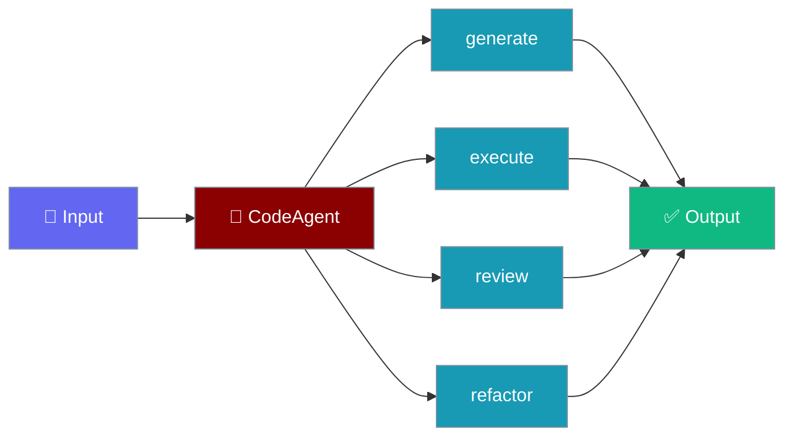
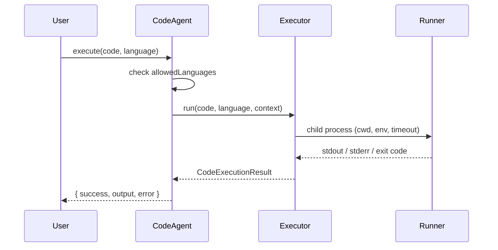

`CodeAgent` generates, executes, reviews, and refactors code, and only runs code when you name an explicit executor.



## Quick Start

<Steps>

<Step title="Run code with an explicit executor">
```typescript
import { CodeAgent, createSubprocessExecutor } from 'praisonai';

const agent = new CodeAgent({
  name: 'Coder',
  code: {
    executor: createSubprocessExecutor(),   // opt-in real runner
    allowedLanguages: ['python'],
    timeout: 20,
  },
});

const result = await agent.execute('print(2 + 2)', 'python');
console.log(result.output);   // "4\n"
console.log(result.success);  // true
```
</Step>

<Step title="Generate, review and refactor">
```typescript
const code = await agent.generate('Write a function to reverse a string');
const review = await agent.review(code);
const better = await agent.refactor(code, 'add type hints');
```
</Step>

</Steps>

---

## Why an explicit executor?

Execution is granted by naming a runner, never by flipping a boolean.

Without `code.executor`, `execute()` returns `{ success: false, error: 'No code executor is configured...' }`. This is deliberate, so model-generated code cannot silently run in-process.

```typescript
const agent = new CodeAgent({ name: 'Coder' }); // no executor

const result = await agent.execute('print(2 + 2)', 'python');
console.log(result.success); // false
console.log(result.error);   // "No code executor is configured, so 'python' code was not run. ..."
```

---

## How It Works



---

## CodeConfig

| Field | Type | Default | Purpose |
|-------|------|---------|---------|
| `executor` | `CodeExecutor` | — | The only way to make `execute()` actually run code. |
| `sandbox` | `boolean` | `true` | Advisory hint passed through to the executor. Does NOT gate execution. |
| `timeout` | `number` (seconds) | `30` | Kills the whole process tree on timeout (SIGKILL). |
| `allowedLanguages` | `string[]` | `['python']` | Gate at the CodeAgent level. |
| `maxOutputLength` | `number` | `10000` | Output capped as chunks arrive (bounded memory). |
| `workingDirectory` | `string` | `process.cwd()` | Passed to the executor. |
| `environment` | `Record<string, string>` | `{}` | Merged with `process.env`. |

---

## createSubprocessExecutor()

`createSubprocessExecutor()` is a ready-made out-of-process runner.

```typescript
import { CodeAgent, createSubprocessExecutor } from 'praisonai';

const agent = new CodeAgent({
  code: { executor: createSubprocessExecutor() },
});
```

Default interpreter map:

| Language | Interpreter |
|----------|-------------|
| `python`, `python3` | `process.env.PRAISONAI_PYTHON ?? 'python3'` with `-c` |
| `javascript`, `node` | `process.execPath` with `-e` |
| `bash` | `bash -c` |
| `sh` | `sh -c` |

- Runs a detached child on non-Windows so the timeout kills the whole process group.
- Truncates output live during streaming, not after close.
- An unregistered language returns `{ success: false, error: "No interpreter is registered for '<lang>'. Known: ..." }`.

<Info>
Set **`PRAISONAI_PYTHON`** to override the interpreter used for `python` / `python3`.
</Info>

---

## Writing your own executor

Supply a `CodeExecutor` to target a container, microVM, e2b, or a remote sandbox service.

```typescript
import { CodeAgent, type CodeExecutor, type CodeExecutorContext } from 'praisonai';

const remoteExecutor: CodeExecutor = async (code, language, context: CodeExecutorContext) => {
  // Send code to your container / microVM / remote sandbox
  return {
    success: true,
    output: '...',
    exitCode: 0,
    executionTime: 0.1,
  };
};

const agent = new CodeAgent({ code: { executor: remoteExecutor } });
```

The `CodeExecutor` signature:

```typescript
type CodeExecutor = (
  code: string,
  language: string,
  context: CodeExecutorContext,
) => Promise<CodeExecutionResult>;
```

`CodeExecutorContext` carries `sandbox`, `timeout`, `workingDirectory`, `environment`, and `maxOutputLength`.

<Warning>
A child process is **not** a security sandbox — it shares the host filesystem, network and user. For untrusted code, supply your own executor targeting a container, microVM, or remote sandbox service.
</Warning>

---

## Best Practices

<AccordionGroup>

<Accordion title="Name an executor explicitly">
Never rely on a boolean to enable execution. Pass `createSubprocessExecutor()` or your own runner so execution is a visible decision.
</Accordion>

<Accordion title="Restrict allowed languages">
Set `allowedLanguages` to only the languages you expect. `execute()` rejects any other language before the executor runs.
</Accordion>

<Accordion title="Isolate untrusted code">
Supply a container or microVM executor for model-generated or user-supplied code. The subprocess runner shares the host.
</Accordion>

<Accordion title="Bound output and time">
Keep `maxOutputLength` and `timeout` sensible. Output is capped as it streams and the timeout kills the whole process tree.
</Accordion>

</AccordionGroup>

---

## Related

<CardGroup cols={2}>
  <Card title="Sandbox" icon="box" href="/js/sandbox">
    The generic Agent `executeCode()` sandbox (separate API)
  </Card>
  <Card title="Agent" icon="user" href="/js/agent">
    Agent configuration and capabilities
  </Card>
  <Card title="Placement" icon="server" href="/js/placement">
    Where agents run
  </Card>
</CardGroup>
