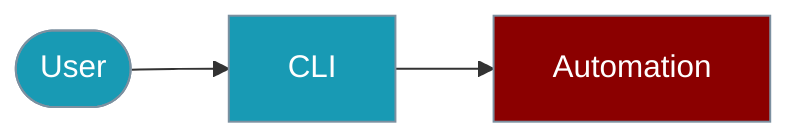

Automate computer tasks from the command line.



## Quick Start

<Steps>

<Step title="Simple Usage">
```bash
praisonai-ts computer screenshot --output ./screenshot.png
```
</Step>

<Step title="With Configuration">
```bash
praisonai-ts computer run "Open browser" --require-approval --browser
```
</Step>

</Steps>

---

## Commands

### Screenshot

```bash
# Take screenshot
praisonai-ts computer screenshot --output ./screenshot.png

# With analysis
praisonai-ts computer screenshot --analyze "What do you see?"
```

### Execute Task

```bash
# Run automation task
praisonai-ts computer run "Open browser and go to google.com" \
  --require-approval \
  --model claude-3.5-sonnet
```

### Interactive Mode

```bash
# Start interactive computer control
praisonai-ts computer interactive \
  --require-approval \
  --browser
```

## Options

| Option | Type | Default | Description |
|--------|------|---------|-------------|
| `--require-approval` | boolean | `true` | Require approval |
| `--browser` | boolean | `false` | Enable browser |
| `--desktop` | boolean | `false` | Enable desktop |
| `--timeout` | number | `30000` | Action timeout |
| `--model` | string | `claude-3.5-sonnet` | Vision model |

## Environment Variables

| Variable | Required | Description |
|----------|----------|-------------|
| `OPENAI_API_KEY` | Yes | For the agent |
| `ANTHROPIC_API_KEY` | For Claude | Claude vision |

## Examples

### Browser Automation

```bash
praisonai-ts computer run \
  "Go to github.com and search for praisonai" \
  --browser \
  --require-approval
```

### Desktop Task

```bash
praisonai-ts computer run \
  "Open the calculator app" \
  --desktop \
  --require-approval
```

## Related

<CardGroup cols={2}>
  <Card title="Computer Use" icon="book" href="/docs/js/computer-use">
    SDK automation
  </Card>
  <Card title="Tool Approval" icon="book" href="/docs/js/tool-approval">
    Approval workflows
  </Card>
</CardGroup>
