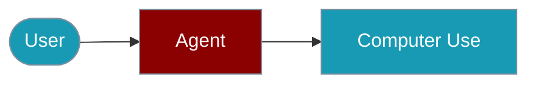

Build agents that can interact with browsers and desktop applications through screenshots, clicks, and keyboard input.





## Quick Start

<Steps>

<Step title="Simple Usage">
```typescript
import { createComputerUse, Agent } from 'praisonai-ts';

const computer = createComputerUse({ requireApproval: true });
const agent = new Agent({
  name: 'ComputerAgent',
  instructions: 'You help users automate computer tasks.',
  tools: computer.getTools(),
});

await agent.chat('Take a screenshot of the current screen');
```
</Step>

<Step title="With Configuration">
```typescript
const computer = createComputerUse({
  requireApproval: true,
  browser: true,
  desktop: false,
  timeout: 30000,
});
```
</Step>

</Steps>

## Configuration

```typescript
import { createComputerUse } from 'praisonai-ts';

const computer = createComputerUse({
  // Safety
  requireApproval: true,    // Require human approval (default: true)
  
  // Capabilities
  browser: true,            // Enable browser control
  desktop: true,            // Enable desktop control
  
  // Settings
  screenshotDir: './screenshots',
  timeout: 30000,           // Action timeout in ms
});
```

## Available Tools

The computer use module provides these tools:

| Tool | Description |
|------|-------------|
| `screenshot` | Take a screenshot |
| `click` | Click at coordinates |
| `doubleClick` | Double-click at coordinates |
| `type` | Type text |
| `key` | Press a key or combination |
| `moveMouse` | Move mouse to coordinates |
| `scroll` | Scroll in a direction |
| `wait` | Wait for a duration |
| `execute` | Execute shell command |

## With Playwright (Browser)

```typescript
import { chromium } from 'playwright';
import { createComputerUse } from 'praisonai-ts';

const browser = await chromium.launch({ headless: false });
const page = await browser.newPage();

const computer = createComputerUse({
  requireApproval: true,
  tools: {
    screenshot: async () => {
      const buffer = await page.screenshot();
      return {
        base64: buffer.toString('base64'),
        width: 1920,
        height: 1080,
      };
    },
    click: async (x, y) => {
      await page.mouse.click(x, y);
    },
    type: async (text) => {
      await page.keyboard.type(text);
    },
    // ... other tools
  },
});
```

## Human Approval

By default, all actions require human approval:

```typescript
import { createComputerUse, createCLIApprovalPrompt } from 'praisonai-ts';

const computer = createComputerUse({
  requireApproval: true,
});

// CLI approval prompt
const approvalHandler = createCLIApprovalPrompt();

computer.onApprovalRequest(async (action) => {
  console.log(`Action requested: ${action.type}`);
  console.log(`Parameters:`, action.params);
  return await approvalHandler(action);
});
```

## Custom Tool Implementations

```typescript
const computer = createComputerUse({
  tools: {
    screenshot: async () => {
      // Custom screenshot implementation
      const screenshot = await takeScreenshot();
      return {
        base64: screenshot.data,
        width: screenshot.width,
        height: screenshot.height,
      };
    },
    click: async (x, y, button = 'left') => {
      // Custom click implementation
      await simulateClick(x, y, button);
    },
    type: async (text) => {
      // Custom type implementation
      await simulateTyping(text);
    },
    execute: async (command) => {
      // Custom command execution
      return await runCommand(command);
    },
  },
});
```

## Agent Example

```typescript
import { Agent, createComputerUse } from 'praisonai-ts';

const computer = createComputerUse({ requireApproval: true });

const agent = new Agent({
  name: 'WebAutomator',
  instructions: `You automate web tasks. Always:
1. Take a screenshot first to understand the current state
2. Describe what you see
3. Plan your actions
4. Execute actions one at a time
5. Verify results with another screenshot`,
  tools: computer.getTools(),
  model: 'claude-3.5-sonnet', // Vision-capable model
});

const response = await agent.chat('Go to google.com and search for "PraisonAI"');
```

## Safety Best Practices

1. **Always require approval** - Enable `requireApproval: true`
2. **Limit capabilities** - Only enable needed features
3. **Sandbox execution** - Run in isolated environments
4. **Log all actions** - Track what the agent does
5. **Set timeouts** - Prevent runaway actions

## Environment Variables

| Variable | Required | Description |
|----------|----------|-------------|
| `OPENAI_API_KEY` | Yes | For the agent |
| `ANTHROPIC_API_KEY` | For Claude | Claude vision |

## Related

<CardGroup cols={2}>
  <Card title="Computer Use CLI" icon="terminal" href="/docs/js/computer-use-cli">
    Terminal automation
  </Card>
  <Card title="Tool Approval" icon="book" href="/docs/js/tool-approval">
    Human-in-the-loop approvals
  </Card>
  <Card title="Image Agent" icon="robot" href="/docs/js/image-agent">
    Vision capabilities
  </Card>
</CardGroup>
