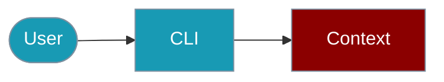

Manage Agent context windows from the command line.



## Quick Start

<Steps>

<Step title="Simple Usage">
```bash
npx praisonai context create --budget 4000
```
</Step>

<Step title="With Configuration">
```bash
npx praisonai context add "User prefers concise answers" --priority 0.9
```
</Step>

</Steps>

---

## Basic Usage

```bash
# Create context manager with budget
npx praisonai context create --budget 4000

# Add high-priority context
npx praisonai context add "User prefers concise answers" --priority 0.9

# Add context from file
npx praisonai context add-file ./system-prompt.txt --priority 1.0

# Show current context stats
npx praisonai context stats
```

## Budget Management

```bash
# Show budget allocation
npx praisonai context budget --show

# Allocate tokens to a source
npx praisonai context budget allocate system 500 --priority 10

# Check available tokens
npx praisonai context budget available
```

## Context Optimization

```bash
# Optimize context to fit budget
npx praisonai context optimize --target 4000

# Optimize with specific strategy
npx praisonai context optimize --strategy truncate-low-priority

# Available strategies: truncate-old, truncate-low-priority, deduplicate, compress
```

## Export and Build

```bash
# Build context string
npx praisonai context build

# Export context to file
npx praisonai context export --output context.txt

# Export as JSON
npx praisonai context export --json --output context.json
```

## Programmatic (TypeScript)

```typescript
import { ContextManager, ContextBudgeter, ContextOptimizer } from 'praisonai';

const context = new ContextManager({ maxTokens: 4000 });
const budgeter = new ContextBudgeter({ totalBudget: 8000 });
const optimizer = new ContextOptimizer({ targetTokens: 5000 });
```

## Related

<CardGroup cols={2}>
  <Card title="Context Manager" icon="book" href="/docs/js/context-manager">
    SDK documentation
  </Card>
  <Card title="Sessions CLI" icon="terminal" href="/docs/js/sessions-cli">
    Session management
  </Card>
  <Card title="Memory CLI" icon="terminal" href="/docs/js/memory-cli">
    Memory operations
  </Card>
</CardGroup>
