Criteria let you define what success looks like - so you can validate if an agent's work meets your standards.

```mermaid
graph LR
    subgraph "Validation"
        A[📝 Output] --> B[📋 Criteria]
        B --> C{Pass?}
        C -->|Yes| D[✅ Accept]
        C -->|No| E[🔄 Retry]
    end
    
    classDef output fill:#6366F1,stroke:#7C90A0,color:#fff
    classDef criteria fill:#F59E0B,stroke:#7C90A0,color:#fff
    classDef result fill:#10B981,stroke:#7C90A0,color:#fff
    
    class A output
    class B,C criteria
    class D,E result
```



## Quick Start

```typescript
import { Agent, Criteria } from 'praisonai';

const agent = new Agent({
  instructions: 'Write marketing copy',
  criteria: [
    Criteria.minLength(100),        // At least 100 characters
    Criteria.contains('call-to-action'),
    Criteria.sentiment('positive')
  ]
});

const result = await agent.chat('Write copy for our new product');
// Validates against all criteria
```

## Common Criteria

| Criteria | Purpose |
|----------|---------|
| `minLength(n)` | Minimum character count |
| `maxLength(n)` | Maximum character count |
| `contains(text)` | Must include specific text |
| `matches(regex)` | Must match a pattern |
| `sentiment(type)` | Positive, negative, or neutral |
| `noOffensive()` | No inappropriate content |

---

## Best Practices

<AccordionGroup>
  <Accordion title="Keep criteria realistic">
    Don't set impossible standards. Criteria should be achievable on first attempt.
  </Accordion>
  
  <Accordion title="Combine multiple criteria">
    Use several simple criteria together rather than one complex criterion.
  </Accordion>
</AccordionGroup>

---

## Related

<CardGroup cols={2}>
  <Card title="Guardrails" icon="shield" href="/docs/js/guardrails">
    Input/output validation
  </Card>
  <Card title="Output" icon="file-export" href="/docs/js/output">
    Structured responses
  </Card>
</CardGroup>
