Agents can validate their work against criteria before returning results.

```mermaid
graph LR
    subgraph "Validation Flow"
        A[🤖 Agent] --> B[📝 Output]
        B --> C[✅ Criteria]
        C -->|pass| D[📤 Return]
        C -->|fail| E[🔄 Retry]
    end
    
    classDef agent fill:#F59E0B,stroke:#7C90A0,color:#fff
    classDef check fill:#6366F1,stroke:#7C90A0,color:#fff
    classDef result fill:#10B981,stroke:#7C90A0,color:#fff
    
    class A,B agent
    class C check
    class D,E result
```



## Quick Start

<Steps>

<Step title="Define Success Criteria">
```typescript
import { Agent } from 'praisonai';

const agent = new Agent({
  instructions: 'Write blog posts',
  criteria: 'Must be at least 500 words and include 3 key points'
});

const result = await agent.chat('Write about AI trends');
// Agent validates output meets criteria before returning
```
</Step>

<Step title="Multiple Criteria">
```typescript
const agent = new Agent({
  criteria: [
    'Contains at least 500 words',
    'Includes an introduction',
    'Has actionable takeaways'
  ]
});
```
</Step>

</Steps>

---

## User Interaction Flow


---

## Configuration Levels

```typescript
// Level 1: String - Simple criteria
const agent = new Agent({
  criteria: 'Must be professional and concise'
});

// Level 2: Array - Multiple criteria
const agent = new Agent({
  criteria: [
    'At least 300 words',
    'Includes examples',
    'No jargon'
  ]
});

// Level 3: Dict - With options
const agent = new Agent({
  criteria: {
    rules: ['professional', 'concise'],
    maxRetries: 3,
    strict: true
  }
});
```

---

## Criteria Options

| Option | Description |
|--------|-------------|
| `rules` | List of validation rules |
| `maxRetries` | Attempts before failing |
| `strict` | Fail on any criteria miss |

---

## API Reference

<Card title="AgentConfig" icon="code" href="/docs/sdk/reference/typescript/classes/AgentConfig">
  Agent configuration including criteria
</Card>

---

## Best Practices

<AccordionGroup>
  <Accordion title="Be specific">
    "At least 500 words" is better than "long enough".
  </Accordion>
  
  <Accordion title="Keep criteria measurable">
    Criteria the agent can verify work best.
  </Accordion>
  
  <Accordion title="Set retry limits">
    Prevent infinite loops with maxRetries.
  </Accordion>
</AccordionGroup>

---

## Related

<CardGroup cols={2}>
  <Card title="Reflection" icon="rotate" href="/docs/js/reflection">
    Self-improvement
  </Card>
  <Card title="Output" icon="display" href="/docs/js/output">
    Output formats
  </Card>
</CardGroup>
