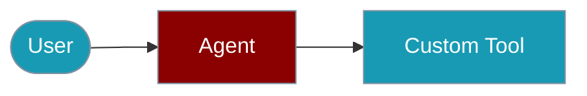

Attach plain TypeScript functions as agent tools with minimal boilerplate.



## Quick Start

<Steps>

<Step title="Simple Usage">
```typescript
import { Agent } from 'praisonai';

async function getWeather(location: string) {
  return `${Math.floor(Math.random() * 30)}°C in ${location}`;
}

const agent = new Agent({
  instructions: 'You provide weather for requested locations.',
  name: 'WeatherAgent',
  tools: [getWeather],
});

await agent.start('What is the weather in Paris?');
```
</Step>

<Step title="Multiple Tools">
```typescript
async function getTime(location: string) {
  const now = new Date();
  return `${now.getHours()}:${now.getMinutes()} in ${location}`;
}

const agent = new Agent({
  instructions: 'You provide weather and local time.',
  tools: [getWeather, getTime],
});
```
</Step>

</Steps>

---

## Single Agent

```typescript
import { Agent } from 'praisonai';

async function getWeather(location: string) {
  console.log(`Getting weather for ${location}...`);
  return `${Math.floor(Math.random() * 30)}°C`;
}

const agent = new Agent({ 
  instructions: `You provide the current weather for requested locations.`,
  name: "DirectFunctionAgent",
  tools: [getWeather]
});

agent.start("What's the weather in Paris, France?");
``` 

## Multi Agents

```typescript
import { Agent } from 'praisonai';

async function getWeather(location: string) {
  console.log(`Getting weather for ${location}...`);
  return `${Math.floor(Math.random() * 30)}°C`;
}

async function getTime(location: string) {
  console.log(`Getting time for ${location}...`);
  const now = new Date();
  return `${now.getHours()}:${now.getMinutes()}`;
}

const agent = new Agent({ 
  instructions: `You provide the current weather and time for requested locations.`,
  name: "DirectFunctionAgent",
  tools: [getWeather, getTime]
});

agent.start("What's the weather and time in Paris, France and Tokyo, Japan?");
```

## Related

<CardGroup cols={2}>
  <Card title="Tools" icon="book" href="/docs/js/tools">
    Built-in tools
  </Card>
  <Card title="Agent" icon="robot" href="/docs/js/agent">
    Agent configuration
  </Card>
  <Card title="MCP" icon="book" href="/docs/js/mcp">
    External tool protocols
  </Card>
</CardGroup>
