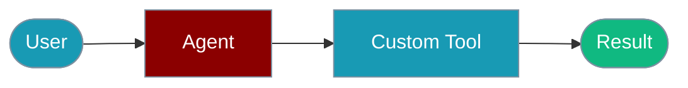
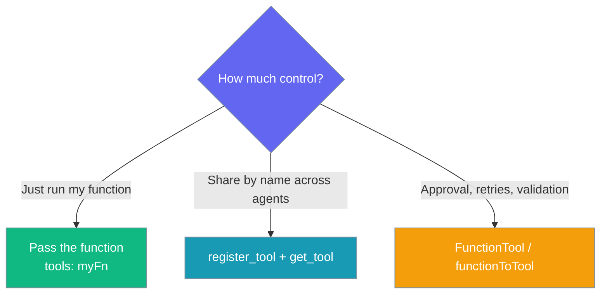

Attach plain TypeScript functions as agent tools, register them by name like Python, or wrap them in a `FunctionTool` for full control.


```mermaid
graph LR
    User([User]) --> Agent[Agent]
    Agent --> Fn[Custom Tool]
    Fn --> Result([Result])

    classDef agent fill:#8B0000,stroke:#7C90A0,color:#fff
    classDef tool fill:#189AB4,stroke:#7C90A0,color:#fff
    classDef result fill:#10B981,stroke:#7C90A0,color:#fff

    class Agent agent
    class User,Fn tool
    class Result result
```

## Quick Start

<Steps>

<Step title="Simple Usage">
```typescript
import { Agent } from 'praisonai';

async function getWeather(location: string) {
  return `${Math.floor(Math.random() * 30)}°C in ${location}`;
}

const agent = new Agent({
  instructions: 'You provide weather for requested locations.',
  name: 'WeatherAgent',
  tools: [getWeather],
});

await agent.start('What is the weather in Paris?');
```
</Step>

<Step title="Named Registration">
```typescript
import { Agent, register_tool, get_tool } from 'praisonai';

async function getWeather(location: string) {
  return `${Math.floor(Math.random() * 30)}°C in ${location}`;
}

register_tool(getWeather, { name: 'weather' });

const agent = new Agent({
  instructions: 'You provide weather for requested locations.',
  tools: [get_tool('weather')!],
});

await agent.start('What is the weather in Paris?');
```
</Step>

</Steps>

---

## Which One Do I Pick?

Three ways to build a tool, from least to most control.


```mermaid
graph TB
    A{How much control?} -->|Just run my function| B[Pass the function<br/>tools: myFn]
    A -->|Share by name across agents| C[register_tool + get_tool]
    A -->|Approval, retries, validation| D[FunctionTool / functionToTool]

    classDef question fill:#6366F1,stroke:#7C90A0,color:#fff
    classDef simple fill:#10B981,stroke:#7C90A0,color:#fff
    classDef named fill:#189AB4,stroke:#7C90A0,color:#fff
    classDef full fill:#F59E0B,stroke:#7C90A0,color:#fff

    class A question
    class B simple
    class C named
    class D full
```

---

## Level 1 — Pass a Plain Function

The easiest way — hand the Agent your function directly. The model returns named arguments; the agent maps them onto your function's parameters, so order doesn't matter.

```typescript
import { Agent } from 'praisonai';

// Named args from the model ({ city: "Paris" }) map to the `city` parameter.
const getWeather = (city: string) => `Weather in ${city}: 22°C, sunny`;

const agent = new Agent({
  instructions: 'Answer weather questions using getWeather.',
  tools: [getWeather],
});

await agent.start('What is the weather in Paris?');
// Calls getWeather("Paris") → "Weather in Paris: 22°C, sunny"
```

- **Named arguments** map to your declared parameter names — order-independent.
- **Return values are JSON-serialized** before going back to the model. Objects and `null` are safe — no manual `JSON.stringify`.

<Note>
Without a `description`, the tool advertises itself as `Tool: <name>` (e.g. `Tool: getWeather`). Give it a clear description when you want the model to pick the right tool reliably.
</Note>

---

## Level 2 — Register by Name

Register a tool once on the global registry, then look it up anywhere — the same `register_tool` / `get_tool` names Python uses.

```typescript
import {
  Agent,
  register_tool,
  get_tool,
  has_tool,
  list_tools,
} from 'praisonai';

const getWeather = (city: string) => `Weather in ${city}: 22°C, sunny`;

register_tool(getWeather, { name: 'weather' });

has_tool('weather');   // true
list_tools();          // ['weather']

const agent = new Agent({
  instructions: 'Report the weather using the weather tool.',
  tools: [get_tool('weather')!],
});

await agent.start('Weather in Paris?');
```

<Warning>
The global `register_tool` **skips** a name that is already taken (Python parity) — it logs a debug message and returns instead of throwing. Pass `{ overwrite: true }` to replace an existing tool. The class method `ToolRegistry.register` **throws** on a duplicate instead.
</Warning>

`register_tool` accepts anything Python accepts — a plain function, a `FunctionTool`, or a `BaseTool`-like object with `run()` / `execute()`.

| Function | camelCase | What it does |
|----------|-----------|--------------|
| `register_tool(tool, options?)` | `registerTool` | Add to the global registry (skips duplicates) |
| `get_tool(name)` | `getTool` | Look up a registered tool by name |
| `has_tool(name)` | `hasTool` | Presence check |
| `remove_tool(name)` | `removeTool` | Delete; returns `boolean` |
| `list_tools()` | `listTools` | Array of registered names |
| `get_tool_definitions()` | `getToolDefinitions` | OpenAI-shape definitions for every tool |
| `get_registry()` | `getRegistry` | The global `ToolRegistry` singleton |

<Note>
`register_tool` writes to the **name-keyed** registry (the analogue of `praisonaiagents/tools/registry.py`). If you previously imported `register_tool` / `get_tool` from `'praisonai'` and passed them tool **ids** or **built instances**, you were using the *factory* registry by accident — see [Factory Registry](/js/tools/factory-registry) for the one-line migration.
</Note>

---

## Level 3 — Full Control with FunctionTool

Wrap a function in a `FunctionTool` when you want to validate it, call it directly, or attach approval and retry behaviour.

```typescript
import { Agent, FunctionTool } from 'praisonai';

const weather = new FunctionTool({
  name: 'weather',
  description: 'Get the current weather for a location',
  parameters: {
    type: 'object',
    properties: {
      location: { type: 'string', description: 'City name' },
    },
    required: ['location'],
  },
  execute: async ({ location }) => `22°C, sunny in ${location}`,
});

weather.validate();                         // throws if malformed, else true
await weather.run({ location: 'Paris' });   // "22°C, sunny in Paris"

const agent = new Agent({
  instructions: 'Report the weather.',
  tools: [weather],
});

await agent.start('Weather in Paris?');
```

Prefer `tool({...})` if you don't need a class instance — it returns the same `FunctionTool`:

```typescript
import { tool } from 'praisonai';

const weather = tool({
  name: 'weather',
  description: 'Get the current weather for a location',
  execute: async ({ location }: { location: string }) => `22°C in ${location}`,
});
```

### `.run()` and `.validate()`

| Method | Signature | Behaviour |
|--------|-----------|-----------|
| `run(params, context?)` | `Promise<TResult>` | Python-parity entry point; returns the full result |
| `validate()` | `boolean` | Throws `ToolValidationError` listing every problem, else returns `true` |
| `execute(params, context?)` | `Promise<TResult>` | Model-facing result (after `toModelOutput`) |

<Warning>
`run()` **still goes through the same approval and restart-safety gates as `execute`** — unlike Python's raw `run()`. TypeScript has no per-name approval registry, so a raw `run()` here would be a second ungated door onto the same tool.
</Warning>

<Note>
**`FunctionTool` is not callable as a function.** The Agent checks `typeof tool === 'function'` before the object branch, so a callable `FunctionTool` would bypass its own approval gate. It is kept intentionally non-callable — call `.run()` or `.execute()`.
</Note>

### Trust Levels

Mark where a tool came from when you register it. `TOOL_TRUST_LEVELS` is `['trusted', 'external']`.

```typescript
import { register_tool, TOOL_TRUST_LEVELS } from 'praisonai';

// In-repo code you wrote.
register_tool(getWeather, { name: 'weather', trustLevel: 'trusted' });

// User-supplied code from outside your codebase.
register_tool(userTool, { name: 'user-plugin', trustLevel: 'external' });
```

An invalid `trustLevel` throws immediately. Read it back with `get_registry().getTrustLevel(name)`.

### Dynamic Schema Overrides

Reshape a parameter's schema at registration time — useful for injecting enums from runtime state.

```typescript
import { register_tool } from 'praisonai';

register_tool(getWeather, {
  name: 'weather',
  dynamicSchemaOverrides: (schema) => ({
    ...schema,
    properties: {
      ...schema.properties,
      location: { type: 'string', enum: ['Paris', 'Tokyo', 'Berlin'] },
    },
  }),
});
```

---

## Multi Agents

Share tools across multiple Agents by passing the same functions:

```typescript
import { Agent, AgentTeam } from 'praisonai';

async function getWeather(location: string) {
  return `${Math.floor(Math.random() * 30)}°C`;
}

async function getTime(location: string) {
  const now = new Date();
  return `${now.getHours()}:${now.getMinutes()}`;
}

const agent = new Agent({
  instructions: 'You provide the current weather and time for locations.',
  name: 'DirectFunctionAgent',
  tools: [getWeather, getTime],
});

await agent.start("What's the weather and time in Paris and Tokyo?");
```

---

## Best Practices

<AccordionGroup>
  <Accordion title="Give every tool a clear description">
    Without a `description`, the tool advertises as `Tool: <name>` — the model has less to go on. A one-line description makes tool selection reliable.
  </Accordion>
  <Accordion title="Validate before you register">
    Call `.validate()` on a `FunctionTool` before registration — it throws `ToolValidationError` listing every problem, so you catch a missing name or bad schema early.
  </Accordion>
  <Accordion title="Mark external tools 'external'">
    Set `trustLevel: 'external'` for user-supplied code and `'trusted'` for in-repo tools, so you can audit where a registered tool came from.
  </Accordion>
  <Accordion title="Reuse the global registry for the common case">
    Use `register_tool` / `get_tool` for "I already have my tool". Reach for the factory registry only when you build instances from user config.
  </Accordion>
</AccordionGroup>

---

## Related

<CardGroup cols={2}>
  <Card title="Tools" icon="wrench" href="/js/tools">
    Tool system overview
  </Card>
  <Card title="Factory Registry" icon="industry" href="/js/tools/factory-registry">
    Build tool instances from config
  </Card>
  <Card title="Tool Errors" icon="triangle-exclamation" href="/js/tools/errors">
    Distinguish missing from broken
  </Card>
  <Card title="MCP Tools" icon="plug" href="/js/mcp-tools">
    External tool protocols
  </Card>
</CardGroup>
