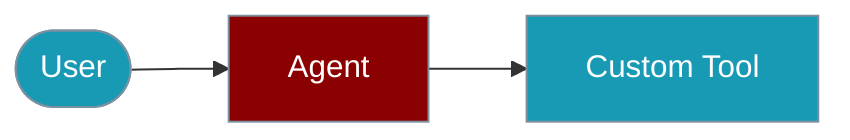

Attach plain TypeScript functions as agent tools with minimal boilerplate.


```mermaid
graph LR
    User([User]) --> Agent[Agent]
    Agent --> Fn[Custom Tool]

    classDef agent fill:#8B0000,stroke:#7C90A0,color:#fff
    classDef tool fill:#189AB4,stroke:#7C90A0,color:#fff

    class Agent agent
    class User,Fn tool
    classDef agent fill:#8B0000,color:#fff
    classDef tool fill:#189AB4,color:#fff

```

## Quick Start

<Steps>

<Step title="Simple Usage">
```typescript
import { Agent } from 'praisonai';

async function getWeather(location: string) {
  return `${Math.floor(Math.random() * 30)}°C in ${location}`;
}

const agent = new Agent({
  instructions: 'You provide weather for requested locations.',
  name: 'WeatherAgent',
  tools: [getWeather],
});

await agent.start('What is the weather in Paris?');
```
</Step>

<Step title="Multiple Tools">
```typescript
async function getTime(location: string) {
  const now = new Date();
  return `${now.getHours()}:${now.getMinutes()} in ${location}`;
}

const agent = new Agent({
  instructions: 'You provide weather and local time.',
  tools: [getWeather, getTime],
});
```
</Step>

</Steps>

---

## Single Agent

```typescript
import { Agent } from 'praisonai';

async function getWeather(location: string) {
  console.log(`Getting weather for ${location}...`);
  return `${Math.floor(Math.random() * 30)}°C`;
}

const agent = new Agent({ 
  instructions: `You provide the current weather for requested locations.`,
  name: "DirectFunctionAgent",
  tools: [getWeather]
});

agent.start("What's the weather in Paris, France?");
``` 

## Multi Agents

```typescript
import { Agent } from 'praisonai';

async function getWeather(location: string) {
  console.log(`Getting weather for ${location}...`);
  return `${Math.floor(Math.random() * 30)}°C`;
}

async function getTime(location: string) {
  console.log(`Getting time for ${location}...`);
  const now = new Date();
  return `${now.getHours()}:${now.getMinutes()}`;
}

const agent = new Agent({ 
  instructions: `You provide the current weather and time for requested locations.`,
  name: "DirectFunctionAgent",
  tools: [getWeather, getTime]
});

agent.start("What's the weather and time in Paris, France and Tokyo, Japan?");
```

## Function-tool argument mapping

The model returns named arguments; the agent maps them to your function's declared parameter names, so order doesn't matter.

```typescript
import { Agent } from 'praisonai';

// Named args from the model ({ city: "Paris" }) map to the `city` parameter —
// no more "Weather in [object Object]".
const getWeather = (city: string) => `Weather in ${city}: 22°C, sunny`;

const agent = new Agent({
  instructions: 'Answer weather questions using getWeather.',
  tools: [getWeather]
});

await agent.start('What is the weather in Paris?');
// Calls getWeather("Paris") → "Weather in Paris: 22°C, sunny"
```

- **Named arguments** map to your declared parameter names — order-independent.
- **Destructured parameters** (`({ city }) => ...`) use a defensive fallback that passes the raw args object.
- **Return values are JSON-serialized** before going back to the model. Objects and `null` are safe — you no longer need to `JSON.stringify` yourself.

```typescript
// Returning an object works — it's serialized to JSON automatically.
const getForecast = (city: string) => ({ city, high: 24, low: 15 });

const agent = new Agent({
  instructions: 'Report the forecast.',
  tools: [getForecast]
});

await agent.start('Forecast for Tokyo?');
// getForecast returns { city: "Tokyo", high: 24, low: 15 }
// The model receives '{"city":"Tokyo","high":24,"low":15}', not "[object Object]".
```

## Related

<CardGroup cols={2}>
  <Card title="Tools" icon="book" href="/js/tools">
    Built-in tools
  </Card>
  <Card title="Agent" icon="robot" href="/js/agent">
    Agent configuration
  </Card>
  <Card title="MCP" icon="book" href="/js/mcp-tools">
    External tool protocols
  </Card>
</CardGroup>
